---
author:
  name: Иванова Анастасия Сергеевна
  degrees: DSc
  orcid: 0000-0002-0877-7063
  email: 1132250427@rudn.ru
  affiliation:
    - name: Российский университет дружбы народов
      country: Российская Федерация
      postal-code: 117198
      city: Москва
      address: ул. Миклухо-Маклая, д. 6
title: "Лабораторная работа №1"
subtitle: "Установка операционной системы на виртуальную машину"
license: CC BY
date: today
date-format: "YYYY-MM-DD"
format:
  revealjs:
    theme: default
    slide-number: true
    preview-links: auto
  pptx: default
  beamer:
    toc: true
    toc-title: "Содержание"
    number-sections: true
---

# Докладчик

:::::::::::::: {.columns align=center}
::: {.column width="70%"}

  * Иванова Анастасия Сергеевна
  * 1 курс группа НКАбд-07-25
  * Российский университет дружбы народов
  * [1132250427@rudn.ru](mailto:1132250427@rudn.ru)

:::
::: {.column width="30%"}

{width=100%}

:::
::::::::::::::

# Цель работы

## Цель работы

Целью данной работы является приобретение практических навыков установки операционной системы на виртуальную машину, настройки минимально необходимых для дальнейшей работы сервисов.

# Актуальность темы

## Обоснование актуальности

- Установка операционной системы — базовый навык, необходимый для дальнейшего изучения дисциплин, связанных с архитектурой компьютера и операционными системами
- Виртуализация позволяет создавать изолированные среды для экспериментов без риска повредить основную систему
- Fedora с менеджером окон Sway — современный дистрибутив, требующий понимания процессов установки и первоначальной настройки
- Практическое освоение процесса установки ОС формирует фундамент для последующей работы с инструментальными средствами разработки

# Объект и предмет исследования

## Объект исследования

- Процесс установки операционной системы на виртуальную машину
- Программное обеспечение для виртуализации (VirtualBox)
- Дистрибутив Linux Fedora (вариант Sway Spin)

## Предмет исследования

- Методика создания виртуальной машины и установки ОС
- Настройка базовых сервисов и драйверов (Guest Additions)
- Конфигурирование системы для комфортной работы (раскладка клавиатуры, SELinux, автоматическое обновление)

# Техническое обеспечение

## Используемое ПО

- Виртуальная машина **VirtualBox** (https://www.virtualbox.org/)
- Дистрибутив **Linux Fedora** (https://getfedora.org)
- Вариант с менеджером окон **sway** (https://fedoraproject.org/spins/sway/)

# Выполнение работы

## Запуск VirtualBox

Запускаем менеджер виртуальных машин:

VirtualBox &

## Создание виртуальной машины

Создаём новую виртуальную машину в графическом интерфейсе

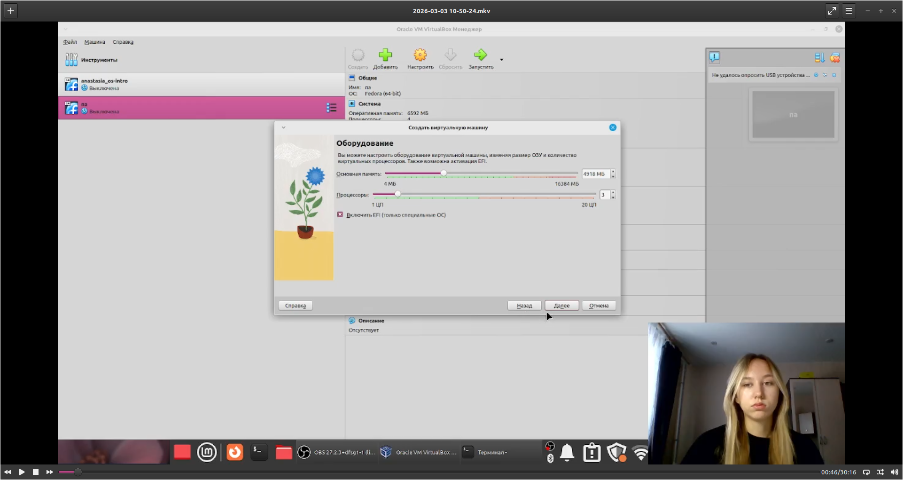{width=70%}

## Установка системы

Запускаем установку:

liveinst

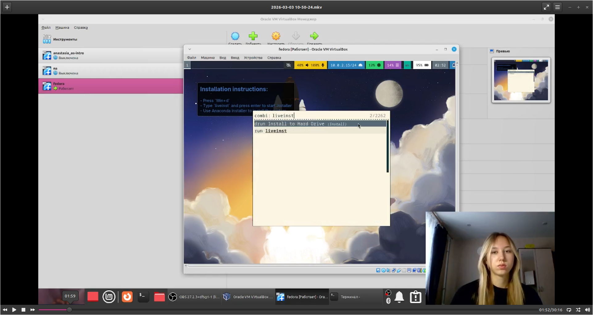{width=70%}

## Завершение установки

Выключаем машину, отключаем образ и запускаем снова

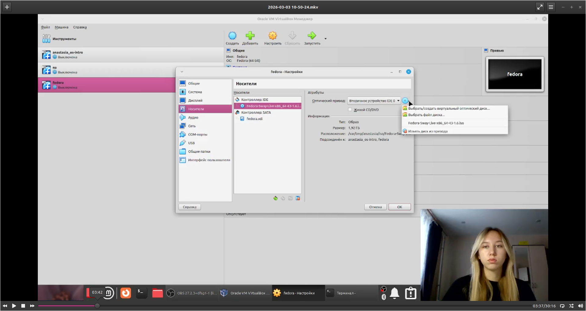{width=70%}

# Установка драйверов VirtualBox

## Вход в систему

Входим под учётной записью

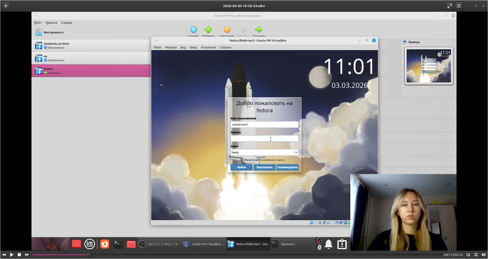{width=70%}

## Настройка прав

Переключаемся на супер-пользователя:

sudo -i

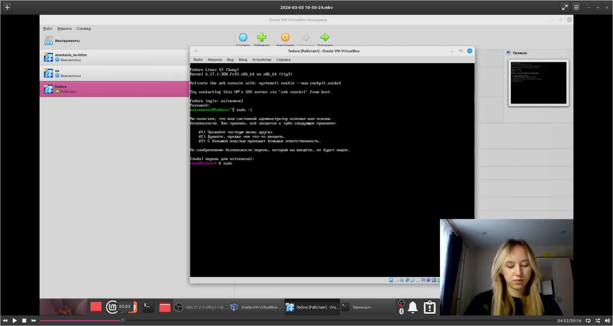{width=70%}

## Установка средств разработки

sudo dnf -y group install development-tools

{width=70%}

## Обновление пакетов

sudo dnf -y update

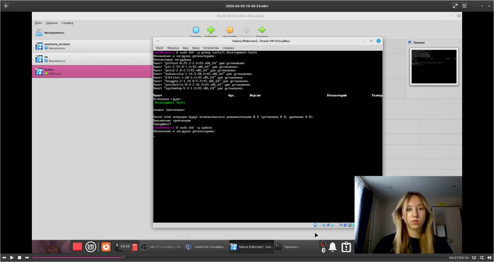{width=70%}

## Повышение комфорта работы

sudo dnf -y install tmux mc
sudo dnf -y install kitty

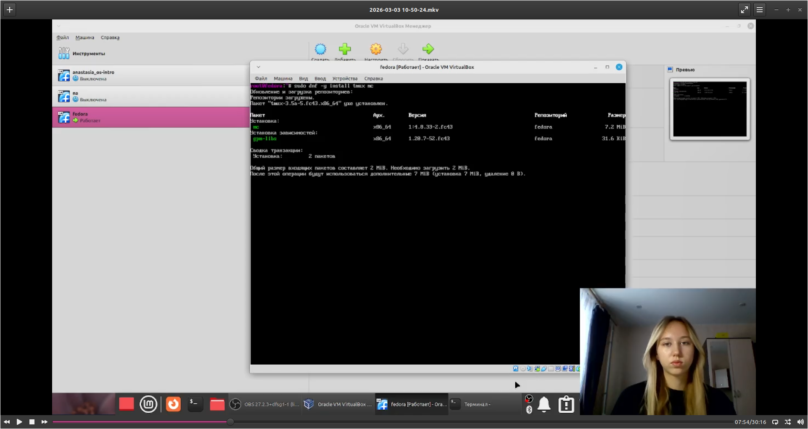{width=70%}

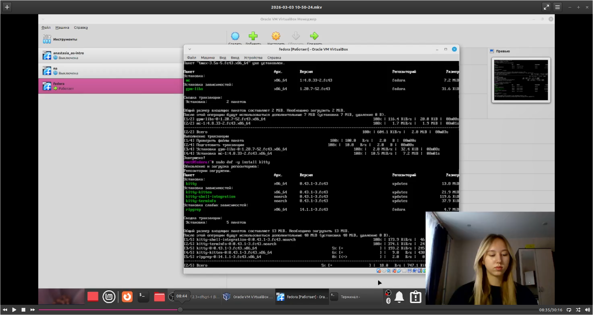{width=70%}

# Автоматическое обновление

## Настройка автоматического обновления

sudo dnf -y install dnf-automatic
sudo systemctl enable --now dnf-automatic.timer

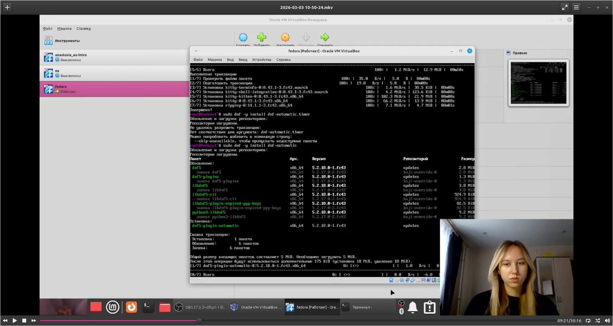{width=70%}

{width=70%}

# Отключение SELinux

## Изменение конфигурации SELinux

В файле `/etc/selinux/config` заменяем:

SELINUX=enforcing

на

SELINUX=permissive

{width=70%}

## Перезагрузка

sudo systemctl reboot

{width=70%}

# Настройка раскладки клавиатуры

## Запуск tmux

{width=70%}

## Создание конфигурационного файла

mkdir -p ~/.config/sway
touch ~/.config/sway/config.d/95-system-keyboard-config.conf

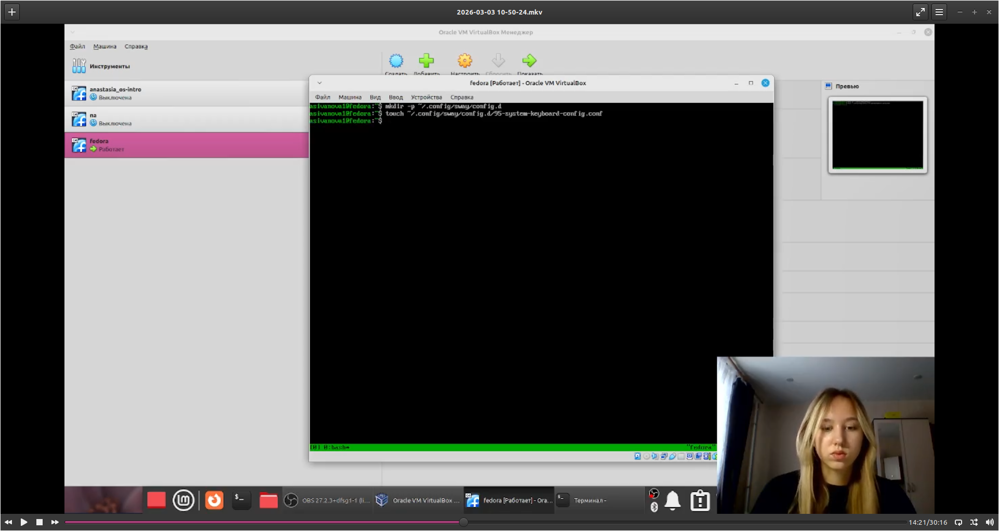{width=70%}

## Редактирование конфигурации

exec_always /usr/libexec/sway-systemd/locale1-xkb-config --oneshot

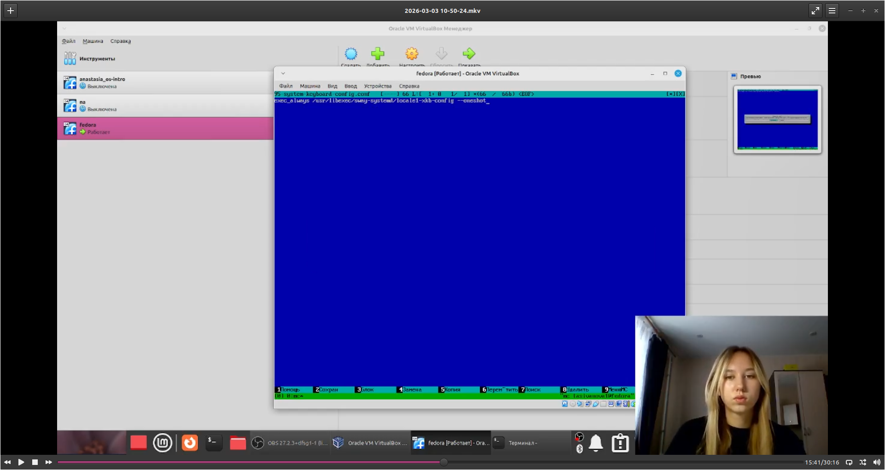{width=70%}

## Настройка X11

sudo -i

Редактируем `/etc/X11/xorg.conf.d/00-keyboard.conf`:

Section "InputClass"
Identifier "system-keyboard"
MatchIsKeyboard "on"
Option "XkbLayout" "us,ru"
Option "XkbVariant" ",winkeys"
Option "XkbOptions" "grp:rctrl_toggle,compose:ralt,terminate:ctrl_alt_bksp"
EndSection

{width=70%}

## Перезагрузка

sudo systemctl reboot

{width=70%}

# Установка ПО для документации

## Запуск tmux

tmux

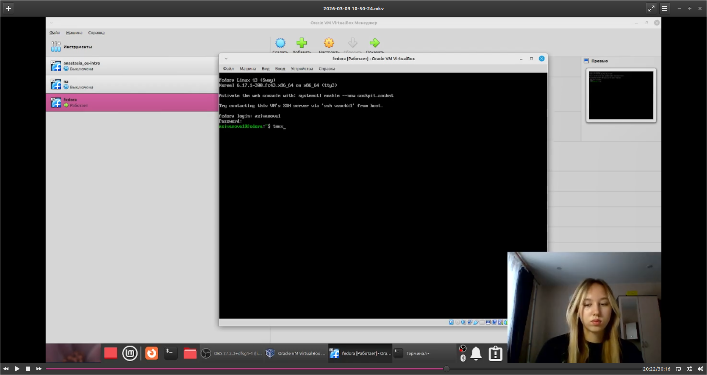{width=70%}

## Установка pandoc

sudo dnf -y install pandoc

{width=70%}

## Установка TeXlive

sudo dnf -y install texlive-scheme-full

{width=70%}

# Домашнее задание

## Получение информации о системе

Команда `dmesg | grep -i "ключевое слово"`

- Версия ядра Linux
- Частота процессора
- Модель процессора (CPU0)
- Объём доступной оперативной памяти
- Тип обнаруженного гипервизора
- Тип файловой системы корневого раздела
- Последовательность монтирования файловых систем

{width=70%}

# Контрольные вопросы

 Учётная запись пользователя

Содержит:
- Имя пользователя (username)
- UID (User ID)
- GID (Group ID)
- Домашний каталог
- Командная оболочка (shell)
- Зашифрованный пароль
- Комментарий

Все данные хранятся в `/etc/passwd`

Команды терминала

- **Справка:** `man <команда>` или `<команда> --help` (пример: `man ls`, `ls --help`)
- **Перемещение:** `cd <путь>` (пример: `cd /var/tmp`, `cd ..`)
- **Просмотр содержимого:** `ls [опции]` (пример: `ls -la` — показать всё, включая скрытые)
- **Объём каталога:** `du -sh <каталог>` (пример: `du -sh /home/anastasia`)
- **Создание каталога:** `mkdir <имя>` (пример: `mkdir new_folder`)
- **Удаление каталога:** `rmdir <имя>` (для пустого) или `rm -rf <имя>` (пример: `rm -rf old_folder`)
- **Создание файла:** `touch <файл>` или `> <файл>`
- **Удаление файла:** `rm <файл>`
- **Права доступа:** `chmod <права> <файл>` (пример: `chmod +x script.sh` — сделать исполняемым)
- **История команд:** `history` (пример: `history | grep ssh` — найти команды с ssh)

Файловая система — это способ организации и хранения данных на диске. Она определяет, как файлы именуются, где хранятся и как к ним обращаться.

Примеры:
- **ext4** — стандартная для Linux, поддерживает журналирование (восстановление после сбоев)
- **NTFS** — основная для Windows, поддерживает большие файлы и права доступа
- **FAT32** — старая, совместимая со всем, но с ограничением на размер файла (до 4 ГБ)

Подмонтированные файловые системы

mount # показать все смонтированные файловые системы
df -h # показать занятое место на смонтированных дисках (в человеко-читаемом виде)
findmnt # показать дерево монтирования
cat /etc/fstab # посмотреть, что монтируется автоматически при загрузке

Удаление зависшего процесса

ps aux | grep firefox # найти процесс (например, Firefox)
kill 1234 # завершить процесс с PID 1234 (обычное завершение)
kill -9 1234 # принудительное завершение, если процесс не отвечает
pkill firefox # завершить все процессы с именем firefox

# Вывод

## Заключение

Мы приобрели практические навыки установки операционной системы на виртуальную машину и настройки минимально необходимых для дальнейшей работы сервисов.

