---
## Author
author:
  name: Иванова Анастасия Сергеевна
  degrees: DSc
  orcid: 0000-0002-0877-7063
  email: 1132250427@rudn.ru
  affiliation:
    - name: Российский университет дружбы народов
      country: Российская Федерация
      postal-code: 117198
      city: Москва
      address: ул. Миклухо-Маклая, д. 6

## Title
title: "Отчет по лабораторной работе №1"
subtitle: "по курсу: Архитектура компьютера и операционные системы"
license: "CC BY"
---

# Цель работы

Целью данной работы является приобретение практических навыков установки операционной системы на виртуальную машину, настройки минимально необходимых для дальнейшей работы сервисов.

# Техническое обеспечение

Были скачаны следующие программы: 
виртуальная машина VirtualBox (https://www.virtualbox.org/),
дистрибутив Linux Fedora (https://getfedora.org), вариант с менеджером окон sway (https://fedoraproject.org/spins/sway/).

# Выполнение лабораторной работы

Создание виртуальной машины
	
Для использования графического интерфейса запустим менеджер виртуальных машин, введя в командной строке VirtualBox & ([рис. @fig-001]):

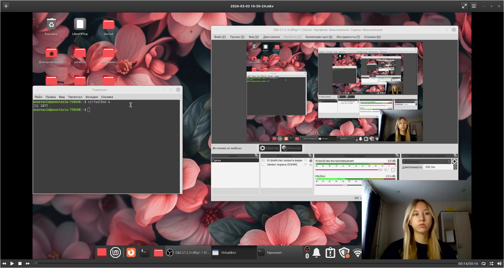{#fig-001 width=70%}

Создадим новую виртуальную машину в графическом интерфейсе ([рис. @fig-002]):

{#fig-002 width=70%}

Введем команду для установки liveinst ([рис. @fig-003]):

{#fig-003 width=70%}

Выключаем машину и отключаем носитель информации с образом, а затем снова запускаем машину ([рис. @fig-004]):

{#fig-004 width=70%}

Установка драйверов для VirtualBox
	
После установки войдем в ОС под заданной нами при установке учётной записью ([рис. @fig-005]):

{#fig-005 width=70%}

Переключимся на роль супер-пользователя sudo -i ([рис. @fig-006]):

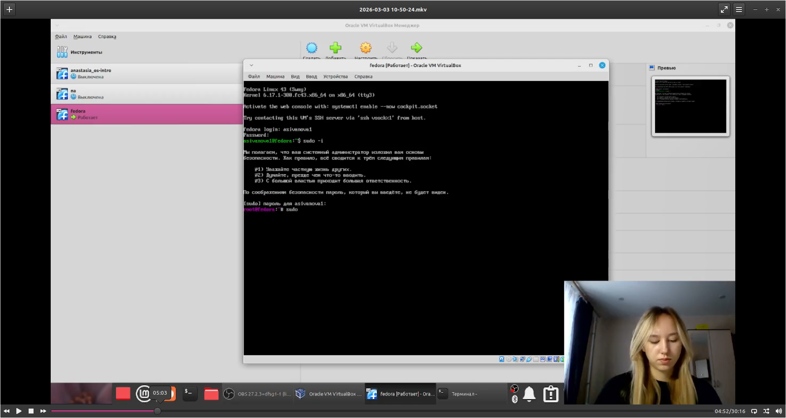{#fig-006 width=70%}

Установим средства разработки sudo dnf -y group install development-tools ([рис. @fig-007]):

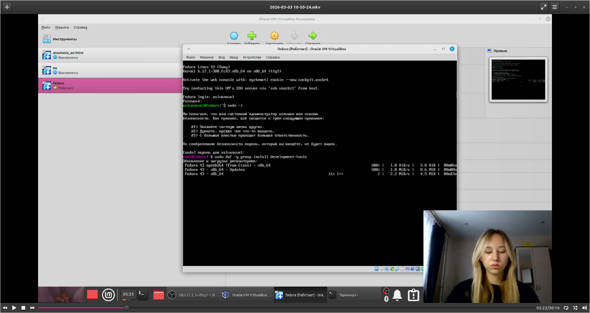{#fig-007 width=70%}

Обновим все пакеты sudo dnf -y update ([рис. @fig-008]):

{#fig-008 width=70%}

Повысим комфорт работы sudo dnf -y install tmux mc ([рис. @fig-009]):

{#fig-009 width=70%}

Установим ругой вариант консоли sudo dnf -y install kitty ([рис. @fig-010]):

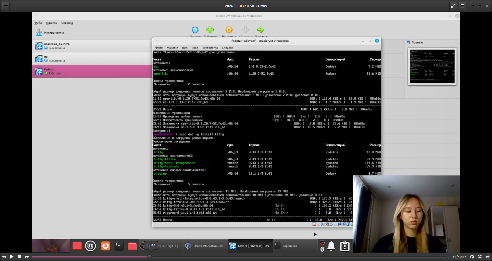{#fig-010 width=70%}

Автоматическое обновление
	
Установим программного обеспечения и зададим необходимую конфигурацию в файле /etc/dnf/automatic.conf и запустим таймер:

sudo dnf -y install dnf-automatic
sudo systemctl enable --now dnf-automatic.timer

([рис. @fig-011]):

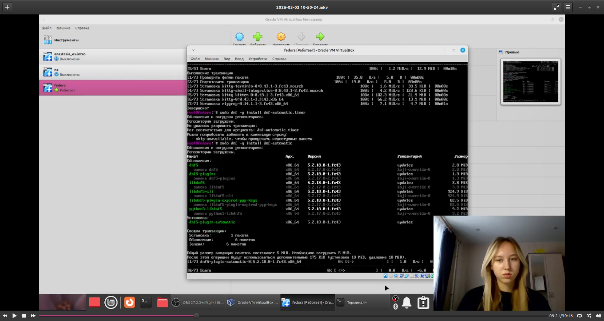{#fig-011 width=70%}

([рис. @fig-012]):

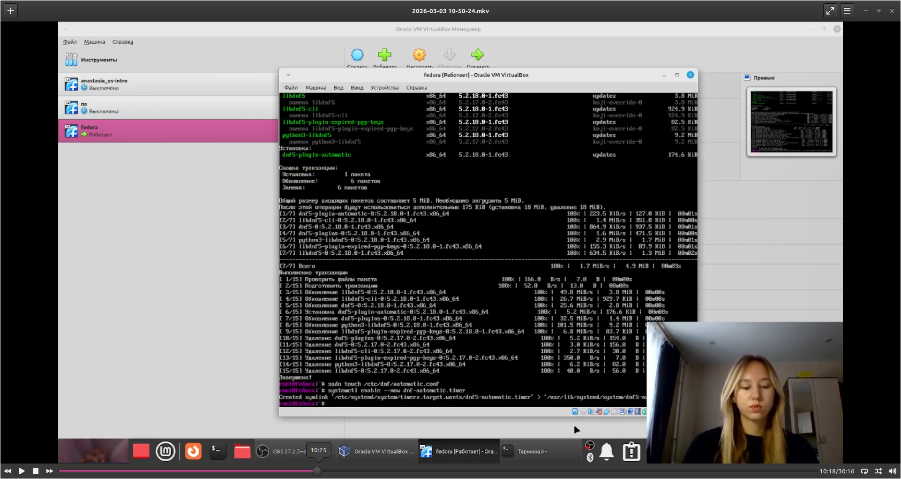{#fig-012 width=70%}

Отключение SELinux

В файле /etc/selinux/config заменим значение SELINUX=enforcing на значение SELINUX=permissive и перегрузим виртуальную машину командой sudo systemctl reboot ([рис. @fig-013]):

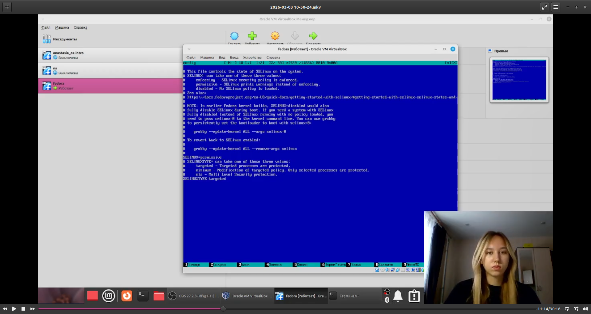{#fig-013 width=70%}

([рис. @fig-014]):

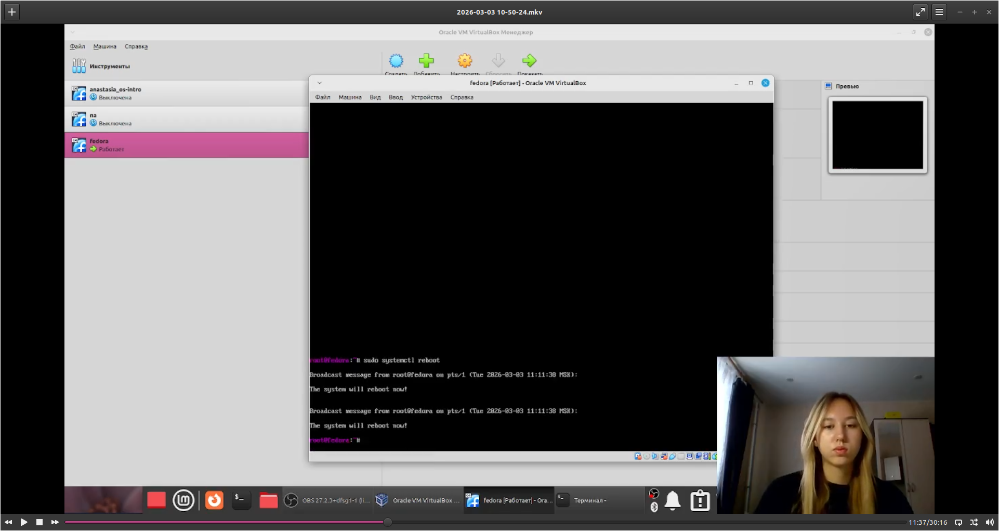{#fig-014 width=70%}

Настройка раскладки клавиатуры
	
Запустим терминальный мультиплексор tmux ([рис. @fig-015]):

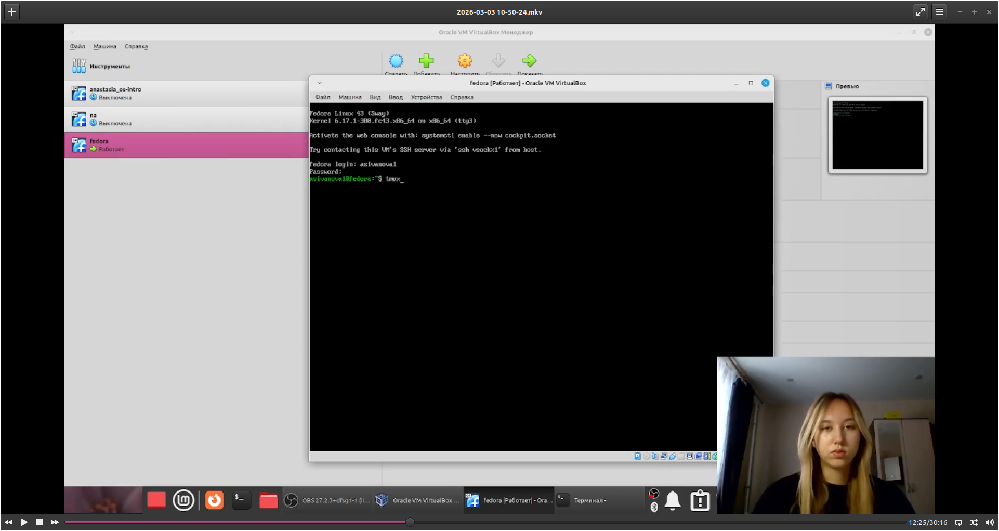{#fig-015 width=70%}

Создадим конфигурационный файл ~/.config/sway/config.d/95-system-keyboard-config.conf:
	
mkdir -p ~/.config/sway
touch ~/.config/sway/config.d/95-system-keyboard-config.conf
	
([рис. @fig-016]):

{#fig-016 width=70%}

Отредактируем конфигурационный файл командой exec_always /usr/libexec/sway-systemd/locale1-xkb-config --oneshot ([рис. @fig-017]):

{#fig-017 width=70%}

Переключимся на роль супер-пользователя sudo -i ([рис. @fig-018]):

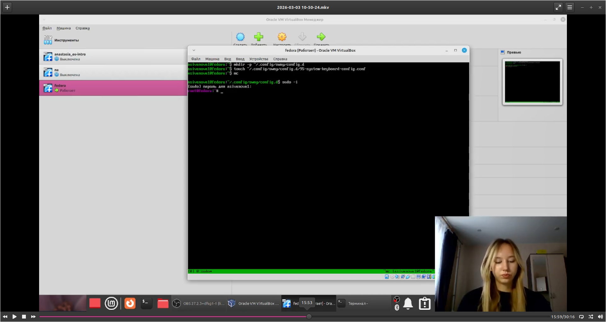{#fig-018 width=70%}

Отредактируем конфигурационный файл /etc/X11/xorg.conf.d/00-keyboard.conf с помощью файлового менеджера mc:
	
Section "InputClass"
Identifier "system-keyboard"
MatchIsKeyboard "on"
Option "XkbLayout" "us,ru"
Option "XkbVariant" ",winkeys"
Option "XkbOptions" "grp:rctrl_toggle,compose:ralt,terminate:ctrl_alt_bksp"
EndSection
	
([рис. @fig-019]):

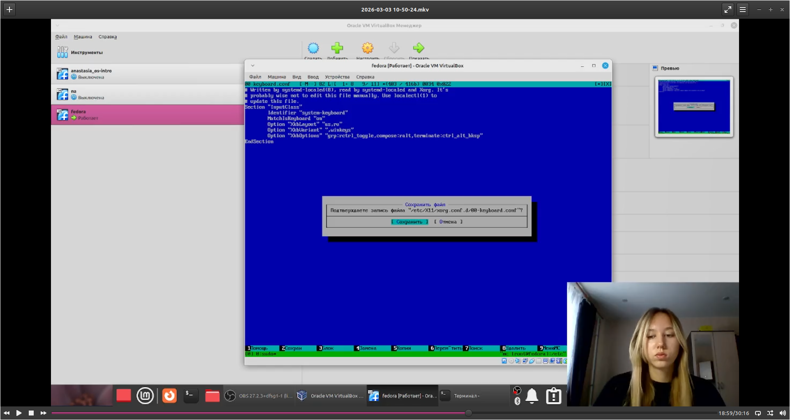{#fig-019 width=70%}

Перегрузим виртуальную машину командой sudo systemctl reboot ([рис. @fig-020]):

{#fig-020 width=70%}

Установка программного обеспечения для создания документации
	
Запустим терминальный мультиплексор tmux ([рис. @fig-021]):

{#fig-021 width=70%}

Переключимся на роль супер-пользователя и установим с помощью менеджера пакетов sudo dnf -y install pandoc ([рис. @fig-022]):

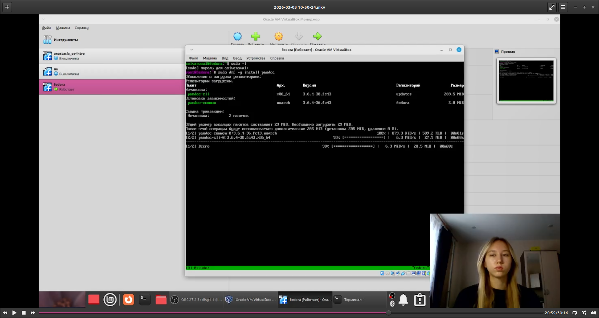{#fig-022 width=70%}

Установим дистрибутив TeXlive sudo dnf -y install texlive-scheme-full ([рис. @fig-023]):

{#fig-023 width=70%}

# Домашнее задание
	
Получим следующую информацию с помощью команды dmesg | grep -i "то, что ищем":
Версия ядра Linux (Linux version).
Частота процессора (Detected Mhz processor).
Модель процессора (CPU0).
Объём доступной оперативной памяти (Memory available).
Тип обнаруженного гипервизора (Hypervisor detected).
Тип файловой системы корневого раздела.
Последовательность монтирования файловых систем.

([рис. @fig-024]):

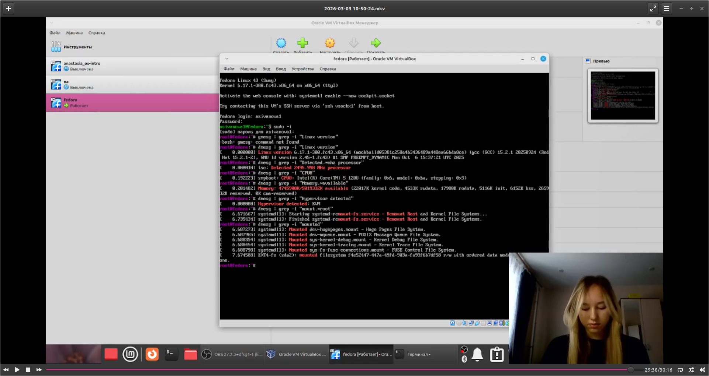{#fig-024 width=70%}

# Контрольные вопросы

1.Какую информацию содержит учётная запись пользователя?:

-Имя пользователя (username) - используется для входа
-UID (User ID) - уникальный числовой идентификатор
-GID (Group ID) - идентификатор основной группы пользователя
-Домашний каталог - например, /home/username
-Командная оболочка (shell) - например, /bin/bash
-Зашифрованный пароль (хранится в /etc/shadow)
-Комментарий (обычно ФИО или описание)

Все эти данные хранятся в файле /etc/passwd

2.Укажите команды терминала и приведите примеры:

для получения справки по команде: man <команда> или <команда> --help(man ls, ls --help)
для перемещения по файловой системе: cd <путь>(cd /var/tmp, cd)
для просмотра содержимого каталога: ls [опции](ls -la (показать всё, включая скрытые))
для определения объёма каталога: du -sh <каталог>(du -sh /home/anastasia)
для создания / удаления каталогов / файлов:mkdir <имя>(mkdir new_folder); rmdir <имя> (пустой) или rm -rf <имя>(rm -rf old_folder); 
для задания определённых прав на файл / каталог:chmod <права> <файл>(chmod +x script.sh (сделать исполняемым))
для просмотра истории команд:history	history | grep ssh((найти команды с ssh))

3.Что такое файловая система? Приведите примеры с краткой характеристикой: Файловая система - это способ организации и хранения данных на диске. Она определяет, как файлы именуются, где хранятся и как к ним обращаться(Примеры: ext4 - стандартная для Linux, поддерживает журналирование (восстановление после сбоев); NTFS - основная для Windows, поддерживает большие файлы и права доступа; FAT32 - старая, совместимая со всем, но с ограничением на размер файла (до 4 ГБ))

4.Как посмотреть, какие файловые системы подмонтированы в ОС:
 
mount              # показать все смонтированные файловые системы
df -h              # показать занятое место на смонтированных дисках (в человеко-читаемом виде)
findmnt            # показать дерево монтирования
cat /etc/fstab     # посмотреть, что монтируется автоматически при загрузке

5.Как удалить зависший процесс: 

ps aux | grep firefox	# найти процесс
kill 1234		# завершить

# Вывод

Мы приобрели практические навыки установки операционной системы на виртуальную машину и настройки минимально необходимых для дальнейшей работы сервисов.

::: {#refs}
:::
