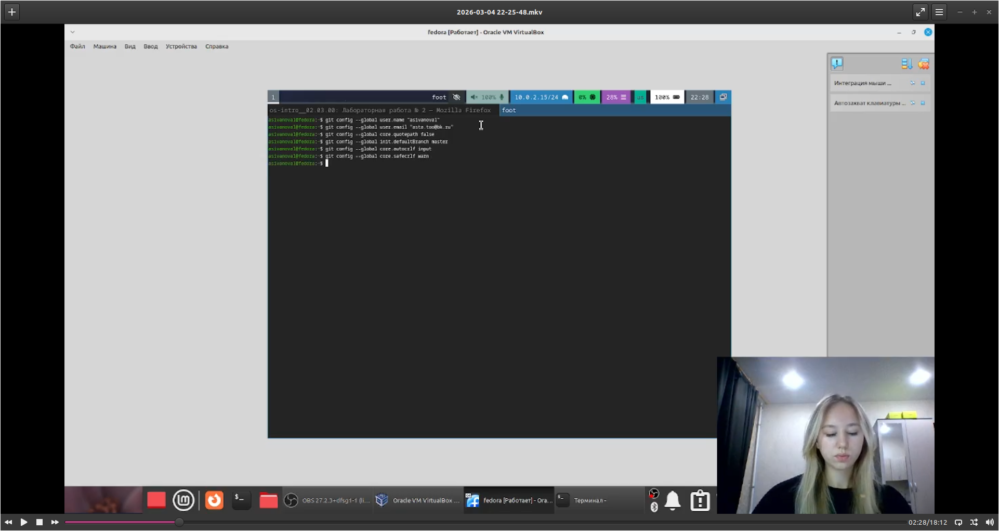
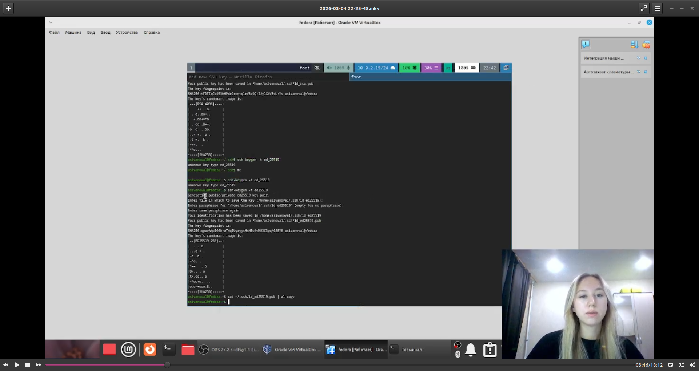
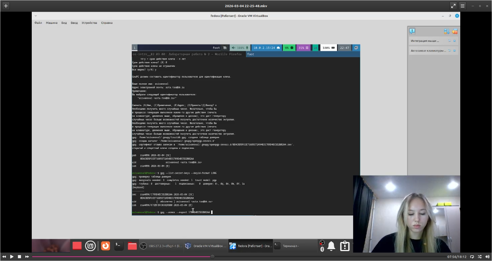
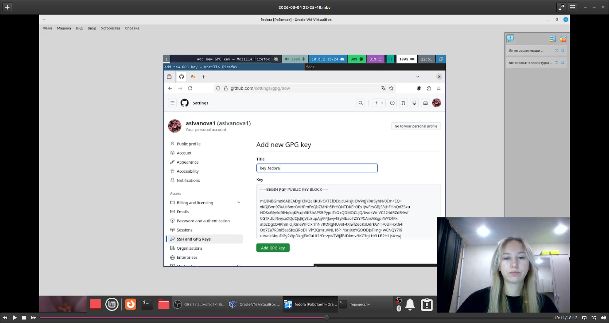
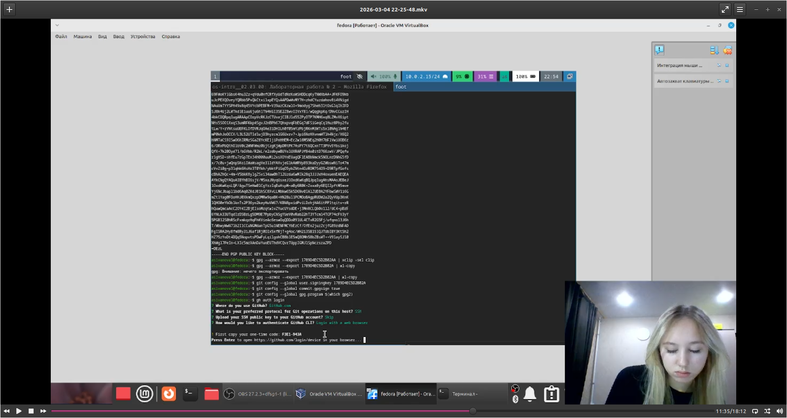
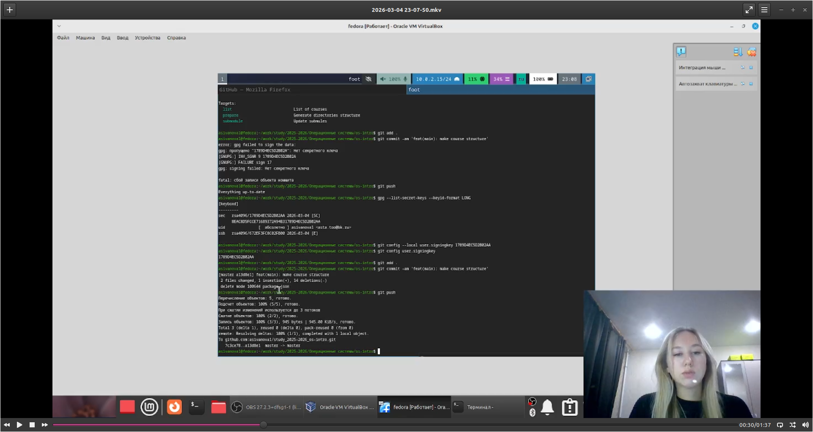

---
author:
  name: Иванова Анастасия Сергеевна
  degrees: DSc
  orcid: 0000-0002-0877-7063
  email: 1132250427@rudn.ru
  affiliation:
    - name: Российский университет дружбы народов
      country: Российская Федерация
      postal-code: 117198
      city: Москва
      address: ул. Миклухо-Маклая, д. 6
title: "Лабораторная работа №2"
subtitle: "Системы контроля версий (Git)"
license: CC BY
date: today
date-format: "YYYY-MM-DD"
format:
  revealjs:
    theme: default
    slide-number: true
    preview-links: auto
  pptx: default
  beamer:
    toc: true
    toc-title: "Содержание"
    number-sections: true
---

# Докладчик

:::::::::::::: {.columns align=center}
::: {.column width="70%"}

  * Иванова Анастасия Сергеевна
  * 1 курс группа НКАбд-07-25
  * Российский университет дружбы народов
  * [1132250427@rudn.ru](mailto:1132250427@rudn.ru)

:::
::: {.column width="30%"}

{width=100%}

:::
::::::::::::::

# Цель работы

## Цель работы

Изучить идеологию и применение средств контроля версий и освоить умения по работе с git.

# Техническое обеспечение

## Используемое ПО

dnf install git
dnf install gh

# Выполнение работы

## Базовая настройка git

git config --global user.name "Name Surname"
git config --global user.email "work@mail"
git config --global core.quotepath false
git config --global init.defaultBranch master
git config --global core.autocrlf input
git config --global core.safecrlf warn

{width=70%}

## Создание SSH-ключа (RSA)

ssh-keygen -t rsa -b 4096

{width=70%}

## Копирование SSH-ключа

xclip -i < ~/.ssh/id_ed25519.pub

{width=70%}

## Добавление SSH-ключа на GitHub

- Настройки аккаунта → **SSH and GPG keys**
- **New SSH key**
- Title: `ed25519@hostname`
- Вставить ключ → **Add SSH key**

{width=70%}

## Создание PGP-ключа

gpg --full-generate-key

{width=70%}

## Просмотр PGP-ключей

gpg --list-secret-keys --keyid-format LONG

{width=70%}

## Копирование PGP-ключа

gpg --armor --export <PGP Fingerprint> | xclip -sel clip

{width=70%}

## Добавление PGP-ключа на GitHub

- **New GPG key**
- Вставить ключ → **Add GPG key**

{width=70%}

## Настройка подписей коммитов

git config --global user.signingkey <PGP Fingerprint>
git config --global commit.gpgsign true
git config --global gpg.program $(which gpg2)

## Авторизация в GitHub CLI

gh auth login

{width=70%}

## Создание репозитория

mkdir -p ~/work/study/2025-2026/"Операционные системы"
cd ~/work/study/2025-2026/"Операционные системы"
gh repo create study_2025-2026_os-intro --template=yamadharma/course-directory-student-template --public
git clone --recursive git@github.com:asivanova1/study_2025-2026_os-intro.git os-intro

{width=70%}

## Настройка каталога курса

cd ~/work/study/2025-2026/"Операционные системы"/os-intro
rm package.json
echo os-intro > COURSE
make

{width=70%}

## Отправка на сервер

git add .
git commit -am 'feat(main): make course structure'
git pus

{width=70%}

# Контрольные вопросы

## Системы контроля версий (VCS)

**Что такое VCS?**  
Программные инструменты, которые отслеживают и фиксируют изменения в файлах, позволяя:

- возвращаться к предыдущим версиям
- работать над проектом нескольким людям одновременно
- видеть кто и когда вносил правки
- восстанавливать утерянные данные

## Основные понятия VCS

- **Хранилище** — база данных со всеми версиями файлов и историей изменений
- **Commit** — сохранение текущего состояния файлов в хранилище с комментарием
- **История** — цепочка всех сделанных commit'ов в хронологическом порядке
- **Рабочая копия** — локальная версия файлов для работы

## Централизованные и децентрализованные VCS

**Централизованные (SVN, CVS):**
- единый сервер с хранилищем
- требуется подключение к нему

**Децентрализованные (Git, Mercurial):**
- у каждого полная копия хранилища локально
- можно работать без интернета

## Единоличная работа с хранилищем

1. Создать репозиторий
2. Работать с файлами
3. Добавлять их в индекс
4. Делать commit
5. Смотреть историю
6. При необходимости откатываться к старым версиям

## Работа с общим хранилищем

1. Клонировать удалённый репозиторий
2. Перед работой забрать изменения (`pull`)
3. Работать, сделать commit локально
4. Отправить изменения (`push`)

## Задачи Git

- Управление версиями
- Ветвление и слияние
- Распределённая работа
- Целостность данных
- Работа офлайн
- Отслеживание авторства

## Основные команды Git

| Команда | Назначение |
|---------|------------|
| `init` | создать репозиторий |
| `clone` | скопировать удалённый репозиторий |
| `add` | добавить изменения в индекс |
| `commit` | зафиксировать изменения |
| `status` | состояние файлов |
| `log` | история |
| `push` | отправить на сервер |
| `pull` | забрать с сервера |
| `branch` | работа с ветками |
| `checkout` | переключение между ветками |
| `merge` | слияние веток |

## Примеры использования

**Локально:**

git init
git add .
git commit -m "сообщение"
git log

**С удалённым репозиторием:**

git clone ссылка
git checkout -b новая-ветка
git add .
git commit -m "сообщение"
git push origin новая-ветка
git pull origin main

## Ветви (branches)

**Что такое:** отдельные линии разработки

**Зачем нужны:**
- изолированная разработка новых функций
- параллельная работа над разными задачами
- исправление ошибок без отвлечения от основной работы
- эксперименты без риска сломать стабильную версию

## Игнорирование файлов (.gitignore)

**Зачем:**
- не засорять репозиторий временными и системными файлами
- не хранить пароли и ключи
- не добавлять сгенерированные файлы
- экономить место
- избегать конфликтов

**Как:** через файл `.gitignore` с шаблонами

# Вывод

## Заключение

Мы изучили идеологию и применение средств контроля версий, а также освоили умения по работе с git.

