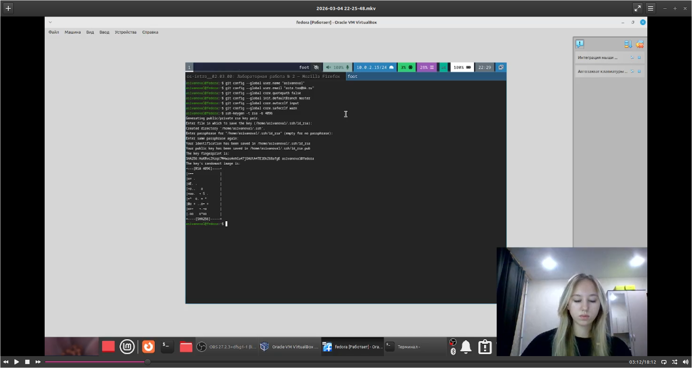
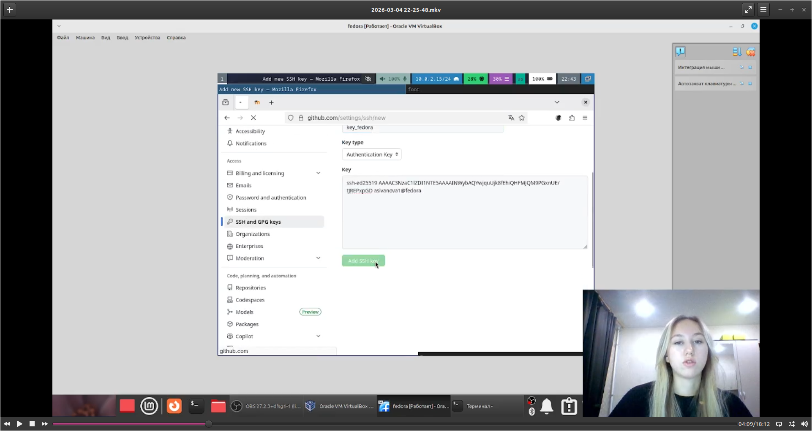
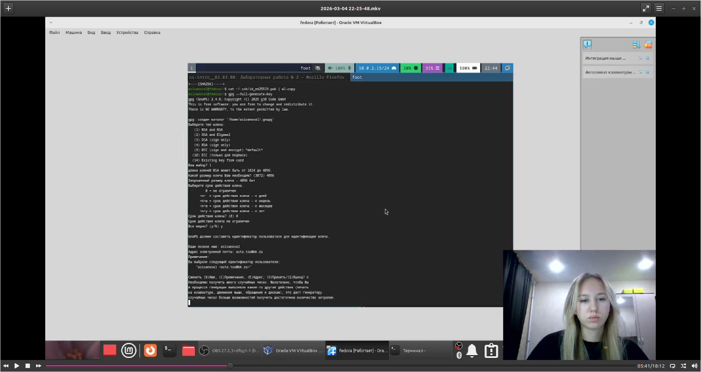

---
## Author
author:
  name: Иванова Анастасия Сергеевна
  degrees: DSc
  orcid: 0000-0002-0877-7063
  email: 1132250427@rudn.ru
  affiliation:
    - name: Российский университет дружбы народов
      country: Российская Федерация
      postal-code: 117198
      city: Москва
      address: ул. Миклухо-Маклая, д. 6

## Title
title: "Отчет по лабораторной работе №2"
subtitle: "по курсу: Архитектура компьютера и операционные системы"
license: "CC BY"
---

# Цель работы

Изучить идеологию и применение средств контроля версий и освоить умения по работе с git.

# Техническое обеспечение

Был скачан пакет: dnf install git, dnf install gh.

# Выполнение лабораторной работы

Базовая настройка git

Зададим имя и email владельца репозитория, настроим utf-8 в выводе сообщений git и  верификацию с подписанием коммитов git, зададим имя начальной ветки, а также установим параметр autocrlf и safecrlf

git config --global user.name "Name Surname"
git config --global user.email "work@mail"
git config --global core.quotepath false
git config --global init.defaultBranch master
git config --global core.autocrlf input
git config --global core.safecrlf warn

([рис. @fig-001]):

{#fig-001 width=70%}

Создание ключа ssh по алгоритму rsa с ключём размером 4096 бит командой ssh-keygen -t rsa -b 4096 ([рис. @fig-002]):

{#fig-002 width=70%}

Добавим SSH-ключа в учётную запись GitHub, скопировав созданный SSH-ключ в буфер обмена командой xclip -i < ~/.ssh/id_ed25519.pub ([рис. @fig-003]):

{#fig-003 width=70%}

Откроем настройки своего аккаунта на GitHub и перейдем в раздел SSH and GPC keys, нажмем кнопку ew SSH key, добавим в поле Title название этого ключа, например, ed25519@hostname, а затем вставим из буфера обмена в поле Key ключ. Нажмем кнопку Add SSH key ([рис. @fig-004]):

{#fig-004 width=70%}

Создадим ключи pgp

Генерируем ключ gpg --full-generate-key ([рис. @fig-005]):

{#fig-005 width=70%}

Добавим PGP ключ в GitHub. Выведем список ключей и копируем отпечаток приватного ключа gpg --list-secret-keys --keyid-format LONG ([рис. @fig-006]):

{#fig-006 width=70%}

Cкопируем ваш сгенерированный PGP ключ в буфер обмена gpg --armor --export <PGP Fingerprint> | xclip -sel clip ([рис. @fig-007]):

{#fig-007 width=70%}

Перейдем в настройки GitHub (https://github.com/settings/keys), нажмем на кнопку New GPG key и вставить полученный ключ в поле ввода ([рис. @fig-008]):

{#fig-008 width=70%}

Настройка автоматических подписей коммитов git

Используем введёный email, указав Git при подписи коммитов:

git config --global user.signingkey <PGP Fingerprint>
git config --global commit.gpgsign true
git config --global gpg.program $(which gpg2)

После этого авторизуемся командой gh auth login, ответив на несколько наводящих вопросов и авторизуемся через браузер ([рис. @fig-009]):

{#fig-009 width=70%}

Сознание репозитория курса на основе шаблона

Создадим рабочее пространство на основе шаблона:

mkdir -p ~/work/study/2025-2026/"Операционные системы"
cd ~/work/study/2025-2026/"Операционные системы"
gh repo create study_2025-2026_os-intro --template=yamadharma/course-directory-student-template --public
git clone --recursive git@github.com:<owner>/study_2025-2026_os-intro.git os-intro

([рис. @fig-010]):

{#fig-010 width=70%}

Настройка каталога курса

Перейдем в каталог курса, удалим лишние файлы и создадим необходимые каталоги:

cd ~/work/study/2025-2026/"Операционные системы"/os-intro
rm package.json
echo os-intro > COURSE
make

([рис. @fig-011]):

{#fig-011 width=70%}

Отправим файлы на сервер:

git add .
git commit -am 'feat(main): make course structure'
git push

([рис. @fig-012]):

{#fig-012 width=70%}

# Контрольные вопросы

1.Что такое системы контроля версий (VCS) и для решения каких задач они предназначаются:это программные инструменты, которые отслеживают и фиксируют изменения в файлах, позволяя возвращаться к предыдущим версиям, работать над проектом нескольким людям одновременно, видеть кто и когда вносил правки, и восстанавливать утерянные данные.

2.Объясните следующие понятия VCS и их отношения: хранилище - база данных, где хранятся все версии файлов и история изменений; сommit - сохранение текущего состояния файлов в хранилище с комментарием; история - цепочка всех сделанных commitом в хронологическом порядке; рабочая копия - локальная версия файлов, с которой непосредственно работает пользователь; связь - пользователь меняет рабочую копию, фиксирует изменения через commit, и они попадают в хранилище, дополняя историю.

3.Что представляют собой и чем отличаются централизованные и децентрализованные VCS? Приведите примеры VCS каждого вида: централизованные - есть единый сервер с хранилищем, для работы нужно подключение к нему. Рабочая копия содержит только последнюю версию. Примеры: SVN, CVS; децентрализованные - у каждого разработчика полная копия хранилища локально, можно работать без интернета. Примеры: Git, Mercurial.

4.Опишите действия с VCS при единоличной работе с хранилищем: создаем репозиторий, работаем с файлами, добавляем их в индекс, делаем commit, смотрим историю, при необходимости откатываемся к старым версиям. 

5.Опишите порядок работы с общим хранилищем VCS: клонируем удалённый репозиторий, перед началом работы забираем актуальные изменения (pull), работаем, делаем commit локально, отправляем изменения в общее хранилище (push).

6.Каковы основные задачи, решаемые инструментальным средством git: управление версиями, поддержка ветвления и слияния, распределённая работа, целостность данных, возможность работать офлайн, отслеживание авторства.

7.Назовите и дайте краткую характеристику командам git: 

init - создать репозиторий
clone - скопировать удалённый репозиторий
add - добавить изменения в индекс
commit - зафиксировать изменения
status - посмотреть состояние файлов
log - посмотреть историю
push - отправить изменения на сервер
pull - забрать изменения с сервера
branch - работать с ветками
checkout - переключиться между ветками
merge - слить ветки

8.Приведите примеры использования при работе с локальным и удалённым репозиториями: локально - git init(создание файла), git add, git commit -m "сообщение", git log; с удалённым - git clone ссылка, git checkout -b новая-ветка, git add,  git commit, git push origin новая-ветка, git pull origin main

9.Что такое и зачем могут быть нужны ветви (branches): это отдельные линии разработки. Нужны чтобы: разрабатывать новые функции изолированно от основной версии, параллельно работать над разными задачами, исправлять ошибки не отвлекаясь от основной работы, экспериментировать без риска сломать стабильную версию.

10.Как и зачем можно игнорировать некоторые файлы при commit: игнорирование файлов делается через файл .gitignore, где перечисляются шаблоны файлов/папок. Нужно чтобы: не засорять репозиторий временными и системными файлами, не хранить пароли и ключи, не добавлять сгенерированные файлы (которые можно восстановить), экономить место, избегать конфликтов из-за файлов специфичных для конкретного разработчика.

# Вывод

Мы изучили идеологию и применение средств контроля версий, а также освоили умения по работе с git.

::: {#refs}
:::
