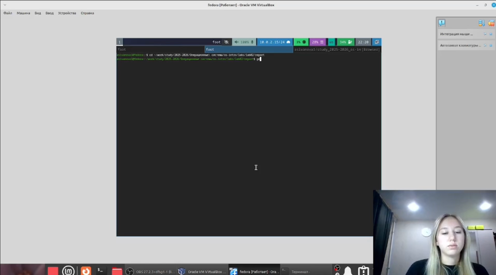

---
author:
  name: Иванова Анастасия Сергеевна
  degrees: DSc
  orcid: 0000-0002-0877-7063
  email: 1132250427@rudn.ru
  affiliation:
    - name: Российский университет дружбы народов
      country: Российская Федерация
      postal-code: 117198
      city: Москва
      address: ул. Миклухо-Маклая, д. 6
title: "Лабораторная работа №3"
subtitle: "Оформление отчётов с помощью Markdown"
license: CC BY
date: today
date-format: "YYYY-MM-DD"
format:
  revealjs:
    theme: default
    slide-number: true
    preview-links: auto
  pptx: default
---

# Докладчик

:::::::::::::: {.columns align=center}
::: {.column width="70%"}

  * Иванова Анастасия Сергеевна
  * 1 курс группа НКАбд-07-25
  * Российский университет дружбы народов
  * [1132250427@rudn.ru](mailto:1132250427@rudn.ru)

:::
::: {.column width="30%"}

{width=100%}

:::
::::::::::::::

# Актуальность темы

## Обоснование актуальности

- Markdown — стандарт оформления технической документации в современных IT-проектах
- Поддерживается всеми крупными платформами (GitHub, GitLab, Notion)
- Позволяет быстро создавать структурированные тексты без изучения сложных редакторов
- Конвертация в различные форматы (PDF, DOCX, HTML) с помощью Pandoc автоматизирует подготовку отчётов

# Объект и предмет исследования

## Объект исследования

- Легковесный язык разметки Markdown
- Инструменты для преобразования Markdown-документов (Pandoc)
- Система автоматизации сборки Make

## Предмет исследования

- Синтаксис Markdown для оформления текстовых документов
- Процесс создания отчёта по лабораторной работе в формате Markdown
- Конвертация Markdown-файлов в PDF и DOCX форматы

# Цель работы

## Цель работы

Научиться оформлять отчёты с помощью легковесного языка разметки Markdown.

# Выполнение работы

## Переход в каталог с шаблоном

cd ~/work/study/2025-2026/Операционные системы/os-intro/labs/lab03/report

{width=70%}

## Редактирование отчёта

Открываем файл и изменяем его содержимое:

gedit report.md

{width=70%}

## Компиляция отчёта

Преобразуем файл из формата Markdown в PDF и DOCX:

make

pandoc report.md -o report.pdf
pandoc report.md -o report.docx

{width=70%}

## Отправка на глобальный репозиторий

git add .
git commit -m "lab03 report done"
git push

{width=70%}

# Вывод

## Заключение

Мы научились оформлять отчёты с помощью легковесного языка разметки Markdown.

Теперь презентация полностью соответствует структуре первых двух лабораторных работ.

