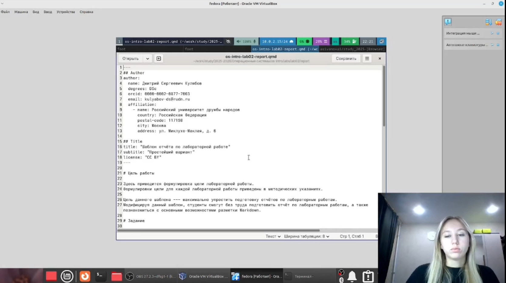
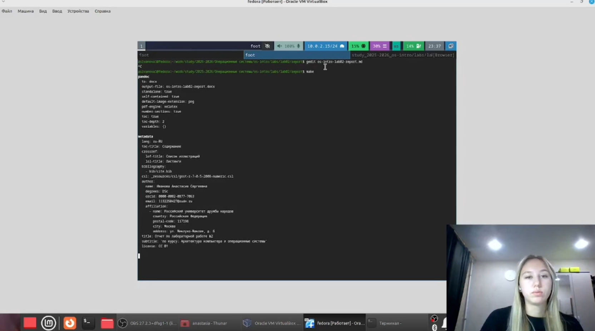
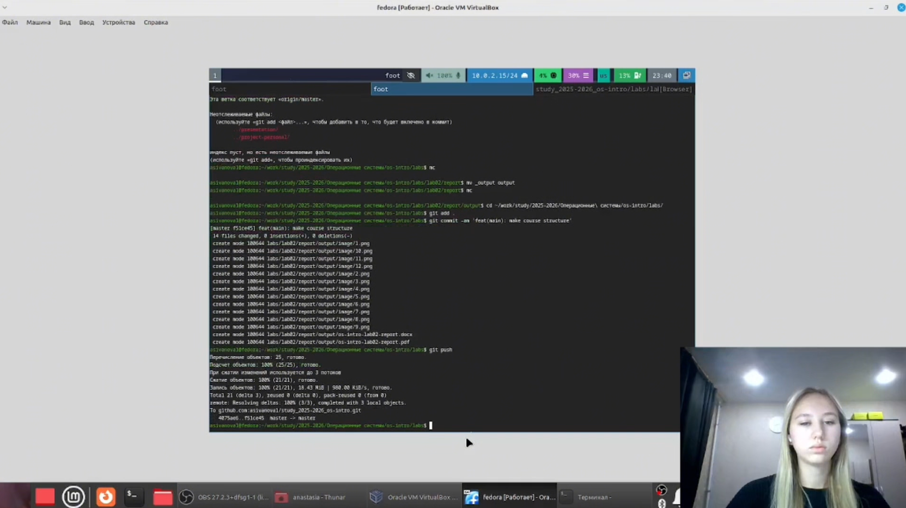

---
## Author
author:
  name: Иванова Анастасия Сергеевна
  degrees: DSc
  orcid: 0000-0002-0877-7063
  email: 1132250427@rudn.ru
  affiliation:
    - name: Российский университет дружбы народов
      country: Российская Федерация
      postal-code: 117198
      city: Москва
      address: ул. Миклухо-Маклая, д. 6

## Title
title: "Отчет по лабораторной работе №3"
subtitle: "по курсу: Архитектура компьютера и операционные системы"
license: "CC BY"
---

# Цель работы

Научиться оформлять отчёты с помощью легковесного языка разметки Markdown.

# Выполнение лабораторной работы

Переходим в каталог, где находится шаблон для отчета ([рис. @fig-001]):

{#fig-001 width=70%}

Открываем файл с помощью gedit и изменяем его ([рис. @fig-002]):

{#fig-002 width=70%}

После отредактирования файла мы выполняем компеляцию из формата md в pdf и docx ([рис. @fig-003]):

{#fig-003 width=70%}

Отправляем созданные и скомпелированные файлы на глобальный репозиторий ([рис. @fig-004]):

{#fig-004 width=70%}

# Вывод

Мы научились оформлять отчёты с помощью легковесного языка разметки Markdown.

::: {#refs}
:::
