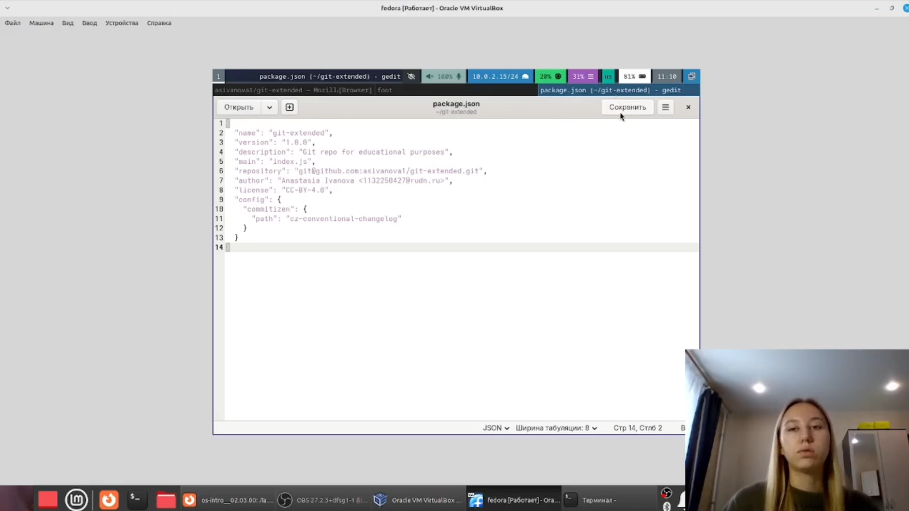
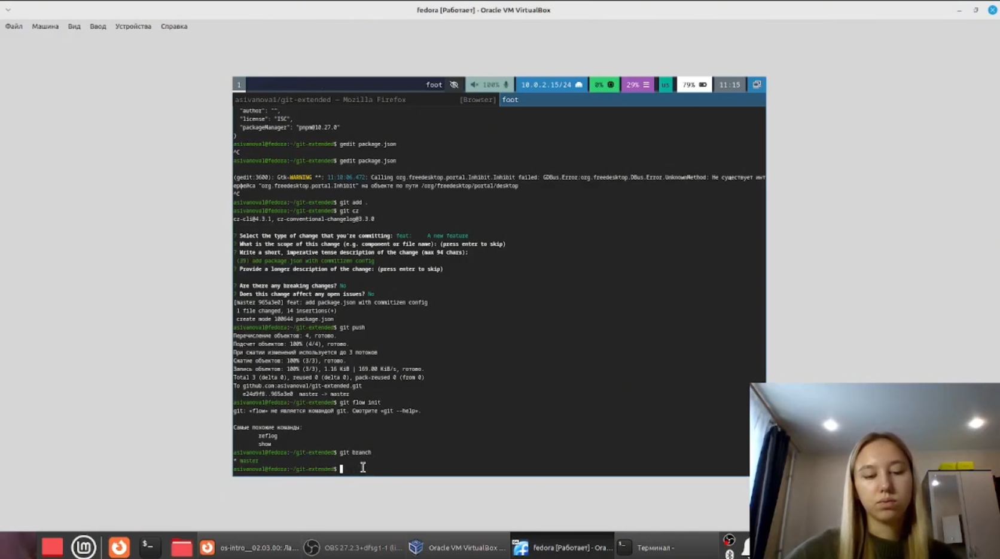
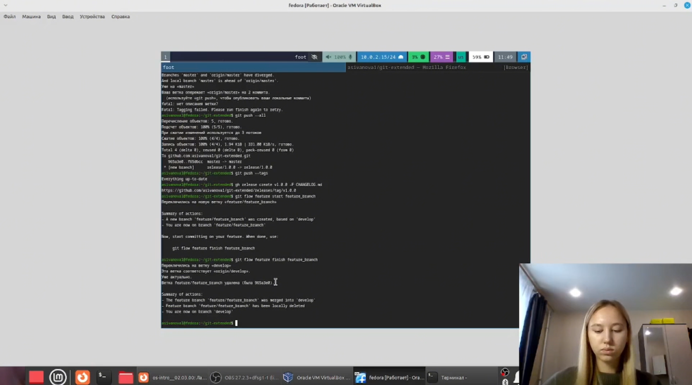
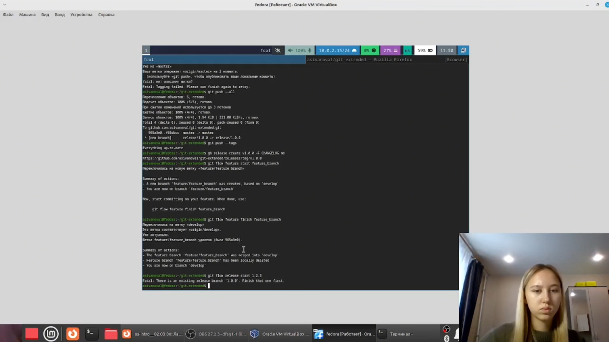
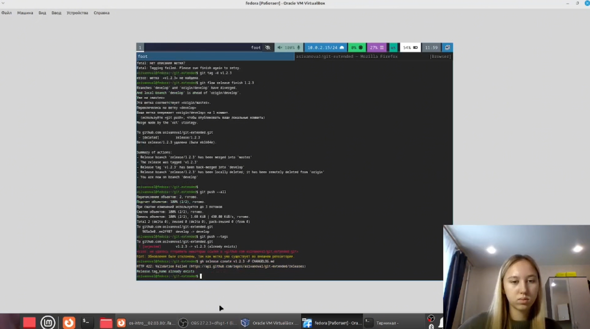
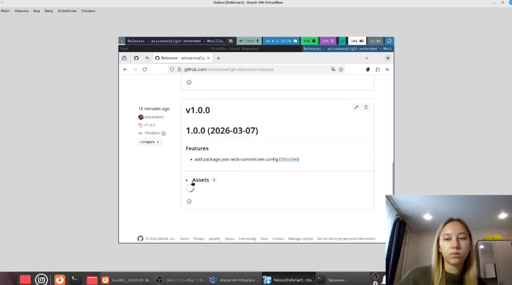

---
author:
  name: Иванова Анастасия Сергеевна
  degrees: DSc
  orcid: 0000-0002-0877-7063
  email: 1132250427@rudn.ru
  affiliation:
    - name: Российский университет дружбы народов
      country: Российская Федерация
      postal-code: 117198
      city: Москва
      address: ул. Миклухо-Маклая, д. 6
title: "Лабораторная работа №4"
subtitle: "Работа с git (Gitflow, Conventional Commits)"
license: CC BY
date: today
date-format: "YYYY-MM-DD"
format:
  revealjs:
    theme: default
    slide-number: true
    preview-links: auto
  pptx: default
---

# Докладчик

:::::::::::::: {.columns align=center}
::: {.column width="70%"}

  * Иванова Анастасия Сергеевна
  * 1 курс группа НКАбд-07-25
  * Российский университет дружбы народов
  * [1132250427@rudn.ru](mailto:1132250427@rudn.ru)

:::
::: {.column width="30%"}

{width=100%}

:::
::::::::::::::

# Актуальность темы

## Обоснование актуальности

- Gitflow — стандартная модель ветвления для крупных проектов с релизным циклом
- Conventional Commits обеспечивают автоматическую генерацию журналов изменений
- Семантическое версионирование (SemVer) — общепринятый стандарт нумерации версий ПО
- Навыки работы с git-flow необходимы для командной разработки и управления релизами

# Объект и предмет исследования

## Объект исследования

- Система контроля версий Git
- Модели ветвления (branching models)
- Инструменты для семантического версионирования

## Предмет исследования

- Рабочий процесс Gitflow
- Спецификация Conventional Commits
- Семантическое версионирование (SemVer)
- Инструменты: git-flow, commitizen, standard-changelog

# Цель работы

## Цель работы

Получение навыков правильной работы с репозиториями git.

# Выполнение работы

## Установка программного обеспечения

Устанавливаем git-flow, Node.js и pnpm:

sudo dnf copr enable elegos/gitflow
sudo dnf install gitflow
sudo dnf install nodejs
sudo dnf install pnpm
text

{width=70%}
{width=70%}

## Настройка Node.js

Выполняем настройку pnpm и обновляем переменные окружения:

pnpm setup
source ~/.bashrc
text

{width=70%}

## Установка инструментов для коммитов

Устанавливаем commitizen и standard-changelog:

pnpm add -g commitizen
pnpm add -g standard-changelog
text

{width=70%}

## Создание репозитория на GitHub

Создаём репозиторий `git-extended` через веб-интерфейс GitHub. Инициализируем локальный репозиторий и делаем первый коммит:

git init
git commit -m "first commit"
git remote add origin git@github.com:asivanova1/git-extended.git
git push -u origin master
text

{width=70%}

## Конфигурация общепринятых коммитов

Инициализируем Node.js-пакет и редактируем `package.json`:

pnpm init
text

{
"name": "git-extended",
"version": "1.0.0",
"description": "Git repo for educational purposes",
"main": "index.js",
"repository": "git@github.com:asivanova1/git-extended.git",
"author": "Anastasia Ivanova 1132250427@rudn.ru",
"license": "CC-BY-4.0",
"config": {
"commitizen": {
"path": "cz-conventional-changelog"
}
}
}
text

{width=70%}

## Добавление файлов и коммит через commitizen

Добавляем файлы и выполняем коммит:

git add .
git cz
git push
text

{width=70%}

## Конфигурация git-flow

Инициализируем git-flow с префиксом `v`:

git flow init
git branch
text

{width=70%}

## Отправка веток на GitHub

Отправляем все ветки и настраиваем отслеживание:

git push --all
git branch --set-upstream-to=origin/develop develop
text

{width=70%}

## Создание первого релиза (v1.0.0)

Создаём релиз с версией 1.0.0:

git flow release start 1.0.0
standard-changelog --first-release
git add CHANGELOG.md
git commit -am 'chore(site): add changelog'
git flow release finish 1.0.0
text

{width=70%}

## Отправка изменений и создание релиза на GitHub

Отправляем изменения и создаём релиз:

git push --all
git push --tags
gh release create v1.0.0 -F CHANGELOG.md
text

{width=70%}

## Разработка новой функциональности

Создаём и завершаем функциональную ветку:

git flow feature start feature_branch
git flow feature finish feature_branch
text

{width=70%}

## Создание второго релиза (v1.2.3)

Создаём релизную ветку для версии 1.2.3:

git flow release start 1.2.3
text

{width=70%}

## Обновление версии и журнала изменений

Обновляем `package.json` и генерируем changelog:

обновляем version в package.json до 1.2.3

standard-changelog
git add CHANGELOG.md
git commit -am 'chore(site): update changelog'
git flow release finish 1.2.3
text

{width=70%}

## Отправка и создание релиза v1.2.3

Отправляем изменения и создаём релиз:

git push --all
git push --tags
gh release create v1.2.3 -F CHANGELOG.md
text

{width=70%}
{width=70%}

# Вывод

## Заключение

Мы получили навыки правильной работы с репозиториями git, освоили модель ветвления Gitflow, научились использовать conventional commits и создавать релизы с автоматической генерацией журнала изменений.

