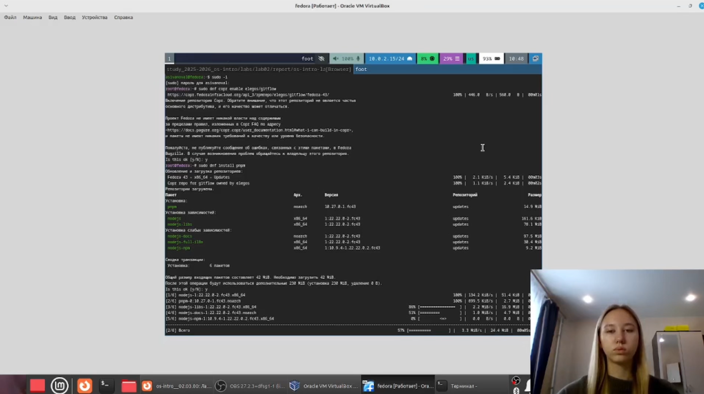
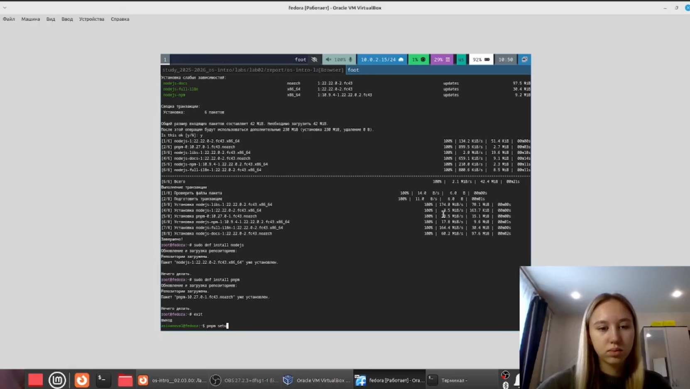
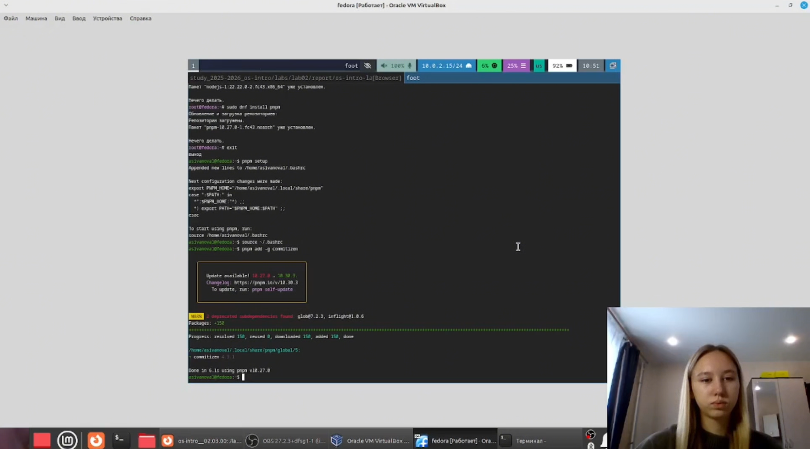
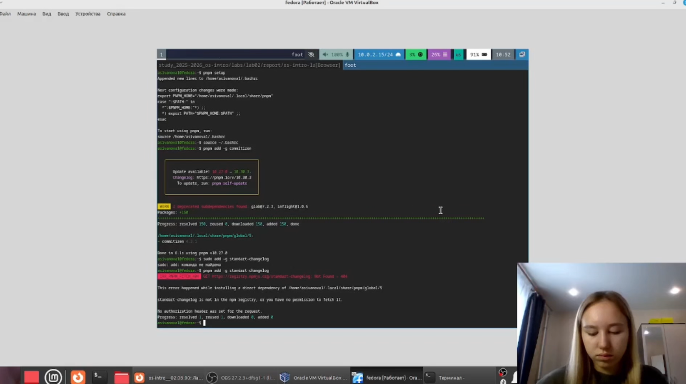
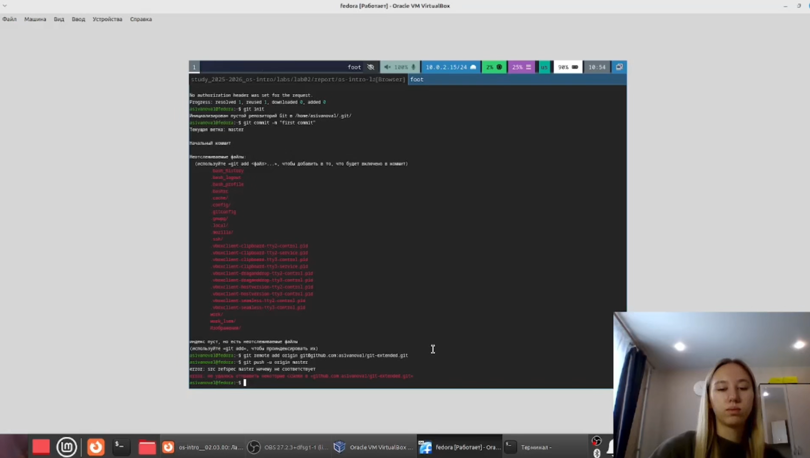
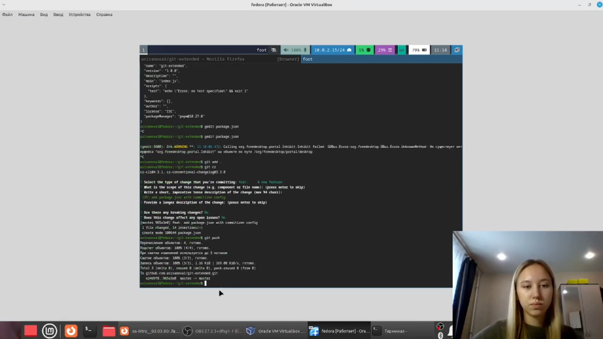
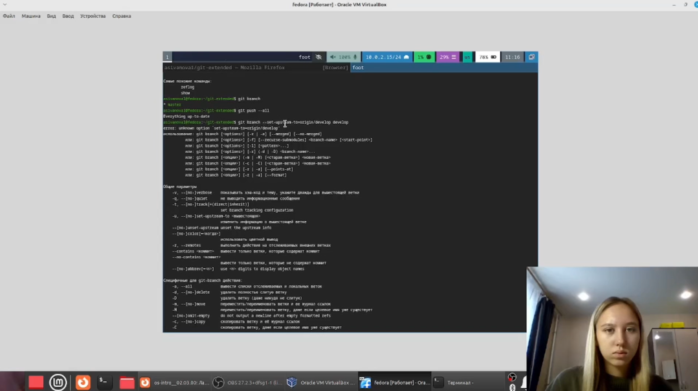
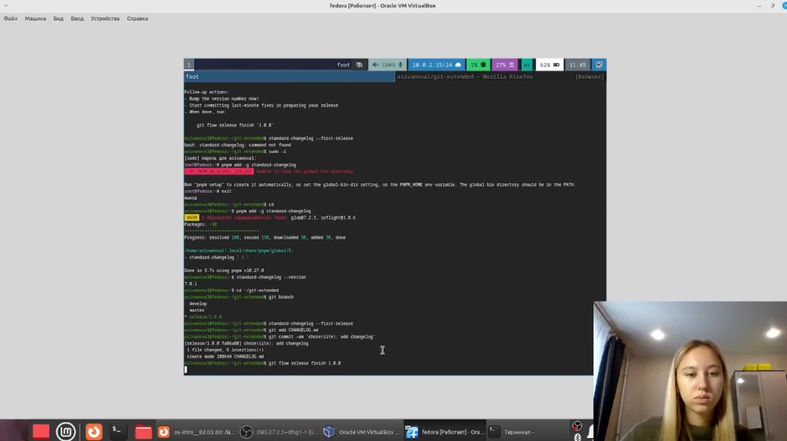
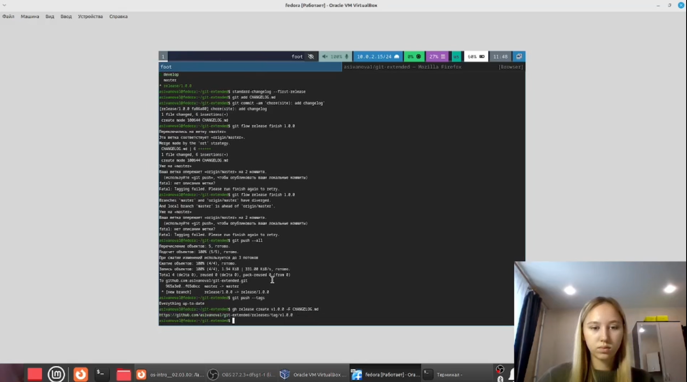
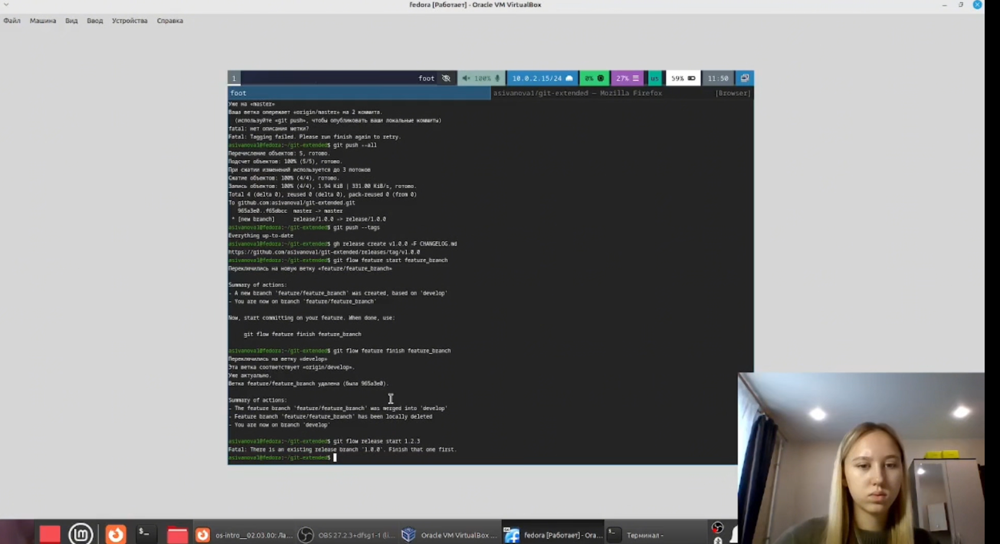

---
## Author
author:
  name: Иванова Анастасия Сергеевна
  degrees: DSc
  orcid: 0000-0002-0877-7063
  email: 1132250427@rudn.ru
  affiliation:
    - name: Российский университет дружбы народов
      country: Российская Федерация
      postal-code: 117198
      city: Москва
      address: ул. Миклухо-Маклая, д. 6

## Title
title: "Отчет по лабораторной работе №4"
subtitle: "по курсу: Архитектура компьютера и операционные системы"
license: "CC BY"
---

# Цель работы

Получение навыков правильной работы с репозиториями git.

# Выполнение лабораторной работы

## 1. Установка программного обеспечения

Сначала мы установим git-flow, Node.js и pnpm, выполнив следующие команды:

sudo dnf copr enable elegos/gitflow

sudo dnf install gitflow

sudo dnf install nodejs

sudo dnf install pnpm

([рис. @fig-001]):

{#fig-001 width=70%}

([рис. @fig-002]):

{#fig-002 width=70%}

## 2. Настройка Node.js

Затем выполним настройку pnpm и обновим переменные окружения:

pnpm setup

source ~/.bashrc

([рис. @fig-003]):

{#fig-003 width=70%}

## 3. Установка инструментов для коммитов

Далее установим commitizen для форматирования коммитов и standard-changelog для генерации журнала изменений:

pnpm add -g commitizen

pnpm add -g standard-changelog

([рис. @fig-004]):

{#fig-004 width=70%}

## 4. Создание репозитория на GitHub

После этого мы создим новый репозиторий git-extended через веб-интерфейс GitHub. Затем инициализируем локальный репозиторий и сделаем первый коммит:

git init

git commit -m "first commit"

git remote add origin git@github.com:asivanova1/git-extended.git

git push -u origin master

([рис. @fig-005]):

{#fig-005 width=70%}

## 5. Конфигурация общепринятых коммитов

Теперь мы инициализируем Node.js-пакет командой pnpm init и отредактируем файл package.json, добавив конфигурацию для commitizen:

{

  "name": "git-extended",

  "version": "1.0.0",

  "description": "Git repo for educational purposes",

  "main": "index.js",

  "repository": "git@github.com:asivanova1/git-extended.git",

  "author": "Anastasia Ivanova <1132250427@rudn.ru>",

  "license": "CC-BY-4.0",

  "config": {

    "commitizen": {

      "path": "cz-conventional-changelog"

    }

  }

}

([рис. @fig-006]):

{#fig-006 width=70%}

## 6. Добавление файлов и коммит через commitizen

Затем мы добавим все файлы в индекс и выполним коммит с помощью git cz, после чего отправим изменения на GitHub:

git add .

git cz

git push

([рис. @fig-007]):

{#fig-007 width=70%}

## 7. Конфигурация git-flow

Далее мы инициализируем git-flow в нашем репозитории и установим префикс для ярлыков в v:

git flow init

После этого проверили, что находимся на ветке develop:

git branch

([рис. @fig-008]):

{#fig-008 width=70%}

## 8. Отправка веток на GitHub

Затем мы отправим все локальные ветки на GitHub и настроим отслеживание для ветки develop:

git push --all

git branch --set-upstream-to=origin/develop develop

([рис. @fig-009]):

{#fig-009 width=70%}

## 9. Создание первого релиза (v1.0.0)

Дальше мы создадим релиз с версией 1.0.0. Для этого выполним следующие действия:

git flow release start 1.0.0

standard-changelog --first-release

git add CHANGELOG.md

git commit -am 'chore(site): add changelog'

git flow release finish 1.0.0

([рис. @fig-010]):

{#fig-010 width=70%}

## 10. Отправка изменений и создание релиза на GitHub

После завершения релиза мы отправим все изменения и теги на GitHub, а затем создадим релиз через GitHub CLI:

git push --all

git push --tags

gh release create v1.0.0 -F CHANGELOG.md

([рис. @fig-011]):

{#fig-011 width=70%}

## 11. Разработка новой функциональности

Затем мы создадим функциональную ветку и, после завершения работы, объединим её с веткой develop:

git flow feature start feature_branch

git flow feature finish feature_branch

([рис. @fig-012]):

{#fig-012 width=70%}

## 12. Создание второго релиза (v1.2.3)

Теперь мы создадим ещё один релиз с обновлённой версией. Для этого сначала создадим релизную ветку:

git flow release start 1.2.3

([рис. @fig-013]):

{#fig-013 width=70%}

Затем обновим номер версии в файле package.json с 1.0.0 на 1.2.3 и сгенерируем обновлённый журнал изменений:

standard-changelog

git add CHANGELOG.md

git commit -am 'chore(site): update changelog'

git flow release finish 1.2.3

([рис. @fig-014]):

{#fig-014 width=70%}

После завершения релиза отправим все изменения и теги на GitHub и создадим новый релиз:

git push --all

git push --tags

gh release create v1.2.3 -F CHANGELOG.md

([рис. @fig-015]):

{#fig-015 width=70%}

([рис. @fig-016]):

{#fig-016 width=70%}

# Вывод

Мы получили навыков правильной работы с репозиториями git.

::: {#refs}
:::
