---
author:
  name: Иванова Анастасия Сергеевна
  degrees: DSc
  orcid: 0000-0002-0877-7063
  email: 1132250427@rudn.ru
  affiliation:
    - name: Российский университет дружбы народов
      country: Российская Федерация
      postal-code: 117198
      city: Москва
      address: ул. Миклухо-Маклая, д. 6
title: "Лабораторная работа №2"
subtitle: "Системы контроля версий (Git)"
license: CC BY
date: today
date-format: "YYYY-MM-DD"
format:
  revealjs:
    theme: default
    slide-number: true
    preview-links: auto
  pptx: default
  beamer:
    toc: true
    toc-title: "Содержание"
    number-sections: true
    pdf-engine: lualatex
    mainfont: Liberation Serif
    sansfont: Liberation Sans
    monofont: Liberation Mono
    lang: ru-RU
    babel-lang: russian
    babel-otherlangs: english
---

# Докладчик

:::::::::::::: {.columns align=center}
::: {.column width="70%"}

  * Иванова Анастасия Сергеевна
  * 1 курс группа НКАбд-07-25
  * Российский университет дружбы народов
  * [1132250427@rudn.ru](mailto:1132250427@rudn.ru)

:::
::: {.column width="30%"}

{width=100%}

:::
::::::::::::::

# Актуальность темы

- Безопасное хранение паролей — важная задача для любого пользователя
- Менеджер паролей `pass` реализует философию Unix: простые текстовые файлы, зашифрованные GPG
- Синхронизация через git позволяет иметь доступ к паролям с любых устройств
- Управление конфигурационными файлами (dotfiles) необходимо для воспроизводимого окружения
- Chezmoi предоставляет удобный инструмент для управления dotfiles

# Объект и предмет исследования

**Объект исследования:**
- Менеджер паролей `pass`
- Система управления конфигурационными файлами `chezmoi`
- Инструменты для синхронизации (git, GitHub)

**Предмет исследования:**
- Установка и настройка `pass`
- Организация хранения паролей
- Синхронизация хранилища с удалённым git-репозиторием
- Управление dotfiles с помощью `chezmoi`
- Автоматизация применения конфигураций на новых машинах

# Цель работы

Настройка рабочей среды: менеджер паролей `pass` и управление конфигурационными файлами с `chezmoi`.

# Установка pass

```bash
sudo dnf install pass pass-otp
```

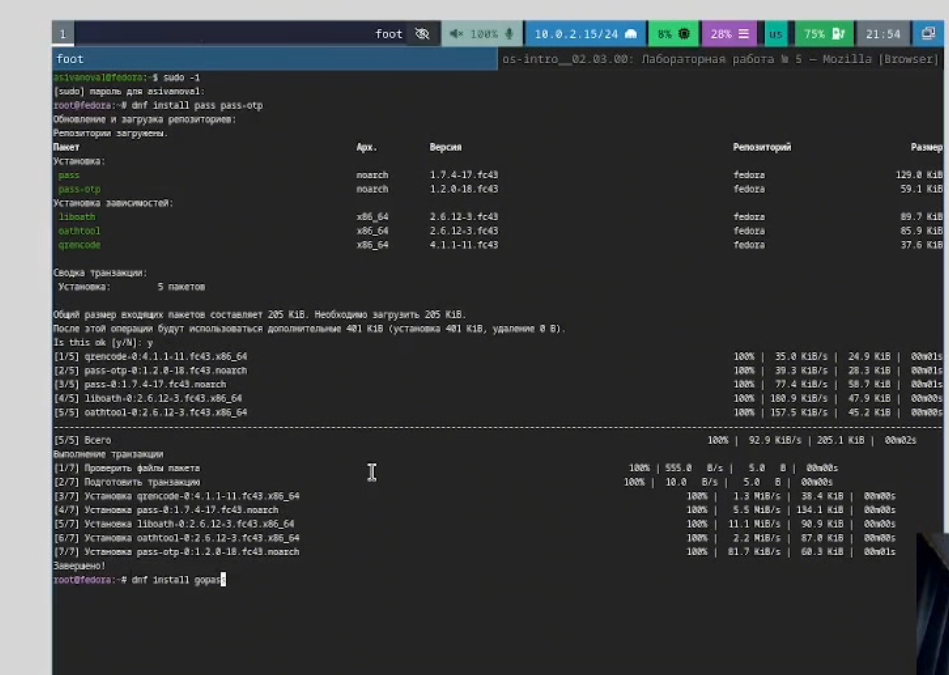{width=70%}

# Проверка GPG-ключей

```bash
gpg --list-secret-keys
```

Если ключа нет — создаём новый:

```bash
gpg --full-generate-key
```

{width=70%}

# Инициализация хранилища

```bash
pass init <email>
```

{width=70%}

# Синхронизация с git

Инициализация git-репозитория:

```bash
pass git init
```

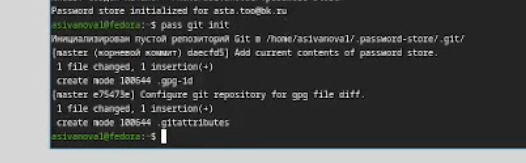{width=70%}

Подключение удалённого репозитория:

```bash
pass git remote add origin git@github.com:<username>/password-store.git
```

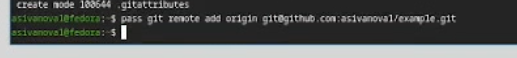{width=70%}

# Синхронизация изменений

```bash
pass git pull
pass git push
```

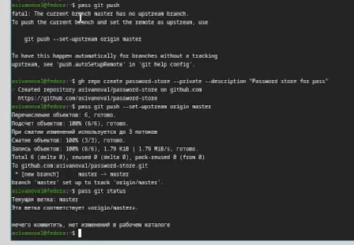{width=70%}

# Ручные изменения

```bash
cd ~/.password-store/
git add .
git commit -am 'edit manually'
git push
```

{width=70%}

# Проверка статуса

```bash
pass git status
```

{width=70%}

# Установка browserpass

```bash
sudo dnf copr enable maximbaz/browserpass
sudo dnf install browserpass
```

{width=70%}

# Сохранение пароля

Добавить новый пароль:

```bash
pass insert example.com
```

Просмотр пароля:

```bash
pass example.com
```

Генерация пароля:

```bash
pass generate example2.com 16
```

{width=70%}

# Установка дополнительного ПО

```bash
sudo dnf -y install dunst fontawesome-fonts powerline-fonts light fuzzel swaylock kitty waybar swaybg wl-clipboard mpv grim slurp
```

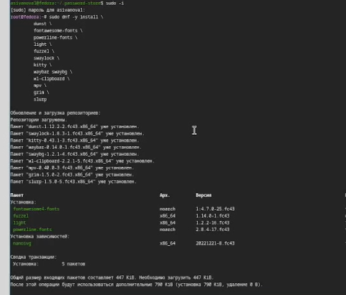{width=70%}

# Установка шрифтов

```bash
sudo dnf copr enable peterwu/iosevka
sudo dnf search iosevka
sudo dnf install iosevka-fonts iosevka-aile-fonts iosevka-curly-fonts iosevka-slab-fonts iosevka-etoile-fonts iosevka-term-fonts
```

{width=70%}

# Установка chezmoi

```bash
sh -c "$(wget -qO- chezmoi.io/get)"
```

# Создание репозитория dotfiles

```bash
gh repo create dotfiles --template="yamadharma/dotfiles-template" --private
```

# Инициализация chezmoi

```bash
chezmoi init git@github.com:<username>/dotfiles.git
```

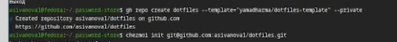{width=70%}

# Проверка изменений

```bash
chezmoi diff
```

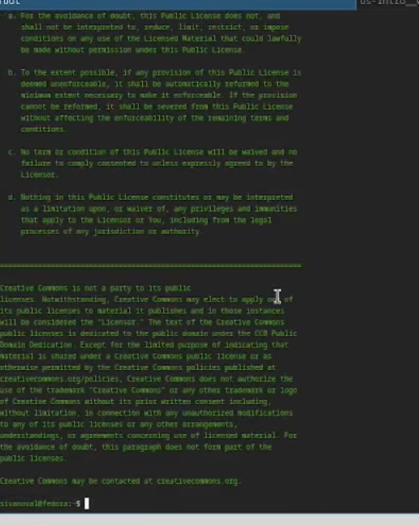{width=70%}

# Применение изменений

```bash
chezmoi apply -v
```

# Использование на нескольких машинах

```bash
chezmoi init https://github.com/<username>/dotfiles.git
```

{width=70%}

```bash
chezmoi diff
```

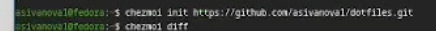{width=70%}

```bash
chezmoi apply -v
```

# Обновление

```bash
chezmoi update -v
```

{width=70%}

# Настройка новой машины одной командой

```bash
chezmoi init --apply https://github.com/<username>/dotfiles.git
```

{width=70%}

# Ежедневные операции

```bash
chezmoi update
```

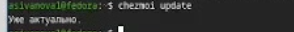{width=70%}

```bash
chezmoi git pull -- --autostash --rebase && chezmoi diff
```

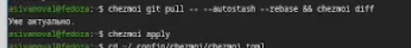{width=70%}

```bash
chezmoi apply
```

# Автоматизация

Добавить в `~/.config/chezmoi/chezmoi.toml`:

```toml
[git]
autoCommit = true
autoPush = true
```

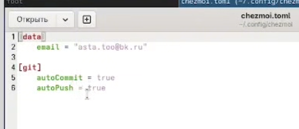{width=70%}

# Выводы

Мы настроили рабочую среду: установили и сконфигурировали менеджер паролей `pass`, настроили его синхронизацию с git, установили `browserpass` для интеграции с браузером, а также освоили работу с системой управления конфигурационными файлами `chezmoi` для синхронизации настроек между несколькими машинами.
