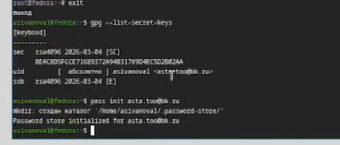
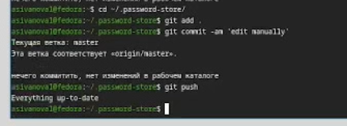
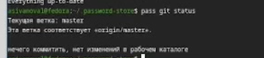
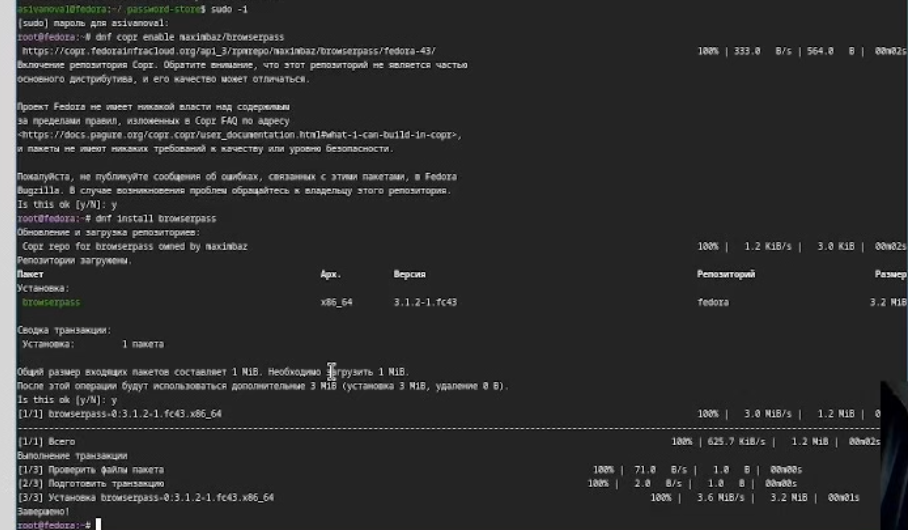
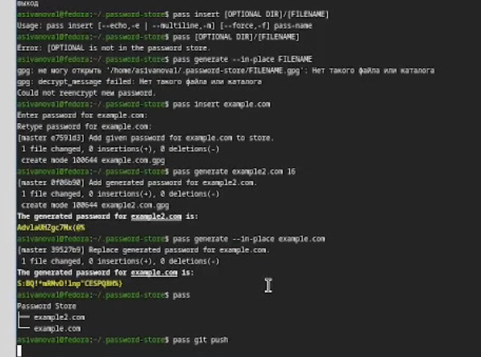
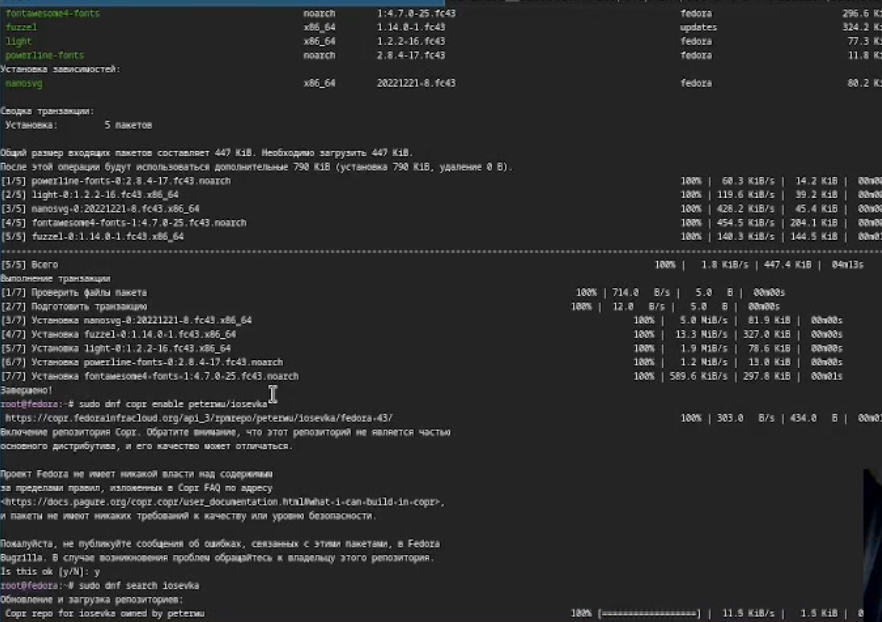
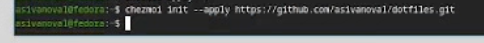

---
## Author
author:
  name: Иванова Анастасия Сергеевна
  degrees: DSc
  orcid: 0000-0002-0877-7063
  email: 1132250427@rudn.ru
  affiliation:
    - name: Российский университет дружбы народов
      country: Российская Федерация
      postal-code: 117198
      city: Москва
      address: ул. Миклухо-Маклая, д. 6

## Title
title: "Отчёт по лабораторной работе 5"
subtitle: "по курсу: Архитектура компьютера и операционные системы"
license: "CC BY"
---

# Цель работы

Настройка рабочей среды.

# Выполнение лабораторной работы

Менеджер паролей pass

Установим необходимые пакеты:
        
pass
dnf install pass pass-otp
dnf install gopass

([рис. @fig-001]):

{#fig-001 width=70%}

Приступим к настройке. Просмотрим список ключей и инициализируем хранилище:

gpg --list-secret-keys
pass init <gpg-id or email>

([рис. @fig-002]):

{#fig-002 width=70%}

Синхронизация с git 

Создадим структуру git:

pass git init

([рис. @fig-003]):

{#fig-003 width=70%}

Также зададим адрес репозитория на хостинге:

pass git remote add origin git@github.com:<git_username>/<git_repo>.git

([рис. @fig-004]):

{#fig-004 width=70%}

Для синхронизации выполняется следующая команда:

pass git pull
pass git push

([рис. @fig-005]):

{#fig-005 width=70%}

Если изменения сделаны непосредственно на файловой системе, необходимо вручную закоммитить и выложить изменения, поэтому сделаем следующее:

cd ~/.password-store/
git add .
git commit -am 'edit manually'
git push

([рис. @fig-006]):

{#fig-006 width=70%}

Проверим статус синхронизации командой:

pass git status

([рис. @fig-007]):

{#fig-007 width=70%}

Настройка интерфейса с броузером

Для взаимодействия с броузером используем интерфейс native messaging.

Плагин browserpass
        
Репозиторий: https://github.com/browserpass/browserpass-extension

Плагин для Firefox: https://addons.mozilla.org/en-US/firefox/addon/browserpass-ce/.

Fedora

dnf copr enable maximbaz/browserpass
dnf install browserpass

([рис. @fig-008]):

{#fig-008 width=70%}

Сохранение пароля

Добавим новый пароль:

pass insert [OPTIONAL DIR]/[FILENAME]

Отобразим пароль для указанного имени файла:

pass [OPTIONAL DIR]/[FILENAME]

Заменим существующий пароль:

pass generate --in-place FILENAME

([рис. @fig-009]):

{#fig-009 width=70%}

Управление файлами конфигурации

Установим дополнительное программное обеспечение:

```bash
sudo dnf -y install \dunst \fontawesome-fonts \powerline-fonts \light \fuzzel \swaylock \kitty \waybar swaybg \wl-clipboard \mpv \grim \slurp
```

([рис. @fig-010]):

{#fig-010 width=70%}

Установим шрифты:

sudo dnf copr enable peterwu/iosevka
sudo dnf search iosevka
sudo dnf install iosevka-fonts iosevka-aile-fonts iosevka-curly-fonts iosevka-slab-fonts iosevka-etoile-fonts iosevka-term-fonts

([рис. @fig-011]):

{#fig-011 width=70%}

Установим бинарный файла. Скрипт определяет архитектуру процессора и операционную систему и скачивает необходимый файл с помощью wget:

sh -c "$(wget -qO- chezmoi.io/get)"

Создадим собственный репозитория с помощью утилит. Будем использовать утилиты командной строки для работы с github. Создадим свой репозиторий для конфигурационных файлов на основе шаблона:

gh repo create dotfiles --template="yamadharma/dotfiles-template" --private

Подключим репозитория к своей системе, инициализируя chezmoi с нашим репозиторием dotfiles:

chezmoi init git@github.com:<username>/dotfiles.git

([рис. @fig-012]):

{#fig-012 width=70%}

Проверим, какие изменения внесёт chezmoi в домашний каталог, запустив:

chezmoi diff

([рис. @fig-013]):

{#fig-013 width=70%}

Нас устраивают изменения, внесённые chezmoi, запустим:

chezmoi apply -v

Использование chezmoi на нескольких машинах

На второй машине инициализируем chezmoi с вашим репозиторием dotfiles:

chezmoi init https://github.com/<username>/dotfiles.git

([рис. @fig-014]):

{#fig-014 width=70%}

Проверим, какие изменения внесёт chezmoi в домашний каталог, запустив:

chezmoi diff

([рис. @fig-015]):

{#fig-015 width=70%}

Нас устраивают изменения, внесённые chezmoi, запустив:

chezmoi apply -v

При существующем каталоге chezmoi можно получить и применить последние изменения из вашего репозитория, проверим их:

chezmoi update -v

([рис. @fig-016]):

{#fig-016 width=70%}

Настройка новой машины с помощью одной команды

Установить свои dotfiles на новый компьютер с помощью одной команды:

chezmoi init --apply https://github.com/<username>/dotfiles.git

([рис. @fig-017]):

{#fig-017 width=70%}

Ежедневные операции c chezmoi

Извлечем последние изменения из репозитория и применим их одной командой:

chezmoi update

([рис. @fig-018]):

{#fig-018 width=70%}

Извлечем последние изменения из своего репозитория и посмотрим, что изменится, фактически не применяя изменения:

chezmoi git pull -- --autostash --rebase && chezmoi diff

([рис. @fig-019]):

{#fig-019 width=70%}

Мы довольны изменениями, можем применить их:

chezmoi apply

Можно автоматически фиксировать и отправлять изменения в исходный каталог в репозиторий. Эта функция отключена по умолчанию, поэтому включяим её, добавив в файл конфигурации ~/.config/chezmoi/chezmoi.toml следующее:

[git]
autoCommit = true
autoPush = true

([рис. @fig-020]):

{#fig-020 width=70%}

Всякий раз, когда в исходный каталог вносятся изменения, chezmoi фиксирует изменения с помощью автоматически сгенерированного сообщения фиксации и отправляет их в наш репозиторий.

# Выводы

Мы настроили рабочую среду.


::: {#refs}
:::
