---
author:
  name: Иванова Анастасия Сергеевна
  degrees: DSc
  orcid: 0000-0002-0877-7063
  email: 1132250427@rudn.ru
  affiliation:
    - name: Российский университет дружбы народов
      country: Российская Федерация
      postal-code: 117198
      city: Москва
      address: ул. Миклухо-Маклая, д. 6
title: "Лабораторная работа №5"
subtitle: "Менеджер паролей `pass`"
license: CC BY
date: today
date-format: "YYYY-MM-DD"
format:
  revealjs:
    theme: default
    slide-number: true
    preview-links: auto
  pptx: default
  beamer:
    toc: true
    toc-title: "Содержание"
    number-sections: true
    pdf-engine: lualatex
    mainfont: Liberation Serif
    sansfont: Liberation Sans
    monofont: Liberation Mono
    lang: ru-RU
    babel-lang: russian
    babel-otherlangs: english
---

# Докладчик

:::::::::::::: {.columns align=center}
::: {.column width="70%"}

  * Иванова Анастасия Сергеевна
  * 1 курс группа НКАбд-07-25
  * Российский университет дружбы народов
  * [1132250427@rudn.ru](mailto:1132250427@rudn.ru)

:::
::: {.column width="30%"}

{width=100%}

:::
::::::::::::::

---

## Актуальность темы

* Командная строка остаётся основным инструментом администрирования Unix-подобных систем
* Навыки работы в командной строке необходимы для эффективного взаимодействия с ОС
* Понимание базовых команд и их опций — фундамент для дальнейшего изучения системного администрирования
* Автоматизация задач и написание скриптов невозможны без уверенного владения командной строкой

---

## Объект и предмет исследования

**Объект исследования:**
* Интерфейс командной строки операционной системы Linux
* Командный интерпретатор shell
* Файловая система Unix

**Предмет исследования:**
* Базовые команды навигации по файловой системе
* Команды управления файлами и каталогами
* Справочная система man
* Механизм истории команд и их модификации

## Цель работы

Приобретение практических навыков взаимодействия пользователя с системой посредством командной строки.

# Выполнение лабораторной работы

## 

1. Определим полное имя нашего домашнего каталога. Далее относительно этого каталога будем выполнять последующие упражнения

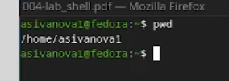{#fig-001 width=70%}

##

2. Перейдем в каталог /tmp ([рис. @fig-002]):

{#fig-002 width=70%}

##

2.1. Выведем на экран содержимое каталога /tmp. Для этого используем команду ls с различными опциями

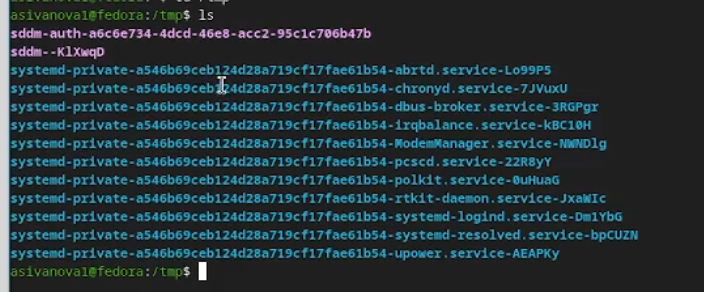{#fig-003 width=70%}

##

Подробный список с правами доступа, владельцем, размером и датой

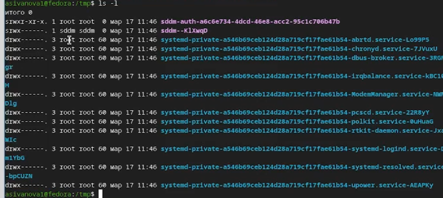{#fig-004 width=70%}

##

Показывает все файлы, включая скрытые 

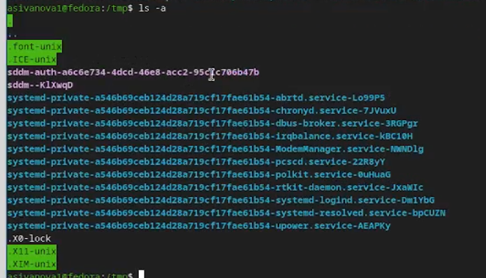{#fig-005 width=70%}

## 

Добавляет символы к именам: / для каталогов, * для исполняемых, @ для ссылок 

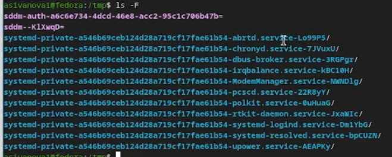{#fig-006 width=70%}

##

2.2. Определим, есть ли в каталоге /var/spool подкаталог с именем cron 

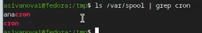{#fig-007 width=70%}

## 

2.3. Перейдем в наш домашний каталог и выведем на экран его содержимое. Определим, кто является владельцем файлов и подкаталогов (Владельцем является asivanova1.)

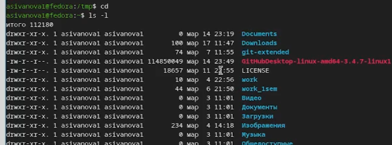{#fig-008 width=70%}

##

3.1. В домашнем каталоге создадим новый каталог с именем newdir, и в нем же создадим новый каталог с именем morefun 

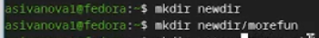{#fig-009 width=70%}

##

3.2. В домашнем каталоге создадим одной командой три новых каталога с именами letters, memos, misk. Затем удалим эти каталоги одной командой 

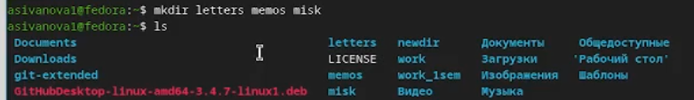{#fig-011 width=70%}

## 

3.3. Попробуем удалить ранее созданный каталог ~/newdir командой rm. Проверим, был ли каталог удалён (Этой командой удалить каталог не получится, т.к. он пустой)

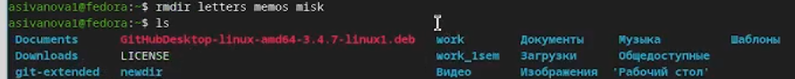{#fig-012 width=70%}

##

3.4. Удалим каталог ~/newdir/morefun из домашнего каталога. Проверим, был ли каталог удалён 

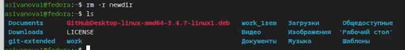{#fig-013 width=70%}

##

4. С помощью команды man определим, какую опцию команды ls нужно использовать для просмотра содержимое не только указанного каталога, но и подкаталогов, входящих в него, а так же позволяющий отсортировать по времени последнего изменения выводимый список содержимого каталога с развёрнутым описанием файлов

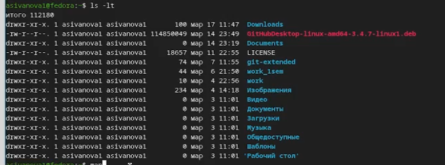{#fig-014 width=70%}

##

5. Используем команду man для просмотра описания команд(cd, pwd, mkdir, rmdir, rm)

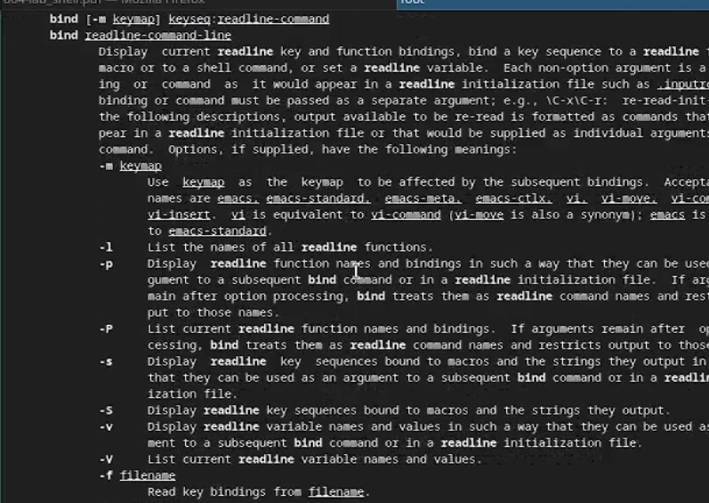{#fig-015 width=70%}

##

pwd: 

Назначение: print name of current/working directory (выводит имя текущего/рабочего каталога).

Основные опции:

-L (--logical): использовать путь из переменной окружения PWD, даже если он содержит символические ссылки.

-P (--physical): разрешать все символические ссылки и выводить физический (абсолютный) путь. Если опция не указана, подразумевается использование -P.

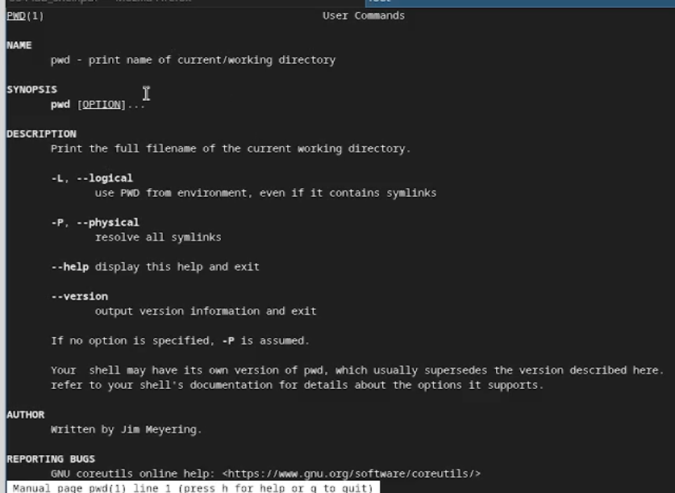{#fig-016 width=70%}

##

mkdir: 

Назначение: make directories (создавать каталоги).

Основные опции:

-m, --mode=MODE: установить права доступа для создаваемого каталога (например, mkdir -m 777 newdir).

-p, --parents: создать все каталоги по указанному пути, если они не существуют (например, mkdir -p parent/child/grandchild).

-v, --verbose: выводить сообщение о каждом создаваемом каталоге.

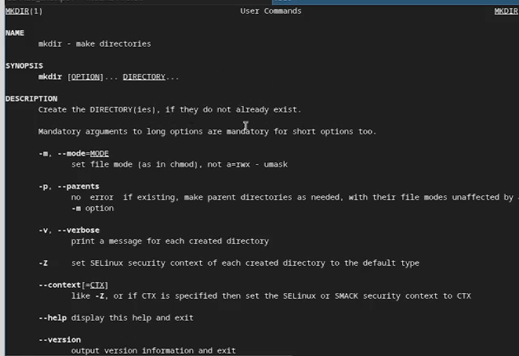{#fig-017 width=70%}

##

rmdir: 

Назначение: remove empty directories (удалять пустые каталоги).

Основные опции:

-p, --parents: удалить каталог и его предков (родительские каталоги), если они станут пустыми. Например, rmdir -p a/b/c эквивалентно rmdir a/b/c; rmdir a/b; rmdir a.

--ignore-fail-on-non-empty: игнорировать ошибки, возникающие при попытке удалить непустой каталог, и не выдавать сообщение об ошибке.

-v, --verbose: выводить диагностическое сообщение для каждого обрабатываемого каталога.

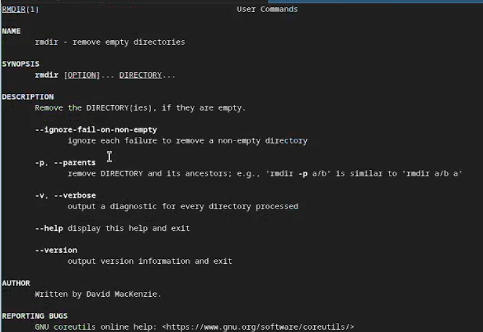{#fig-018 width=70%}

##

rm:

Назначение: remove files or directories (удалять файлы или каталоги). По умолчанию каталоги не удаляются.

Основные опции:

-f, --force: игнорировать несуществующие файлы и аргументы, никогда не выводить запрос на подтверждение.

-i: выводить запрос на подтверждение перед каждым удалением.

-r, -R, --recursive: удалять каталоги и их содержимое рекурсивно. Это основная опция для удаления непустых каталогов.

-d, --dir: удалять пустые каталоги (альтернатива rmdir).

-v, --verbose: выводить пояснения того, что делается.

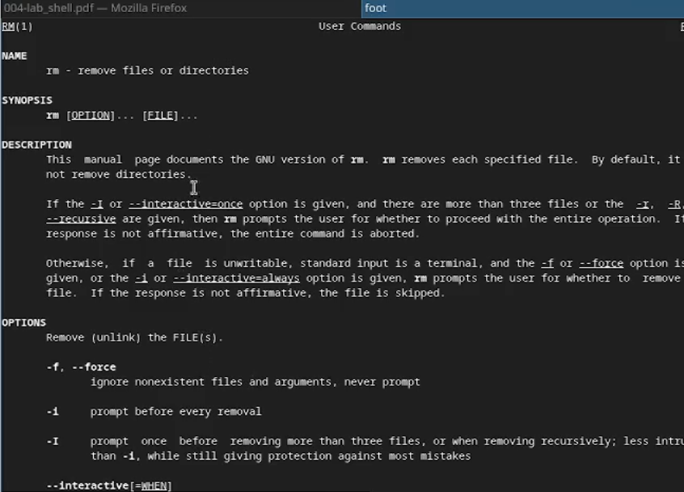{#fig-019 width=70%}

##

6. Используем информацию, полученную при помощи команды history, выполним модификацию и исполнение нескольких команд из буфера команд 

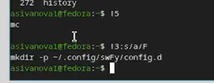{#fig-020 width=70%}

##

# Контрольные вопросы

1. Что такое командная строка? - это текстовый интерфейс взаимодействия пользователя с операционной системой, где команды вводятся в виде текста и выполняются интерпретатором (shell).

2. При помощи какой команды можно определить абсолютный путь текущего каталога? - Команда `pwd`.

3. При помощи какой команды и каких опций можно определить только тип файлов и их имена в текущем каталоге? - Команда ls с опцией -F (/ - каталог; * - исполняемый файл; @ - ссылка; без символа - обычный файл).

4. Каким образом отобразить информацию о скрытых файлах? - Команда ls с опцией -a

5. При помощи каких команд можно удалить файл и каталог? Можно ли это сделать одной и той же командой:
    
- Удаление файла: rm file.txt

- Удаление пустого каталога: rmdir dir/ или rm -d dir/

- Удаление непустого каталога: rm -r dir/

- Одной командой: rm -r old_project (удаляет папку со всем содержимым)

6. Каким образом можно вывести информацию о последних выполненных пользователем командах? работы? - Команда history выводит список ранее выполненных команд с номерами.

7. Как воспользоваться историей команд для их модифицированного выполнения:

- !5 — выполнить команду под номером 5

- !! — выполнить последнюю команду

- !3:s/ls/cd — заменить в команде №3 ls на cd и выполнить

8. Приведите примеры запуска нескольких команд в одной строке - cd /tmp && ls -l  # вторая выполняется при успехе первой; mkdir test ; cd test  # последовательное выполнение.

9. Дайте определение и приведите примера символов экранирования - это способ отменить специальное значение символа, чтобы интерпретировать его как обычный текст. Основной символ экранирования — обратный слеш \.

10. Охарактеризуйте вывод информации на экран после выполнения команды ls с опцией l - Команда ls -l выводит подробную информацию в виде таблицы.

11. Что такое относительный путь к файлу? Приведите примеры использования относительного и абсолютного пути при выполнении какой-либо команды:

- Абсолютный путь — полный путь от корневого каталога / (ls /home/anastasia/Documents/file.txt)

- Относительный путь — путь относительно текущего каталога (если текущий каталог /home/anastasia) (ls Documents/file.txt).

12. Как получить информацию об интересующей вас команде? - С помощью команды man.

13. Какая клавиша или комбинация клавиш служит для автоматического дополнения вводимых команд? - Клавиша Tab. При вводе начала команды или пути нажатие Tab автоматически дополняет ввод или показывает возможные варианты.

##

# Вывод

Мы приобрели практические навыки взаимодействия пользователя с системой посредством командной строки.

---

