---
author:
  name: Иванова Анастасия Сергеевна
  degrees: DSc
  orcid: 0000-0002-0877-7063
  email: 1132250427@rudn.ru
  affiliation:
    - name: Российский университет дружбы народов
      country: Российская Федерация
      postal-code: 117198
      city: Москва
      address: ул. Миклухо-Маклая, д. 6
title: "Лабораторная работа №7"
subtitle: "по курсу: Архитектура компьютера и опреационные системы"
license: CC BY
date: today
date-format: "YYYY-MM-DD"
format:
  revealjs:
    theme: default
    slide-number: true
    preview-links: auto
  pptx: default
  beamer:
    toc: true
    toc-title: "Содержание"
    number-sections: true
    pdf-engine: lualatex
    mainfont: Liberation Serif
    sansfont: Liberation Sans
    monofont: Liberation Mono
    lang: ru-RU
    babel-lang: russian
    babel-otherlangs: english
---

# Докладчик

:::::::::::::: {.columns align=center}
::: {.column width="70%"}

  * Иванова Анастасия Сергеевна
  * 1 курс группа НКАбд-07-25
  * Российский университет дружбы народов
  * [1132250427@rudn.ru](mailto:1132250427@rudn.ru)

:::
::: {.column width="30%"}

{width=100%}

:::
::::::::::::::

---


# Цель работы

Ознакомление с файловой системой Linux, её структурой, именами и содержанием каталогов. Приобретение практических навыков по применению команд для работы с файлами и каталогами, по управлению процессами (и работами), по проверке использования диска и обслуживанию файловой системы.

##

# Выполнение лабораторной работы

## 1. Выполним все примеры, приведённые в первой части описания лабораторной работы:

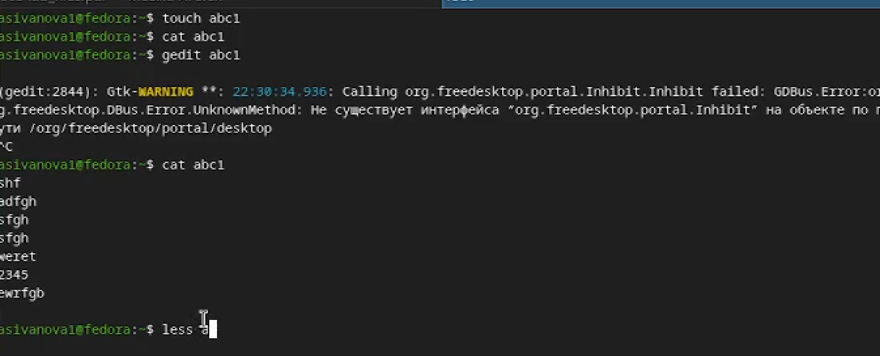{#fig-001 width=70%}

##

## 2. Выполним следующие действия:

### 2.1. Скопируем файл /usr/include/sys/io.h в домашний каталог и назовем его equipment:

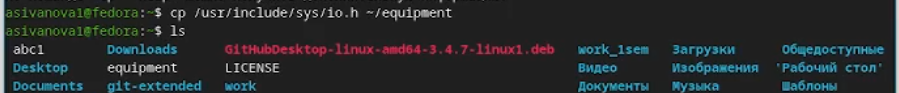{#fig-002 width=70%}

##

### 2.2. В домашнем каталоге создадим директорию ~/ski.plases:

{#fig-003 width=70%}

##

### 2.3. Переместим файл equipment в каталог ~/ski.plases:

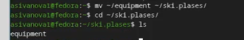{#fig-004 width=70%}

##

### 2.4. Переименуем файл ~/ski.plases/equipment в ~/ski.plases/equiplist:

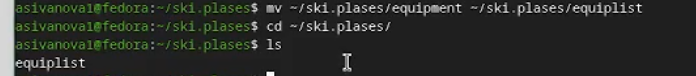{#fig-005 width=70%}

##

### 2.5. Создадим в домашнем каталоге файл abc1 и скопируем его в каталог ~/ski.plases, назовем equiplist2:

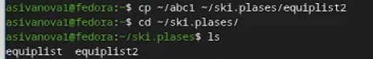{#fig-006 width=70%}

##

### 2.6. Создадим каталог с именем equipment в каталоге ~/ski.plases:

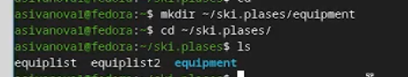{#fig-007 width=70%}

##

### 2.7. Переместим файлы ~/ski.plases/equiplist и equiplist2 в каталог ~/ski.plases/equipment:

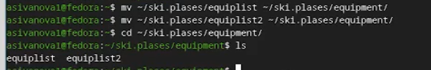{#fig-008 width=70%}

##

### 2.8. Создадим и переместим каталог ~/newdir в каталог ~/ski.plases и назовем его plans:

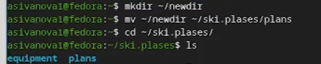{#fig-009 width=70%}

##

## 3. Определим опции команды chmod, необходимые для того, чтобы присвоить перечисленным ниже файлам выделенные права доступа, считая, что в начале таких прав нет:

3.1. drwxr--r-- ... australia
3.2. drwx--x--x ... play
3.3. -r-xr--r-- ... my_os
3.4. -rw-rw-r-- ... feathers

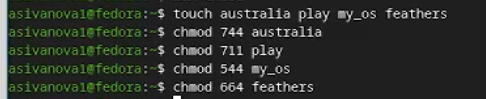{#fig-010 width=70%}

##

## 4. Проделаем приведённые ниже упражнения:

### 4.1. Просмотрим содержимое файла /etc/password:

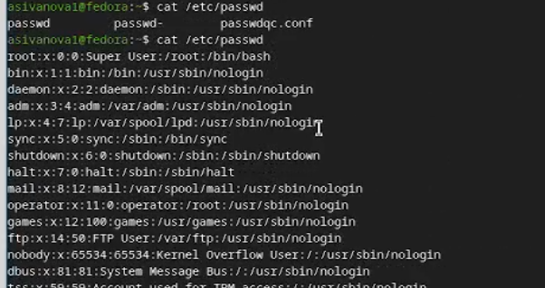{#fig-011 width=70%}

##

### 4.2. Скопируем файл ~/feathers в файл ~/file.old:

{#fig-012 width=70%}

##

### 4.3. Переместим файл ~/file.old в каталог ~/play:

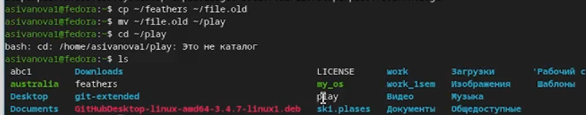{#fig-013 width=70%}

##

### 4.4. Скопируем каталог ~/play в каталог ~/fun:

{#fig-014 width=70%}

##

### 4.5. Переместим каталог ~/fun в каталог ~/play и назовем его games:

{#fig-015 width=70%}

##

### 4.6. Лишим владельца файла ~/feathers права на чтение:

{#fig-016 width=70%}

##

### 4.7. Попытаетемся просмотреть файл ~/feathers командой cat:

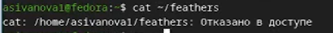{#fig-017 width=70%}

##

### 4.8. Попытаемся скопировать файл ~/feathers:

{#fig-018 width=70%}

##

### 4.9. Вернем владельцу файла ~/feathers право на чтение:

{#fig-019 width=70%}

##

### 4.10. Лишим владельца каталога ~/play права на выполнение:

{#fig-020 width=70%}

##

### 4.11. Перейдем в каталог ~/play. Что произошло:

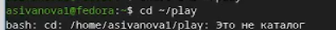{#fig-021 width=70%}

##

### 4.12. Вернем владельцу каталога ~/play право на выполнение:

{#fig-022 width=70%}

##

## 5. Прочитаем man по командам mount, fsck, mkfs, kill и кратко их охарактеризуем, приведя примеры: 

## mount

**Назначение:** монтирование файловых систем (подключение дисков, разделов, устройств к каталогам).

**Пример:**
```bash
mount /dev/sda1 /mnt

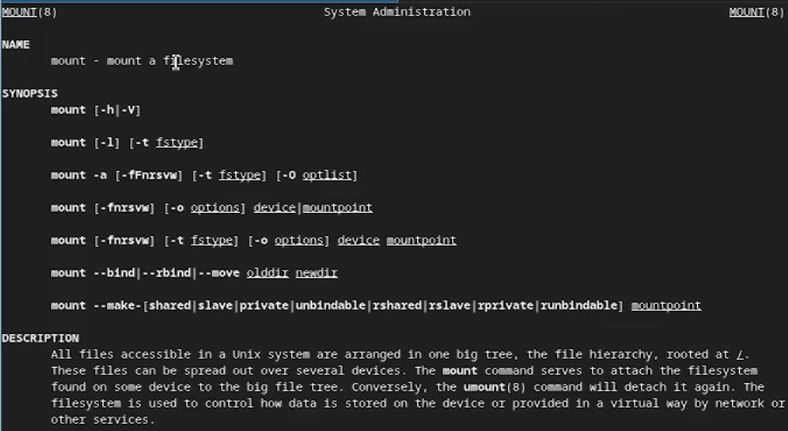{#fig-023 width=70%}

##

## fsck

**Назначение:** проверка и восстановление целостности файловой системы.

**Пример:**
```bash
fsck /dev/sda1

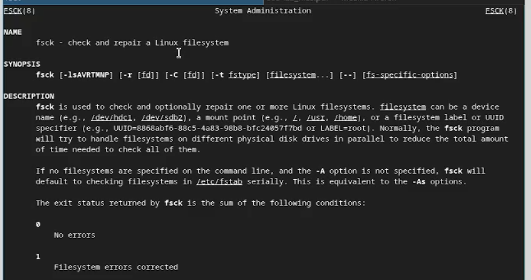{#fig-024 width=70%}

##

## mkfs

**Назначение:** создание файловой системы (форматирование раздела).

**Пример:**
```bash
mkfs.ext4 /dev/sdb1

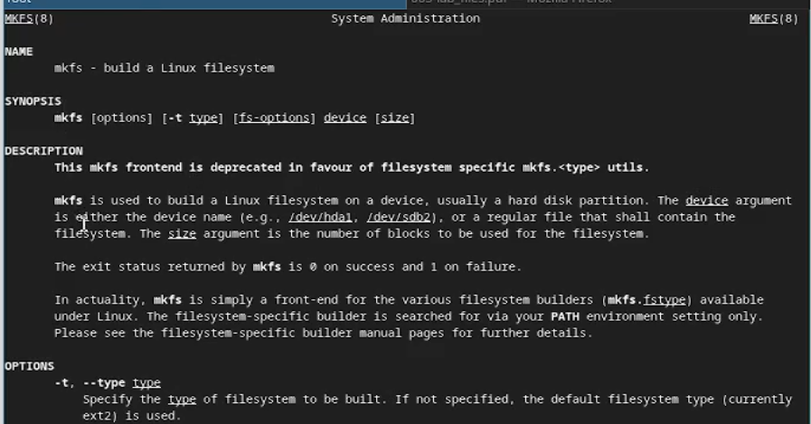{#fig-025 width=70%}

##

## kill

**Назначение:** отправка сигналов процессам (завершение, остановка, перезапуск).

**Пример:**
```bash
kill -9 1234

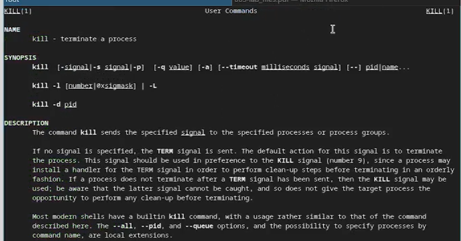{#fig-026 width=70%}

##

# Контрольные вопросы

## 1. Дайте характеристику каждой файловой системе, существующей на жёстком диске компьютера, на котором вы выполняли лабораторную работу.

Файловые системы, которые могут присутствовать на жёстком диске:

- **ext4** — стандартная файловая система для Linux. Поддерживает журналирование (восстановление после сбоев), большие файлы (до 16 ТБ) и разделы (до 1 ЭБ). Используется для корневого раздела и домашних каталогов.
- **swap** — не файловая система в классическом понимании, а раздел подкачки. Используется для временного хранения данных при нехватке оперативной памяти.
- **EFI System Partition (ESP)** — раздел с файловой системой FAT32, содержит загрузчики для UEFI.
- **tmpfs** — временная файловая система в оперативной памяти, используется для `/tmp`, `/run`, `/dev/shm`. Данные не сохраняются после перезагрузки.

##

## 2. Приведите общую структуру файловой системы и дайте характеристику каждой директории первого уровня этой структуры.

Стандартная структура файловой системы Linux (FHS — Filesystem Hierarchy Standard):

| Каталог | Назначение |
|---------|------------|
| `/` | Корневой каталог, основа всей файловой системы. |
| `/bin` | Базовые исполняемые файлы (команды), необходимые для работы системы в однопользовательском режиме. |
| `/boot` | Файлы загрузчика (ядро, initrd, GRUB). |
| `/dev` | Файлы устройств (диски, терминалы, и т.д.). |
| `/etc` | Конфигурационные файлы системы. |
| `/home` | Домашние каталоги пользователей. |
| `/lib` | Библиотеки, необходимые для программ в `/bin` и `/sbin`. |
| `/media` | Точки монтирования съёмных носителей. |
| `/mnt` | Временные точки монтирования. |
| `/opt` | Дополнительное программное обеспечение. |
| `/proc` | Виртуальная файловая система, предоставляющая информацию о процессах и ядре. |
| `/root` | Домашний каталог суперпользователя. |
| `/run` | Данные о работающей системе (PID-файлы, сокеты). |
| `/sbin` | Системные исполняемые файлы для администрирования. |
| `/srv` | Данные сервисов (например, веб-сервера). |
| `/sys` | Виртуальная файловая система для информации об устройствах и ядре. |
| `/tmp` | Временные файлы (очищается при перезагрузке). |
| `/usr` | Пользовательские программы, библиотеки, документация. |
| `/var` | Изменяемые данные (логи, очереди печати, кэш). |

##

## 3. Какая операция должна быть выполнена, чтобы содержимое некоторой файловой системы было доступно операционной системе?

Необходимо выполнить **монтирование (mount)** файловой системы. Для этого используется команда `mount`, которая связывает устройство (раздел диска) с точкой монтирования (каталогом). Пример:
```bash
mount /dev/sdb1 /mnt/data

После этого содержимое раздела /dev/sdb1 становится доступным в каталоге /mnt/data.

## 4. Назовите основные причины нарушения целостности файловой системы. Как устранить повреждения файловой системы?

Причины нарушения целостности:

    - внезапное отключение питания

    - аппаратные сбои (плохие сектора на диске)

    - ошибки в работе программ или драйверов

    - некорректное завершение работы системы

##

Устранение повреждений:

1.Использование команды fsck (file system check):

```bash
fsck /dev/sda1

2.Для журналируемых файловых систем (ext4) восстановление происходит быстрее за счёт журнала.

3.В некоторых случаях может потребоваться загрузка с Live-системы для проверки корневого раздела.

##

## 5. Как создаётся файловая система?

Файловая система создаётся с помощью команды mkfs (make file system) для выбранного раздела. Примеры:

```bash
mkfs.ext4 /dev/sdb1   # создание ext4
mkfs.xfs /dev/sdb2    # создание XFS
mkfs.vfat /dev/sdb3   # создание FAT32

Перед созданием файловой системы раздел должен быть размечен (с помощью fdisk, gdisk, parted).

##

## 6. Дайте характеристику командам для просмотра текстовых файлов.
Команда	Назначение	

Пример:

| Команда | Описание | Пример |
|---------|----------|--------|
| `cat` | Выводит содержимое файла целиком. Подходит для небольших файлов. | `cat file.txt` |
| `less` | Постраничный просмотр. Позволяет прокручивать файл вперёд и назад. | `less file.txt` |
| `head` | Выводит первые строки файла (по умолчанию 10). | `head -20 file.txt` |
| `tail` | Выводит последние строки файла (по умолчанию 10). | `tail -5 file.txt` |
| `nl` | Выводит содержимое с нумерацией строк. | `nl file.txt` |

##

## 7. Приведите основные возможности команды cp в Linux.

Команда cp используется для копирования файлов и каталогов.

Пример:

| Опция | Назначение |
|-------|------------|
| `-i` | Запрос подтверждения перед перезаписью |
| `-r` / `-R` | Рекурсивное копирование каталогов |
| `-u` | Копировать только если исходный файл новее целевого |
| `-v` | Выводить подробности (verbose) |
| `-p` | Сохранять права доступа, владельца и временные метки |
| `-a` | Архивное копирование (сохраняет все атрибуты, рекурсивно) |

Примеры:

```bash
cp file1 file2              # копирование файла
cp -r dir1 dir2             # копирование каталога
cp -i file1 file2           # запрос перед перезаписью

```bash
cp file1 file2              # копирование файла
cp -r dir1 dir2             # копирование каталога
cp -i file1 file2           # запрос перед перезаписью

##

## 8. Приведите основные возможности команды mv в Linux.

Команда mv используется для перемещения и переименования файлов и каталогов.

| Опция | Назначение |
|-------|------------|
| `-i` | Запрос подтверждения перед перезаписью |
| `-u` | Перемещать только если исходный файл новее целевого |
| `-v` | Выводить подробности (verbose) |
| `-n` | Не перезаписывать существующие файлы |

```bash
mv file1 file2              # переименование
mv file1 dir/               # перемещение
mv -i file1 file2           # запрос перед перезаписью

##

## 9. Что такое права доступа? Как они могут быть изменены?

Права доступа — это набор правил, определяющих, кто и какие действия может выполнять с файлом или каталогом. Права задаются для трёх категорий пользователей:

    u (user) — владелец

    g (group) — группа-владелец

    o (others) — все остальные

Действия:

    r (read) — чтение

    w (write) — запись

    x (execute) — выполнение (для файлов) / доступ в каталог

##

Изменение прав выполняется командой chmod (change mode) в двух форматах:

1. Символьный формат:
 
```bash   
chmod u+x file           # добавить выполнение для владельца
chmod g-w file           # убрать запись для группы
chmod u=rwx,g=rx,o=r file # установить конкретные права

2. Числовой (восьмеричный) формат:

    | Цифра | Права |
    |-------|-------|
    | 7 | rwx |
    | 6 | rw- |
    | 5 | r-x |
    | 4 | r-- |
    | 3 | -wx |
    | 2 | -w- |
    | 1 | --x |
    | 0 | --- |

```bash
chmod 755 file            # rwxr-xr-x
chmod 644 file            # rw-r--r--

##

# Вывод

Мы ознакомились с файловой системой Linux, её структурой, именами и содержанием каталогов. Приобрели практические навыки по применению команд для работы с файлами и каталогами, по управлению процессами (и работами), по проверке использования диска и обслуживанию файловой системы.


---
