---
author:
  name: Иванова Анастасия Сергеевна
  degrees: DSc
  orcid: 0000-0002-0877-7063
  email: 1132250427@rudn.ru
  affiliation:
    - name: Российский университет дружбы народов
      country: Российская Федерация
      postal-code: 117198
      city: Москва
      address: ул. Миклухо-Маклая, д. 6
title: "Лабораторная работа №8"
subtitle: "по курсу: Архитектура компьютера и опреационные системы"
license: CC BY
date: today
date-format: "YYYY-MM-DD"
format:
  revealjs:
    theme: default
    slide-number: true
    preview-links: auto
  pptx: default
  beamer:
    toc: true
    toc-title: "Содержание"
    number-sections: true
    pdf-engine: lualatex
    mainfont: Liberation Serif
    sansfont: Liberation Sans
    monofont: Liberation Mono
    lang: ru-RU
    babel-lang: russian
    babel-otherlangs: english
---

# Докладчик

:::::::::::::: {.columns align=center}
::: {.column width="70%"}

  * Иванова Анастасия Сергеевна
  * 1 курс группа НКАбд-07-25
  * Российский университет дружбы народов
  * [1132250427@rudn.ru](mailto:1132250427@rudn.ru)

:::
::: {.column width="30%"}

{width=100%}

:::
::::::::::::::

---

# Вводная часть

## Актуальность

- Эффективное управление файловой системой и процессами — базовый навык администрирования Linux
- Умение быстро находить файлы и фильтровать данные ускоряет работу с большими объёмами информации
- Контроль за использованием дискового пространства предотвращает сбои в работе системы
- Навыки управления процессами позволяют оперативно реагировать на зависания и утечки ресурсов

## Объект и предмет исследования

| Компонент | Содержание |
|-----------|------------|
| **Объект исследования** | Командная оболочка Linux (bash) и её инструменты для работы с файлами, процессами и дисковым пространством |
| **Предмет исследования** | Синтаксис и практическое применение команд: `find`, `grep`, `df`, `du`, `ps`, `kill`, а также механизмы перенаправления потоков (`>`, `>>`, `|`) и управления задачами (`jobs`, `fg`, `bg`) |

##

# Цель работы

Ознакомиться с инструментами поиска файлов и фильтрации текстовых данных, приобрести практические навыки: по управлению процессами (и заданиями), по проверке использования диска и обслуживанию файловых систем.

##

# Выполнение лабораторной работы

1. Осуществите вход в систему, используя соответствующее имя пользователя ([рис. @fig-001]):

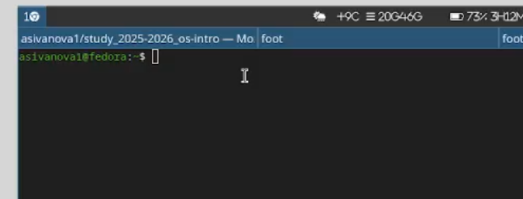{#fig-001 width=70%}

##

2. Запишите в файл file.txt названия файлов, содержащихся в каталоге /etc. Допишите в этот же файл названия файлов, содержащихся в вашем домашнем каталоге ([рис. @fig-002]):

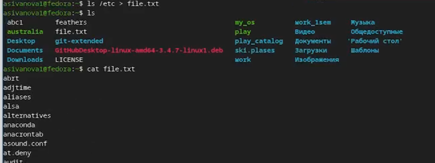{#fig-002 width=70%}

##

Дополнение списка ([рис. @fig-003]):

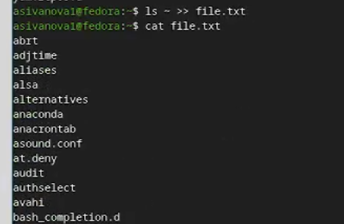{#fig-003 width=70%}

##

3. Выведите имена всех файлов из file.txt, имеющих расширение .conf, после чего запишите их в новый текстовой файл conf.txt ([рис. @fig-004]):

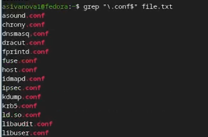{#fig-004 width=70%}

##

Запись в новый файл ([рис. @fig-005]):

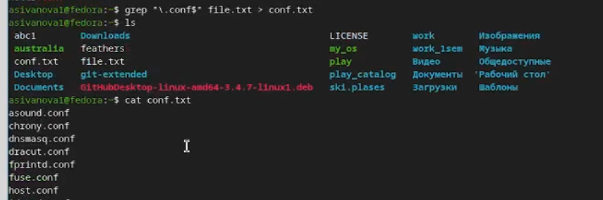{#fig-005 width=70%}

##

4. Определите, какие файлы в вашем домашнем каталоге имеют имена, начинавшиеся с символа c? Предложите несколько вариантов, как это сделать ([рис. @fig-006]):

{#fig-006 width=70%}

##

5. Выведите на экран (по странично) имена файлов из каталога /etc, начинающиеся с символа h ([рис. @fig-007]):

{#fig-007 width=70%}

##

Отдельно имена([рис. @fig-008]):

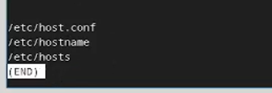{#fig-008 width=70%}

##

6. Запустите в фоновом режиме процесс, который будет записывать в файл ~/logfile файлы, имена которых начинаются с log ([рис. @fig-009]):

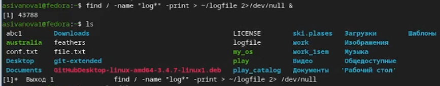{#fig-009 width=70%}

##

7. Удалите файл ~/logfile ([рис. @fig-010]):

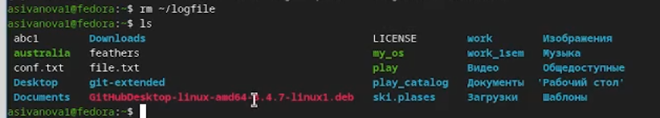{#fig-010 width=70%}

## 

8. Запустите из консоли в фоновом режиме редактор gedit ([рис. @fig-011]):

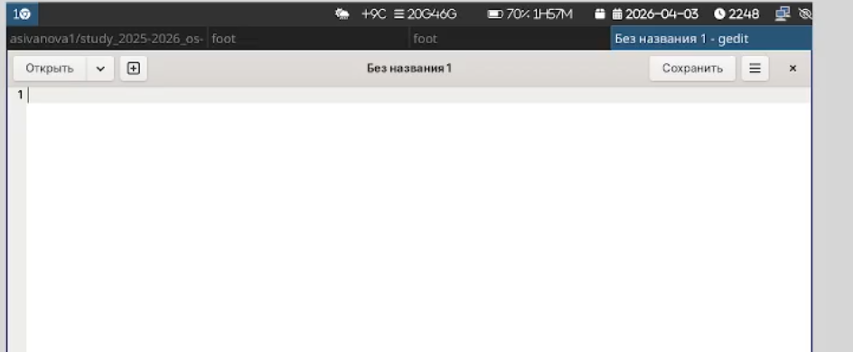{#fig-011 width=70%}

##

9. Определите идентификатор процесса gedit, используя команду ps, конвейер и фильтр grep ([рис. @fig-012]):

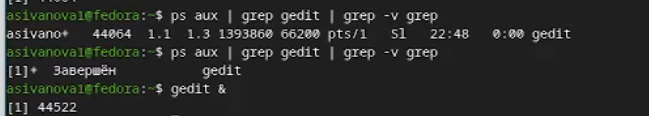{#fig-012 width=70%}

##

Еще один способ ([рис. @fig-013]):

{#fig-013 width=70%}

##

10. Прочтите справку (man) команды kill, после чего используйте её для завершения процесса gedit ([рис. @fig-014]):

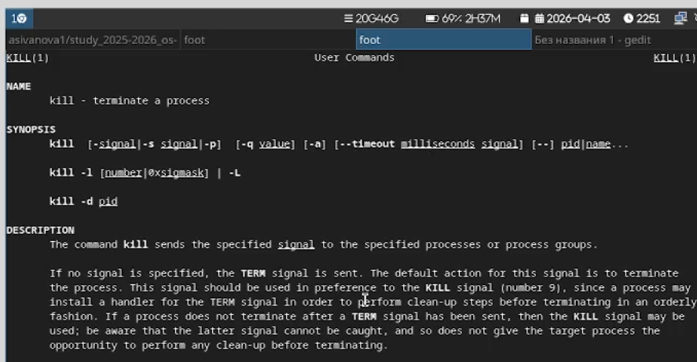{#fig-014 width=70%}

##

Использование команды ([рис. @fig-015]):

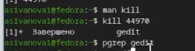{#fig-015 width=70%}

##

11. Выполните команды df и du, предварительно получив более подробную информацию об этих командах, с помощью команды man ([рис. @fig-016]):

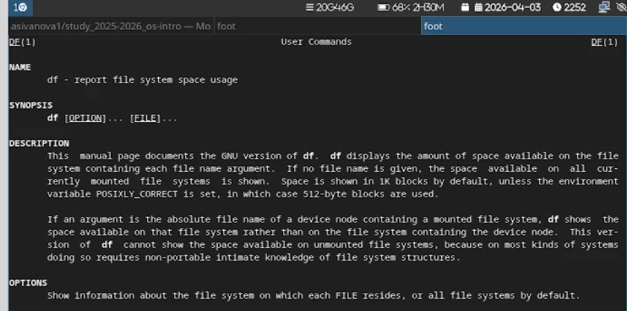{#fig-016 width=70%}

##

Исполнение команды ([рис. @fig-017]):

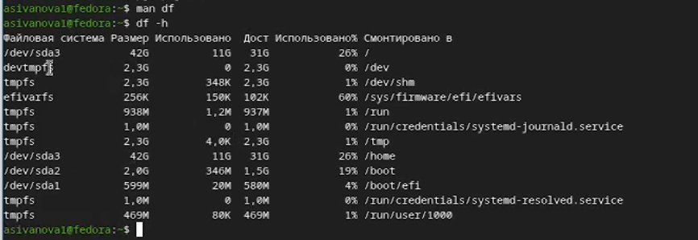{#fig-017 width=70%}

##

Просмотр информации о команде ([рис. @fig-018]):

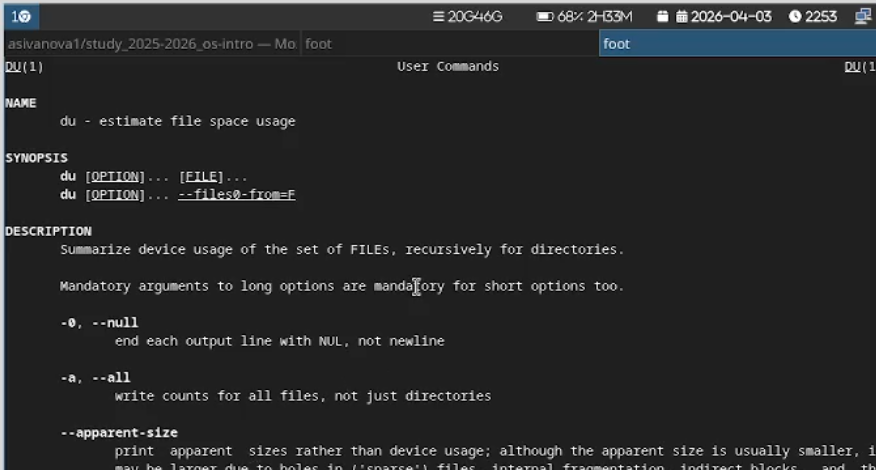{#fig-018 width=70%}

##

Использование команды ([рис. @fig-019]):

{#fig-019 width=70%}

##

12. Воспользовавшись справкой команды find, выведите имена всех директорий, имеющихся в вашем домашнем каталоге ([рис. @fig-020]):

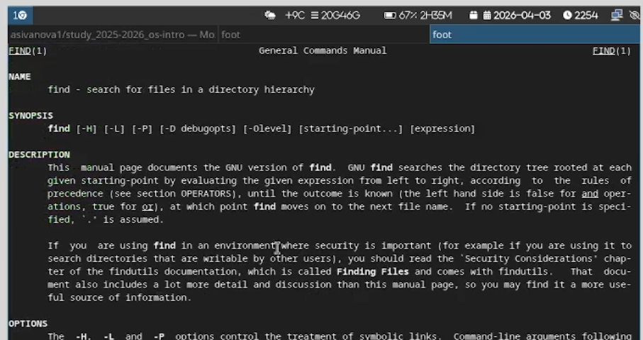{#fig-020 width=70%}

##

Использование команды ([рис. @fig-021]):

{#fig-021 width=70%}

##

Вывод команды ([рис. @fig-022]):

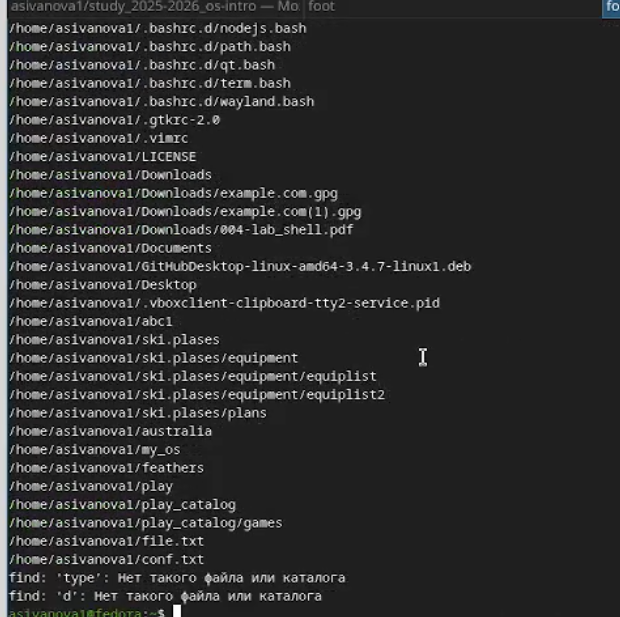{#fig-022 width=70%}

##

# Контрольные вопросы

**1. Какие потоки ввода вывода вы знаете?**

В Linux существует три стандартных потока ввода-вывода:

| Поток | Аббревиатура | Номер дескриптора | Назначение |
|-------|-------------|------------------|------------|
| **stdin** | Standard Input | 0 | Ввод данных в программу (по умолчанию — клавиатура) |
| **stdout** | Standard Output | 1 | Вывод результатов работы программы (по умолчанию — терминал) |
| **stderr** | Standard Error | 2 | Вывод сообщений об ошибках (по умолчанию — терминал) |

##

Эти потоки можно перенаправлять с помощью операторов `<`, `>`, `2>`, `&>` и других.

**Примеры перенаправления:**
```bash
command > output.txt      # перенаправить stdout в файл
command 2> error.log      # перенаправить stderr в файл
command &> all.log        # перенаправить оба потока в файл
command < input.txt       # перенаправить stdin из файла

##

**2. Объясните разницу между операцией `>` и `>>`.**

| Оператор | Описание | Поведение с файлом |
|----------|----------|-------------------|
| `>` | Перенаправление вывода с **перезаписью** | Если файл существует — его содержимое **удаляется**, затем записываются новые данные. Если файла нет — он создаётся. |
| `>>` | Перенаправление вывода с **добавлением** | Данные **добавляются в конец** файла. Если файла нет — он создаётся. |

**Примеры:**
```bash
echo "Привет" > file.txt      # file.txt будет содержать только "Привет"

##

**3. Что такое конвейер?**

**Конвейер (pipeline)** — это механизм командной оболочки (shell), позволяющий передать стандартный вывод одной команды на стандартный ввод другой с помощью символа `|`.

**Синтаксис:**
```bash
команда1 | команда2 | команда3

**Принцип работы:** stdout команды слева автоматически становится stdin команды справа. Данные передаются потоком без создания промежуточных файлов.

**Примеры использования:**
```bash
ls -la | grep ".txt"              # отфильтровать только .txt файлы из длинного списка
ps aux | grep nginx | wc -l       # подсчитать количество запущенных процессов nginx
cat access.log | awk '{print $1}' | sort | uniq -c | sort -rn  # топ IP-адресов в логе
journalctl | grep "error" | head  # вывести первые найденные ошибки из системного журнала

##

**4. Что такое процесс? Чем это понятие отличается от программы?**

| Понятие | Определение |
|---------|------------|
| **Программа** | Статический исполняемый файл, хранящийся на диске. Содержит набор инструкций и ресурсов, но не выполняется. |
| **Процесс** | Динамический экземпляр запущенной программы в оперативной памяти. Имеет состояние, выделенные ресурсы, идентификатор (PID) и выполняется процессором. |

**Ключевые отличия:**
- Программа существует на носителе информации, процесс — в памяти и на CPU.
- Одна программа может породить множество независимых процессов (например, несколько вкладок браузера).
- Процесс имеет жизненный цикл: создание → выполнение → ожидание → завершение.
- Процесс обладает собственным контекстом: регистры CPU, стек, куча, открытые файловые дескрипторы, сигналы.

##

**5. Что такое PID и GID?**

| Аббревиатура | Расшифровка | Описание |
|-------------|-------------|----------|
| **PID** | Process ID | Уникальный числовой идентификатор процесса в системе. Присваивается ядром при создании. PID `1` зарезервирован за `systemd`/`init`. |
| **GID** | Group ID | Уникальный идентификатор группы пользователей. Определяет групповые права доступа к файлам, процессам и устройствам. |

**Полезные команды:**
```bash
echo $$              # вывести PID текущего интерпретатора shell
ps aux | grep nginx  # найти PID процесса по имени
id                   # показать UID, GID и дополнительные группы текущего пользователя
ps -eo pid,ppid,cmd  # вывести PID, PID родителя и команду для всех процессов

##

**6. Что такое задачи и какая команда позволяет ими управлять?**

**Задача (job)** — это процесс или конвейер, запущенный в рамках текущей интерактивной сессии оболочки, которым можно управлять как единым целым (переводить в фон, приостанавливать, возвращать на передний план).

**Управление задачами осуществляется встроенными командами shell:**

| Команда / Сочетание | Описание |
|---------------------|----------|
| `jobs` | Вывести список активных, остановленных и фоновых задач |
| `bg [номер]` | Продолжить выполнение остановленной задачи в фоновом режиме |
| `fg [номер]` | Перевести задачу на передний план (интерактивный режим) |
| `Ctrl+Z` | Приостановить выполнение текущей задачи (SIGTSTP) |
| `Ctrl+C` | Прервать выполнение текущей задачи (SIGINT) |
| `%1`, `%2` | Обращение к задаче по её номеру в списке `jobs` |

##

**Пример работы:**
```bash
$ sleep 300 &        # запустить в фоне
[1] 14502
$ jobs               # показать список задач
[1]+  Running    sleep 300 &
$ fg %1              # вернуть на передний план
$ Ctrl+Z             # приостановить
[1]+  Stopped    sleep 300
$ bg %1              # продолжить в фоне
[1]+  sleep 300 &

##

**7. Найдите информацию об утилитах top и htop. Каковы их функции?**

**🔹 `top`**
**Описание:** Стандартная утилита мониторинга процессов в реальном времени (входит в пакет `procps-ng`).

**Основные функции:**
- Отображение таблицы процессов: PID, пользователь, приоритет, %CPU, %MEM, время работы, команда
- Сводная статистика системы: uptime, загрузка CPU, использование RAM и Swap, количество задач
- Интерактивное управление:
  - `P` — сортировка по загрузке CPU
  - `M` — сортировка по потреблению памяти
  - `k` — завершение процесса (запрос PID и сигнала)
  - `r` — изменение приоритета (`renice`)
  - `q` — выход

##

**🔹 `htop`**
**Описание:** Улучшенная интерактивная альтернатива `top` с цветным псевдографическим интерфейсом (требует установки: `sudo apt install htop`).

**Преимущества:**
- Цветной интерфейс с гистограммами загрузки CPU и памяти
- Вертикальная и горизонтальная прокрутка списка процессов
- Древовидное отображение иерархии процессов (`F5`)
- Удобный поиск (`F3`) и фильтрация
- Управление мышью и клавиатурой
- Быстрая отправка сигналов процессам (`F9`)

##

**8. Назовите и дайте характеристику команде поиска файлов. Приведите примеры использования этой команды.**

**Основная команда: `find`**

**Характеристика:**
- Мощная утилита для рекурсивного поиска файлов и каталогов
- Поддерживает критерии поиска: имя, тип, размер, время изменения, права, владелец, группа
- Работает в реальном времени, сканируя файловую систему
- Поддерживает действия над найденными файлами: `-exec`, `-delete`, `-ok`

##

**Синтаксис:**
```bash
find [путь] [критерии] [действия]

**Примеры использования:**
```bash
find /home -name "config.txt"  # найти файлы по имени
find /var/log -name "*.log" -mtime -7  # найти .log файлы, изменённые за последние 7 дней

##

**9. Можно ли по контексту (содержанию) найти файл? Если да, то как?**

**Да, можно.** Для поиска по содержимому файлов используются следующие инструменты:

🔹 `grep` — основной инструмент
```bash
grep "ошибка" *.log  # поиск строки в файлах текущего каталога
grep -r "CONFIG_VALUE" /etc/   # рекурсивный поиск по директории
grep -rin "search term" /path/to/dir  # поиск с номерами строк и игнорированием регистра

##

**10. Как определить объем свободной памяти на жёстком диске?**

Используйте команду `df`:

```bash
df -h          # свободное место в ГБ/МБ
df -h /home    # только для раздела /home

##

**11. Как определить объем вашего домашнего каталога?**

Используйте команду `du`:

```bash
du -sh ~              # общий размер домашнего каталога
du -h --max-depth=1 ~ # размер подкаталогов 1-го уровня

##

**12. Как удалить зависший процесс?**

**1. Найти PID процесса:**
```bash
ps aux | grep имя_процесса
pgrep имя_процесса
top / htop  # визуальный поиск

**2. Завершить процесс:**
```bash
kill PID        # мягкое завершение (SIGTERM)
kill -9 PID     # принудительное (SIGKILL)
killall имя     # завершить все процессы с именем
pkill -f "строка"  # по шаблону команды

##

# Вывод

Мы ознакомились с инструментами поиска файлов и фильтрации текстовых данных, приобрели практические навыки: по управлению процессами (и заданиями), по проверке использования диска и обслуживанию файловых систем.


---
