---
## Author
author:
  name: Иванова Анастасия Сергеевна 
  degrees: DSc
  orcid: 0000-0002-0877-7063
  email: 1132250427@rudn.ru
  affiliation:
    - name: Российский университет дружбы народов
      country: Российская Федерация
      postal-code: 117198
      city: Москва
      address: ул. Миклухо-Маклая, д. 6

## Title
title: "Отчёт по лабораторной работе 9"
subtitle: "по курсу: Архитектура компьютера и операционные системы"
license: "CC BY"
---

# **Цель работы**

Освоение основных возможностей командной оболочки Midnight Commander. Приобретение навыков практической работы по просмотру каталогов и файлов; манипуляций с ними.

# **Выполнение лабораторной работы**

**1. Изучим информацию о mc, вызвав в командной строке man mc.** ([рис. @fig-001]):

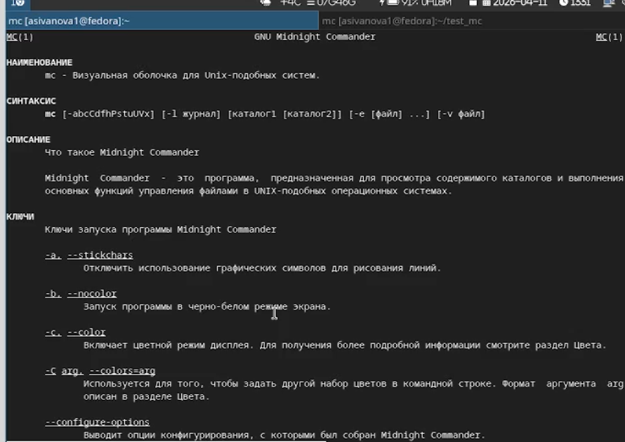{#fig-001 width=70%}

**2. Запустим из командной строки mc, изучим его структуру и меню.** ([рис. @fig-002]):

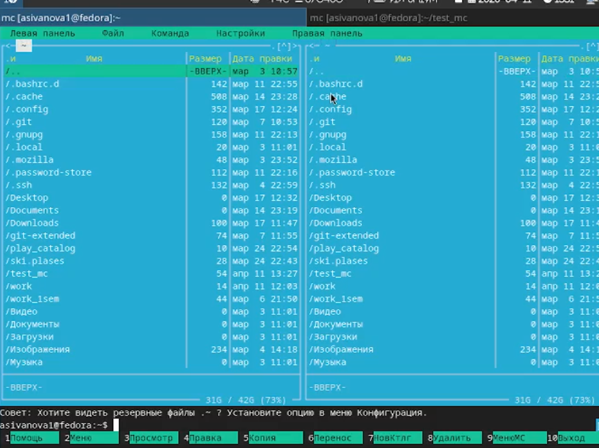{#fig-002 width=70%}

**3. Выполним несколько операций в mc, используя управляющие клавиши  (смена панелей, отключение панелей)** ([рис. @fig-003]):

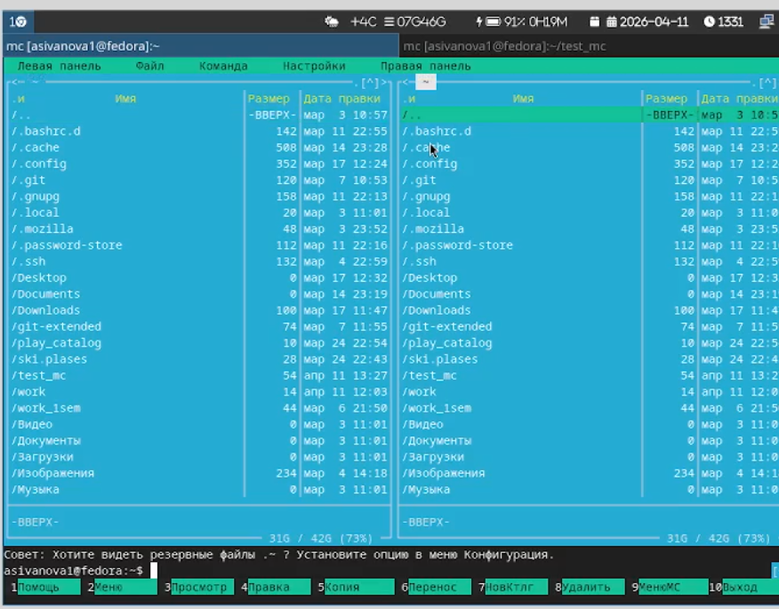{#fig-003 width=70%}

**4. Используя возможности подменю Файл** ([рис. @fig-004]):

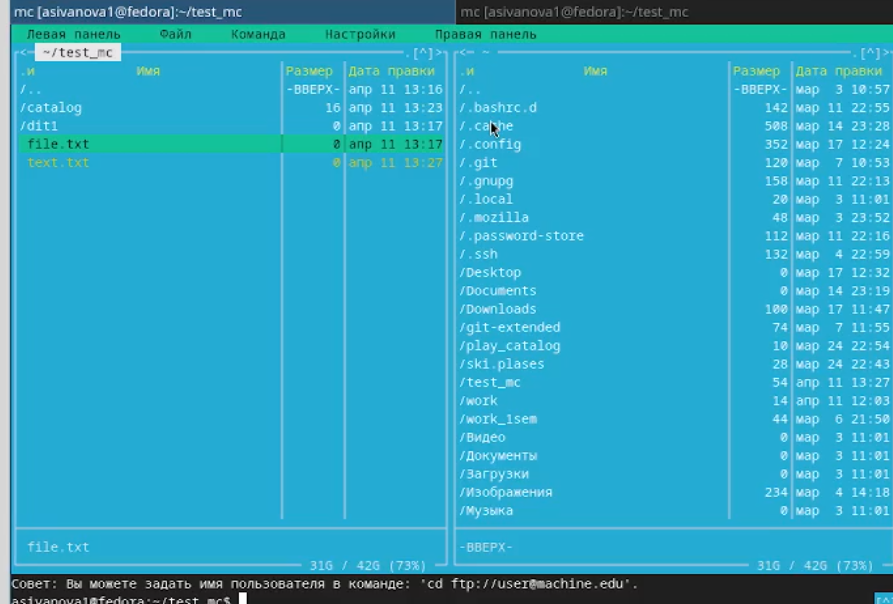{#fig-004 width=70%}

**Выполним:**

    - просмотр содержимого текстового файла ([рис. @fig-005]):

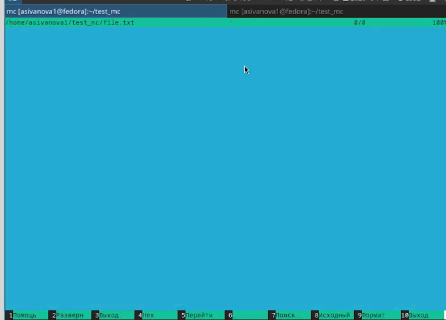{#fig-005 width=70%}

    - редактирование содержимого текстового файла (без сохранения результатов редактирования) ([рис. @fig-006]):

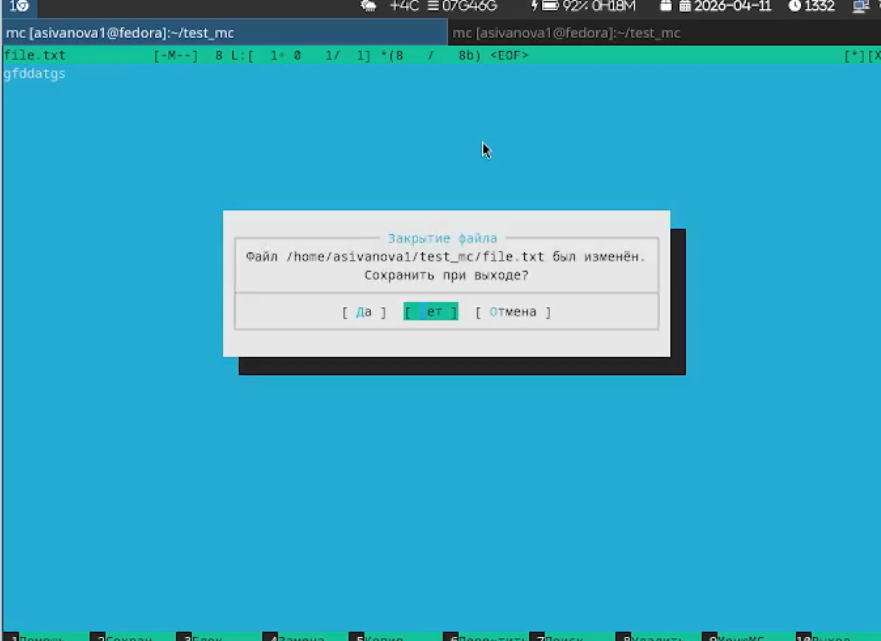{#fig-006 width=70%}

    - создание каталога ([рис. @fig-007]):

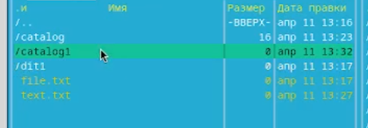{#fig-007 width=70%}

    - копирование файлов в созданный каталог ([рис. @fig-008]):

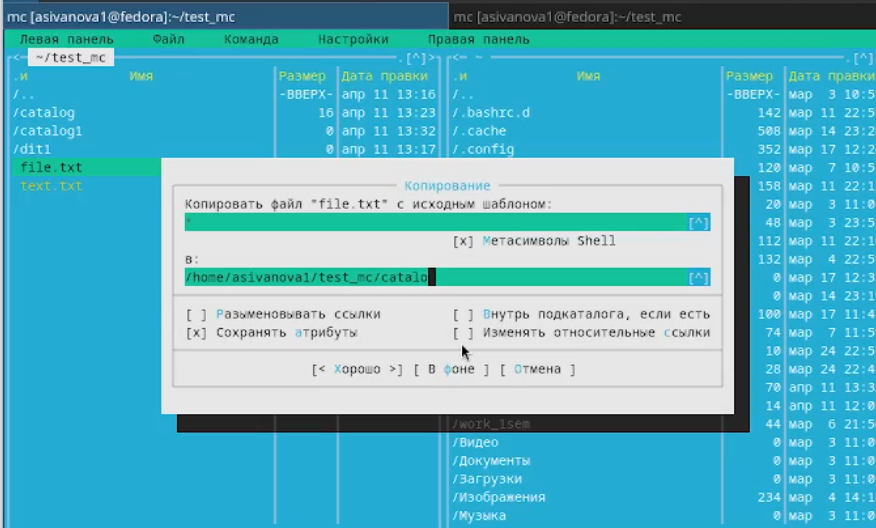{#fig-008 width=70%}

**5. С помощью соответствующих средств подменю Команда осуществим:**
   
    - поиск в файловой системе файла с заданными условиями ([рис. @fig-009]):

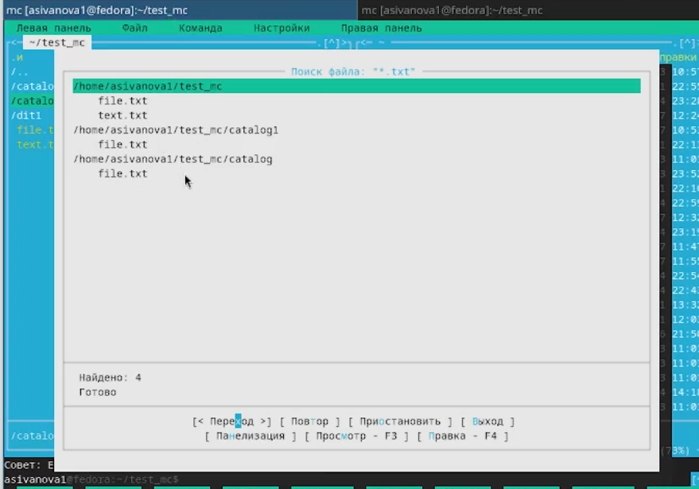{#fig-009 width=70%}

    - анализ файла меню и файла расширений ([рис. @fig-010]):

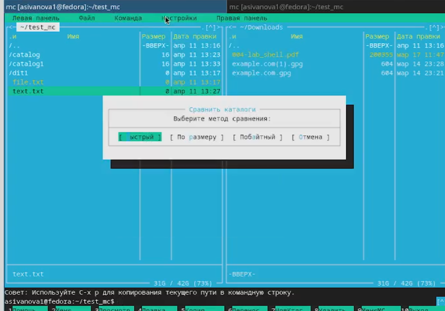{#fig-010 width=70%}

**6. Вызовем подменю Настройки. Освоим операции, определяющие структуру экрана mc (Full screen, Double Width, Show Hidden Files и т.д.).** ([рис. @fig-011]):

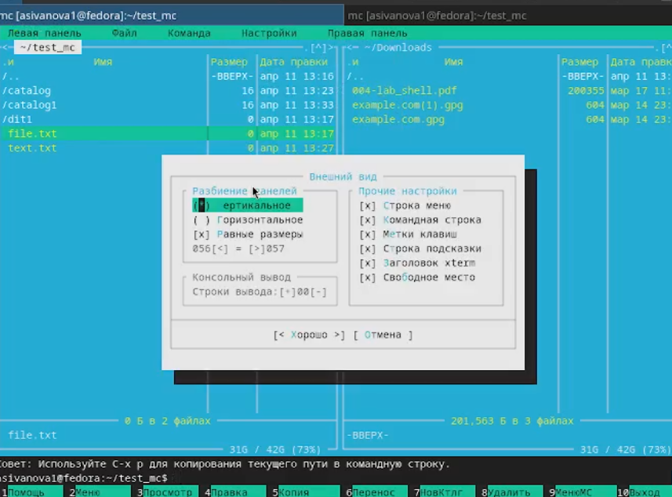{#fig-011 width=70%}

**7. Задание по встроенному редактору mc:**

1) Создадим текстовой файл text.txt и откроем его ([рис. @fig-012]):

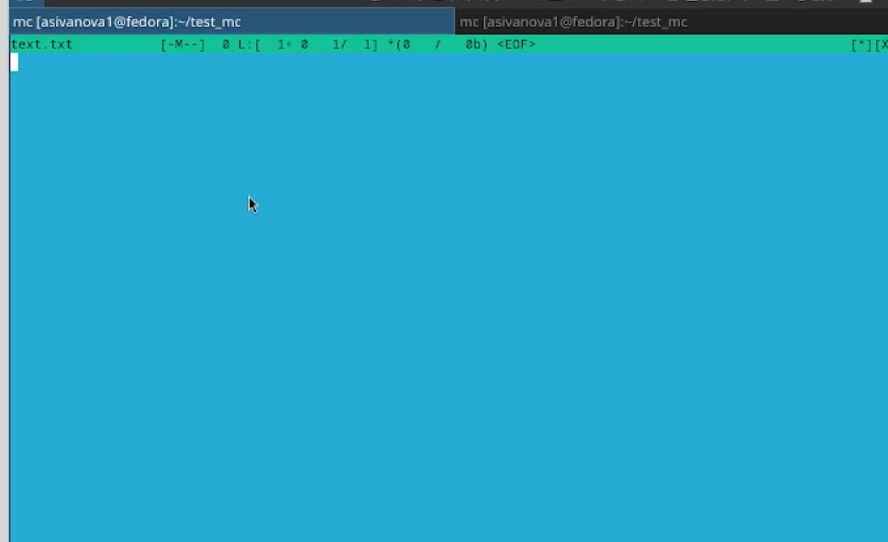{#fig-012 width=70%}

2) Вставим в открытый файл небольшой фрагмент текста, скопированный из любого другого файла или Интернета ([рис. @fig-013]):

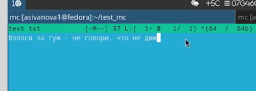{#fig-013 width=70%}

3) Проделаем с текстом следующие манипуляции, используя горячие клавиши:

   3.1) Удалим строку текста ([рис. @fig-014]):

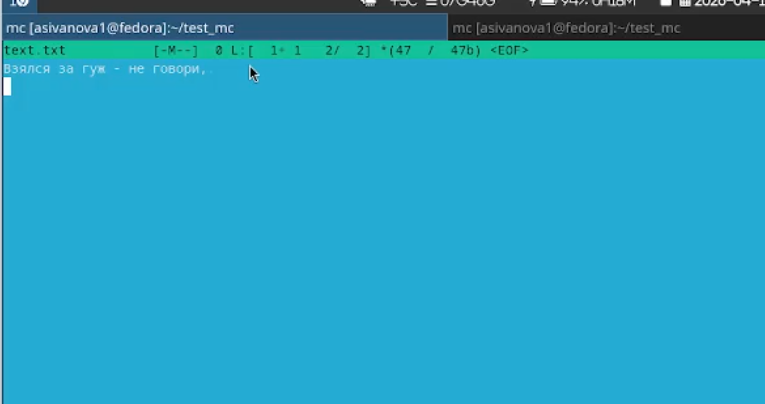{#fig-014 width=70%}

   3.2) Выделим фрагмент текста и скопируем его на новую строку ([рис. @fig-015]):

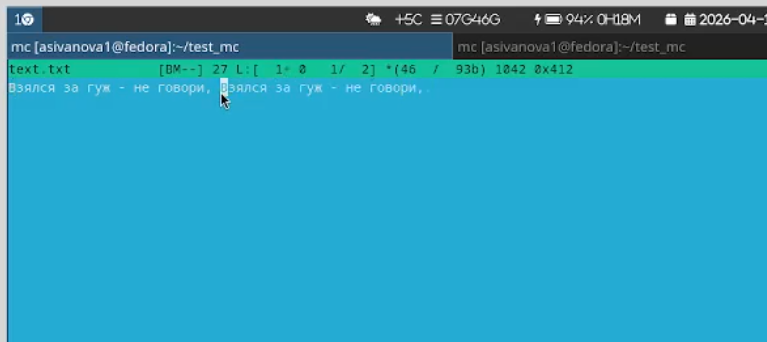{#fig-015 width=70%}

   3.3) Выделим фрагмент текста и перенесём его на новую строку ([рис. @fig-016]):

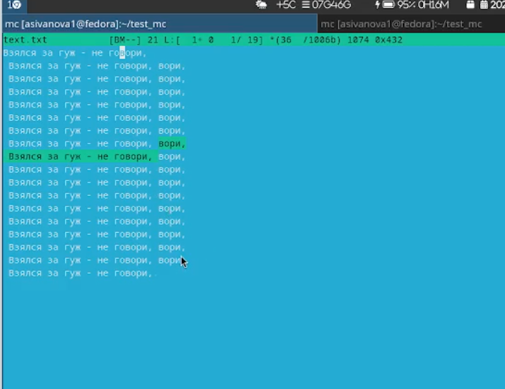{#fig-016 width=70%}

   3.4) Отменим последнее действие ([рис. @fig-017]):

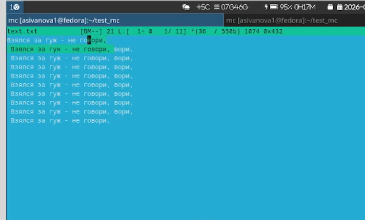{#fig-017 width=70%}

   3.5) Перейдём в конец файла (нажав комбинацию клавиш) и напишем некоторый текст ([рис. @fig-018]):

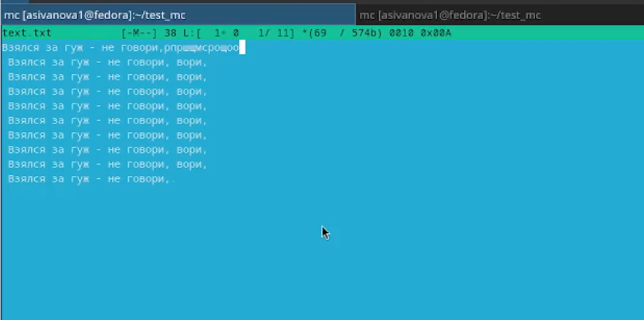{#fig-018 width=70%}

   3.6) Перейдём в начало файла (нажав комбинацию клавиш) и напишем некоторый текст ([рис. @fig-019]):

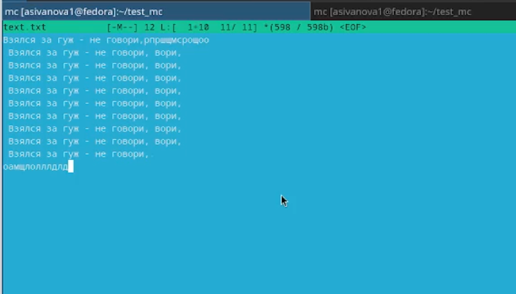{#fig-019 width=70%}

   3.7) Сохраним и закроем файл ([рис. @fig-020]):

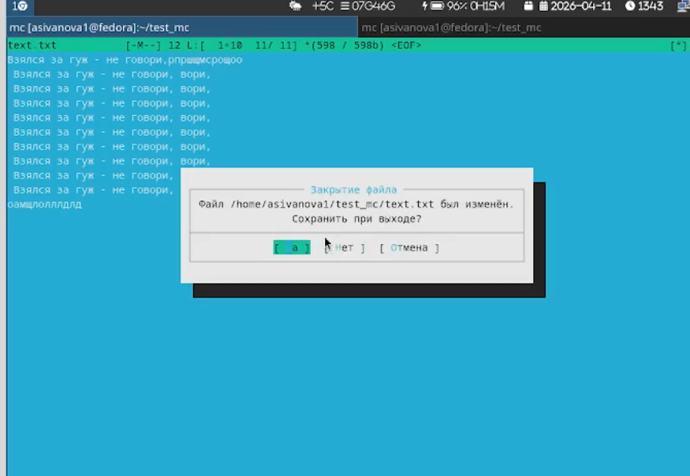{#fig-020 width=70%}

4) Откроем файл с исходным текстом на некотором языке программирования (например C или Java) ([рис. @fig-021]):

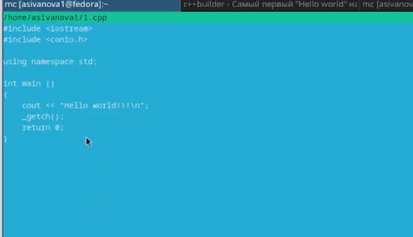{#fig-021 width=70%}

5) Используя меню редактора, включим подсветку синтаксиса, если она не включена, или выключим, если она включена ([рис. @fig-022]):

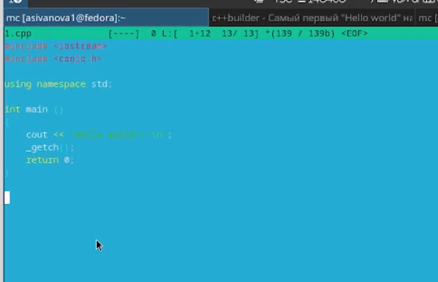{#fig-022 width=70%}

## **Контрольные вопросы**

---

**1. Какие режимы работы есть в mc? Охарактеризуйте их.**

- **Панельный режим** — основной режим, отображаются две панели с файлами
- **Режим информации** — на панели отображается информация о текущем файле и файловой системе
- **Режим дерева** — на панели отображается структура дерева каталогов

---

**2. Какие операции с файлами можно выполнить как с помощью команд shell, так и с помощью меню (комбинаций клавиш) mc? Приведите несколько примеров.**

| Операция | Команда shell | В mc |
|----------|---------------|------|
| Копирование | `cp file1 file2` | `F5` |
| Перемещение | `mv file1 dir/` | `F6` |
| Удаление | `rm file` | `F8` |
| Создание каталога | `mkdir dir` | `F7` |

---

**3. Опишите структура меню левой (или правой) панели mc, дайте характеристику командам.**

- **Список** — отображение содержимого каталога
- **Дерево** — отображение дерева каталогов
- **Информация** — информация о текущем файле
- **Формат списка** — настройка отображения (стандартный, укороченный, расширенный)
- **Сортировка** — по имени, времени, размеру
- **Фильтр** — отображение только определённых файлов

---

**4. Опишите структура меню Файл mc, дайте характеристику командам.**

- **Просмотр** (`F3`) — просмотр содержимого файла
- **Редактирование** (`F4`) — редактирование файла
- **Копирование** (`F5`) — копирование файлов
- **Перемещение** (`F6`) — перемещение/переименование
- **Создание каталога** (`F7`) — создание нового каталога
- **Удаление** (`F8`) — удаление файлов/каталогов
- **Права доступа** (`Ctrl+x` → `c`) — изменение прав доступа
- **Символическая ссылка** (`Ctrl+x` → `s`) — создание ссылки

---

**5. Опишите структура меню Команда mc, дайте характеристику командам.**

- **Поиск файлов** — поиск файлов по имени и содержимому
- **История команд** — просмотр и повтор команд
- **Каталоги быстрого доступа** — быстрый переход в часто используемые каталоги
- **Редактировать файл меню** — настройка пользовательского меню (`~/.mc/menu`)
- **Редактировать файл расширений** — настройка действий для файлов по расширениям (`~/.mc/ext`)

---

**6. Опишите структура меню Настройки mc, дайте характеристику командам.**

- **Внешний вид** — настройка отображения панелей, цветов
- **Настройки панелей** — настройка отображения файлов, показ скрытых файлов
- **Подтверждение** — запрос подтверждения при удалении, перезаписи
- **Распознавание клавиш** — тестирование функциональных клавиш
- **Виртуальная файловая система** — настройка работы с архивами и сетью

---

**7. Назовите и дайте характеристику встроенным командам mc.**

- `cd` — смена текущего каталога
- `pwd` — показать текущий каталог
- `ls` — просмотр содержимого
- `cp` — копирование
- `mv` — перемещение
- `rm` — удаление
- `mkdir` — создание каталога

---

**8. Назовите и дайте характеристику командам встроенного редактора mc.**

| Команда | Действие |
|---------|----------|
| `Ctrl + y` | Удалить строку |
| `F5` | Копировать выделенное |
| `F6` | Вырезать/переместить выделенное |
| `F2` | Сохранить файл |
| `F10` | Выйти из редактора |
| `Ctrl + u` | Отменить последнее действие |
| `Ctrl + Home` | Перейти в начало файла |
| `Ctrl + End` | Перейти в конец файла |
| `Ctrl + s` | Включить/выключить подсветку синтаксиса |

---

**9. Дайте характеристику средствам mc, которые позволяют создавать меню, определяемое пользователем.**

Файл `~/.mc/menu` — пользовательское меню, вызываемое клавишей `F2`. Позволяет добавлять свои команды для выполнения над файлами. Формат:

```
M + 1=Команда
    Выполняемая команда
```

---

**10. Дайте характеристику средствам mc, которые позволяют выполнять действия, определяемые пользователем, над текущим файлом.**

Файл `~/.mc/ext` — файл расширений, определяет действия для файлов по расширению. Например, для `*.c` можно задать компиляцию при нажатии `F3`. Формат:

```
regex/\.c$
    Open=команда
    View=команда для просмотра
```

# **Выводы**

Мы освоили основных возможностей командной оболочки Midnight Commander, приобрели навыков практической работы по просмотру каталогов и файлов; манипуляций с ними.

::: {#refs}
:::
