---
## Author
author:
  name: Иванова Анастасия Сергеевна
  degrees: DSc
  orcid: 0000-0002-0877-7063
  email: 1132250427@rudn.ru
  affiliation:
    - name: Российский университет дружбы народов
      country: Российская Федерация
      postal-code: 117198
      city: Москва
      address: ул. Миклухо-Маклая, д. 6

## Title
title: "Отчёт по лабораторной работе №10"
subtitle: "по курсу: Архитектура компьютера и опреционные системы"
license: "CC BY"
---

# Цель работы

Познакомиться с операционной системой Linux. Получить практические навыки работы с редактором vi, установленным по умолчанию практически во всех дистрибутивах.

# Выполнение лабораторной работы

## Задание 1. Создание нового файла с использованием vi

1. Создадим каталог с именем ~/work/os/lab06 ([рис. @fig-001]):

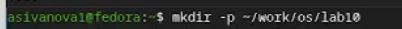{#fig-001 width=70%}

2. Перейдем во вновь созданный каталог ([рис. @fig-002]):

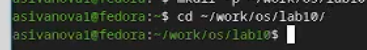{#fig-002 width=70%}

3. Вызовем vi и создадим файл hello.sh ([рис. @fig-003]):

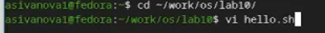{#fig-003 width=70%}

4. Нажмем клавишу i и введем текст ([рис. @fig-004]):

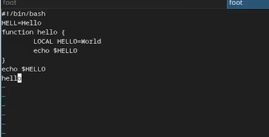{#fig-004 width=70%}

5. Нажмем клавишу Esc для перехода в командный режим после ввода текста ([рис. @fig-005]):

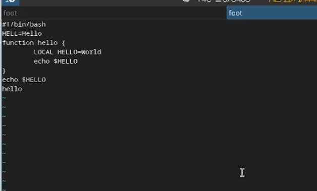{#fig-005 width=70%}

6. Нажмем : для перехода в режим последней строки и внизу нашего экрана появляется приглашение в виде двоеточия ([рис. @fig-006]):

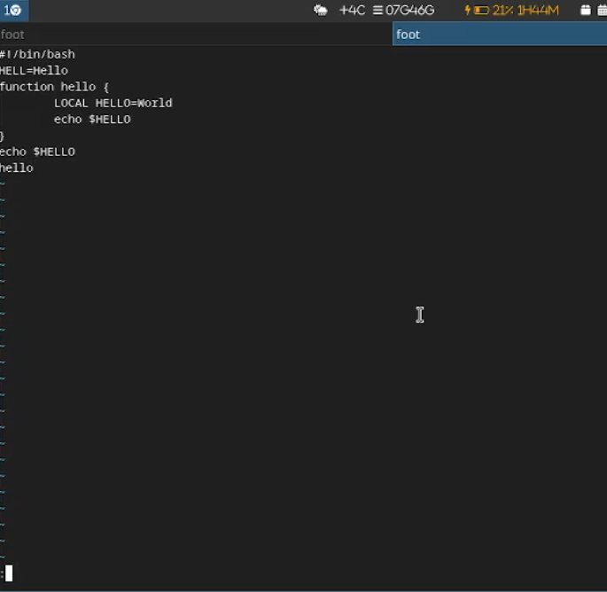{#fig-006 width=70%}

7. Нажмем w (записать) и q (выйти), а затем нажмем клавишу Enter для сохранения текста и завершения работы ([рис. @fig-007]):

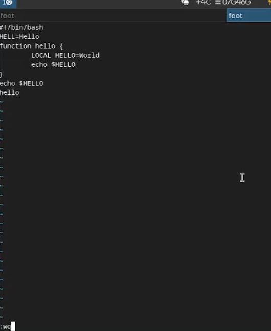{#fig-007 width=70%}

8. Сделем файл исполняемым ([рис. @fig-008]):

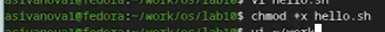{#fig-008 width=70%}

## Задание 2. Редактирование существующего файла

1. Вызовем vi на редактирование файла ([рис. @fig-009]):

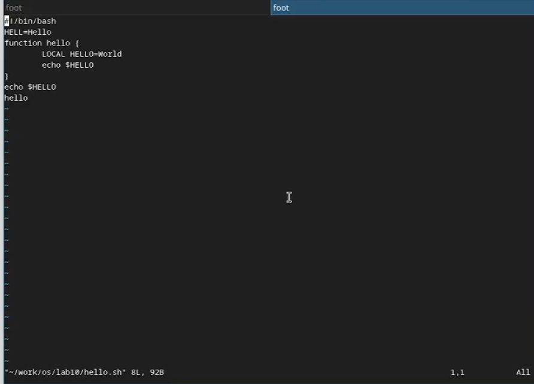{#fig-009 width=70%}

2. Установим курсор в конец слова HELL второй строки ([рис. @fig-010]):

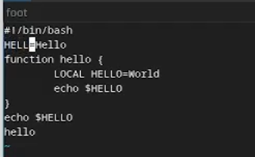{#fig-010 width=70%}

3. Перейдем в режим вставки и заменим на HELLO. Нажмем Esc для возврата в командный режим ([рис. @fig-011]):

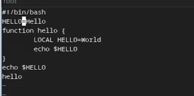{#fig-011 width=70%}

4. Установим курсор на четвертую строку и сотрем слово LOCAL ([рис. @fig-012]):

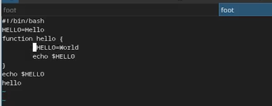{#fig-012 width=70%}

5. Перейдем в режим вставки и наберем следующий текст: local, затем нажмем Esc для возврата в командный режим ([рис. @fig-013]):

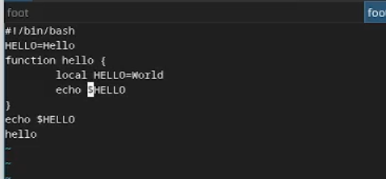{#fig-013 width=70%}

6. Установим курсор на последней строке файла. Вставим после неё строку, содержащую следующий текст: echo $HELLO ([рис. @fig-014]):

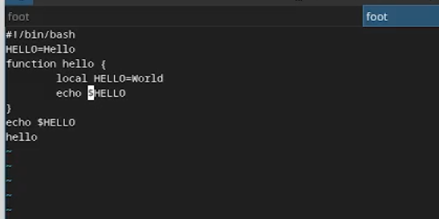{#fig-014 width=70%}

7. Нажмем Esc для перехода в командный режим ([рис. @fig-015]):

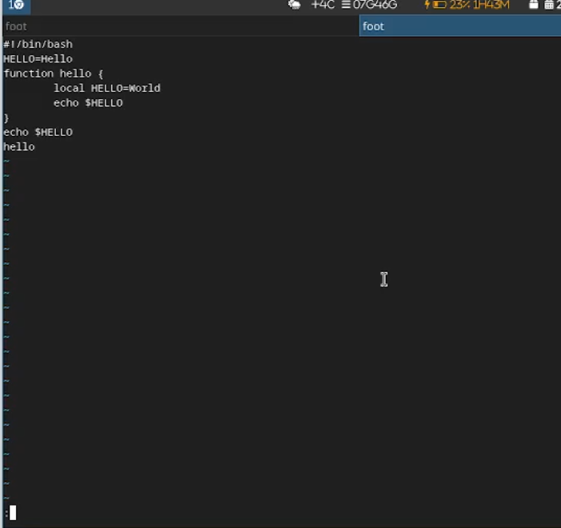{#fig-015 width=70%}

8. Введем символ : для перехода в режим последней строки. Запишем произведённые изменения и выйдем из vi ([рис. @fig-016]):

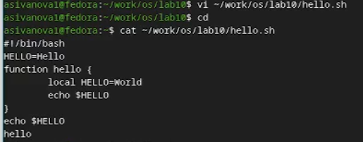{#fig-016 width=70%}

9. Проверим работу файл ([рис. @fig-017]):

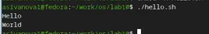{#fig-017 width=70%}

# Контрольные вопросы

**1. Дайте краткую характеристику режимам работы редактора vi.**

- **Командный режим** — предназначен для ввода команд редактирования и навигации. Переход — клавиша `Esc`.
- **Режим вставки** — предназначен для ввода текста. Переход — клавиши `i`, `a`, `o`, `O`.
- **Режим последней строки** — используется для сохранения файла, выхода из редактора, поиска и замены. Переход — `:` (двоеточие) в командном режиме.

---

**2. Как выйти из редактора, не сохраняя произведённые изменения?**

В командном режиме нажать `:` → ввести `q!` → нажать `Enter`.

---

**3. Назовите и дайте краткую характеристику командам позиционирования.**

| Команда | Действие |
|---------|----------|
| `0` | Переход в начало текущей строки |
| `$` | Переход в конец текущей строки |
| `w` | Переход к началу следующего слова |
| `b` | Переход к началу предыдущего слова |
| `gg` | Переход в начало файла |
| `G` | Переход в конец файла |
| `nG` | Переход на строку с номером n |
| `Ctrl+f` | Переход на страницу вперёд |
| `Ctrl+b` | Переход на страницу назад |

---

**4. Что для редактора vi является словом?**

Словом является последовательность букв, цифр и символа подчёркивания `_`. Пунктуация и пробелы разделяют слова.

---

**5. Каким образом из любого места редактируемого файла перейти в начало (конец) файла?**

- В начало файла: в командном режиме нажать `gg`
- В конец файла: в командном режиме нажать `G`

---

**6. Назовите и дайте краткую характеристику основным группам команд редактирования.**

| Группа | Команды | Действие |
|--------|---------|----------|
| Вставка | `i`, `a`, `o`, `O` | Вставка текста перед/после курсора, на новой строке |
| Удаление | `x`, `dd`, `dw` | Удаление символа, строки, слова |
| Замена | `r`, `R` | Замена одного или нескольких символов |
| Копирование | `yy` | Копирование строки |
| Вставка | `p`, `P` | Вставка скопированного или удалённого текста после/перед курсором |
| Отмена | `u` | Отмена последнего действия |

---

**7. Необходимо заполнить строку символами $. Каковы ваши действия?**

1. Перейти в командный режим (`Esc`)
2. Переместить курсор на нужную строку
3. Нажать `R` (замена нескольких символов)
4. Вводить `$` до конца строки
5. Нажать `Esc` для выхода из режима замены

Или: `r$` — заменить один символ под курсором на `$`.

---

**8. Как отменить некорректное действие, связанное с процессом редактирования?**

В командном режиме нажать `u` — отмена последнего действия.

---

**9. Назовите и дайте характеристику основным группам команд режима последней строки.**

| Команда | Действие |
|---------|----------|
| `:w` | Сохранить файл |
| `:q` | Выйти из редактора |
| `:wq` | Сохранить и выйти |
| `:q!` | Выйти без сохранения |
| `:set nu` | Показать номера строк |
| `:set nonu` | Скрыть номера строк |
| `:set list` | Показать невидимые символы |
| `:set ic` | Игнорировать регистр при поиске |
| `:set all` | Показать все опции |

---

**10. Как определить, не перемещая курсора, позицию, в которой заканчивается строка?**

В командном режиме нажать `$` — курсор переместится в конец строки, показав позицию.

---

**11. Выполните анализ опций редактора vi (сколько их, как узнать их назначение и т.д.).**

Узнать список всех опций можно командой `:set all` (более 100 опций). Узнать назначение конкретной опции — `:help set` или `:help опция`.

Основные опции:

| Опция | Назначение |
|-------|------------|
| `autoindent` | Автоматический отступ |
| `ignorecase` | Игнорировать регистр при поиске |
| `number` | Показывать номера строк |
| `syntax` | Подсветка синтаксиса |
| `tabstop` | Ширина табуляции |
| `wrap` | Перенос строк |

---

**12. Как определить режим работы редактора vi?**

- В **командном режиме** клавиши печатают команды, а не текст. Внизу экрана нет индикатора режима.
- В **режиме вставки** вводимый текст отображается, внизу экрана появляется индикатор `-- INSERT --`.
- В **режиме последней строки** внизу экрана появляется двоеточие `:`.

---

**13. Постройте граф взаимосвязи режимов работы редактора vi.**

```
        +-------------------+
        |                   |
        |   Командный режим |
        |                   |
        +-------------------+
          |         |     |
          |         |     |
    i/a/o/O|         |:    |Esc
          |         |     |
          v         v     v
+-------------------+     +-------------------+
|                   |     |                   |
|   Режим вставки   |     | Режим последней   |
|                   |     |     строки        |
+-------------------+     +-------------------+
          |                     |
          |                     | w / q / wq / q!
          |                     v
          |                 +-------------------+
          |                 |                   |
          |                 |      Выход        |
          |                 |                   |
          |                 +-------------------+
          |
          |Esc
          |
          v
+-------------------+
|                   |
|   Командный режим |
|                   |
+-------------------+
```

# Вывод

Мы познакомились с операционной системой Linux и получили практические навыки работы с редактором vi, установленным по умолчанию практически во всех дистрибутивах.

::: {#refs}
:::
