---
## Author
author:
  name: Иванова Анастасия Сергеевна
  degrees: DSc
  orcid: 0000-0002-0877-7063
  email: 1132250427@rudn.ru
  affiliation:
    - name: Российский университет дружбы народов
      country: Российская Федерация
      postal-code: 117198
      city: Москва
      address: ул. Миклухо-Маклая, д. 6

## Title
title: "Отчёт по лабораторной работе №11"
subtitle: "по курсу: Архитектура компьютера и опреционные системы"
license: "CC BY"
---

# Цель работы

Познакомиться с операционной системой Linux. Получить практические навыки работы с редактором Emacs.

---

# Выполнение лабораторной работы

## Задание 1. Основные команды emacs

1. Откроем emacs ([рис. @fig-001]):

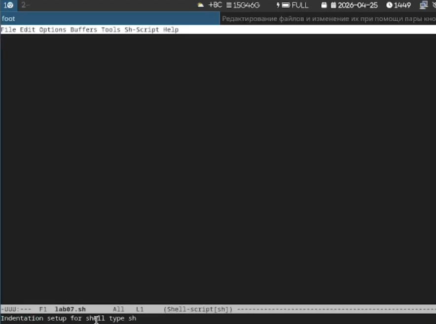{#fig-001 width=70%}

2. Создадим файл lab07.sh с помощью комбинации `C-x C-f` ([рис. @fig-002]):

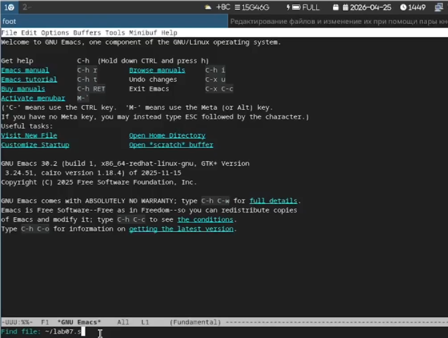{#fig-002 width=70%}

3. Наберём текст ([рис. @fig-003]):

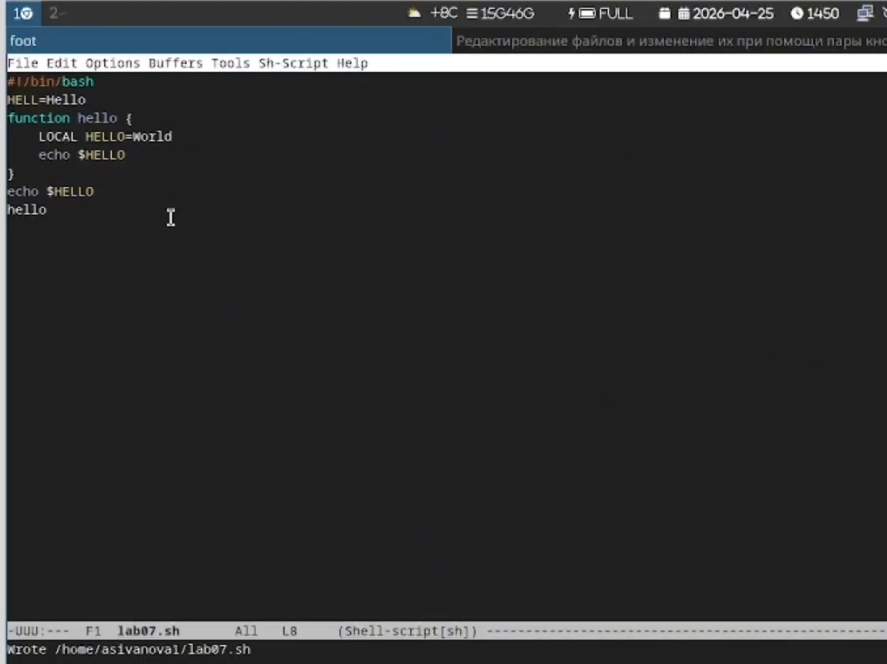{#fig-003 width=70%}

Текст файла:
```bash
#!/bin/bash
HELL=Hello
function hello {
    LOCAL HELLO=World
    echo $HELLO
}
echo $HELLO
hello
```

4. Сохраним файл с помощью комбинации `C-x C-s` ([рис. @fig-004]):

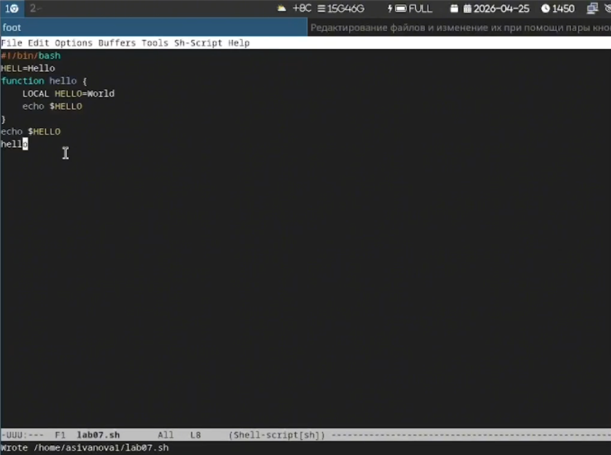{#fig-004 width=70%}

---

## Задание 2. Редактирование текста

5. Проделаем с текстом стандартные процедуры редактирования:

5.1. Вырежем одной командой целую строку (`C-k`) ([рис. @fig-005]):

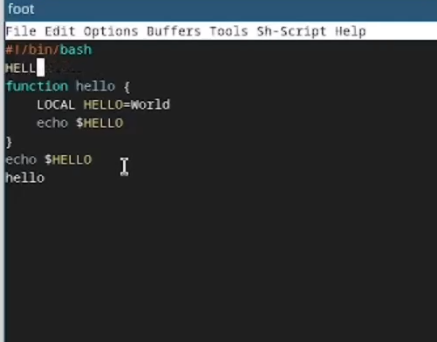{#fig-005 width=70%}

5.2. Вставим эту строку в конец файла (`C-y`) ([рис. @fig-006]):

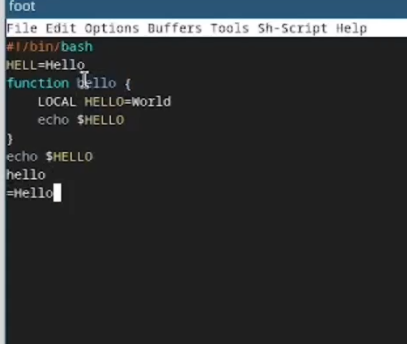{#fig-006 width=70%}

5.3. Выделим область текста (`C-space`) ([рис. @fig-007]):

{#fig-007 width=70%}

5.4. Скопируем область в буфер обмена (`M-w`) ([рис. @fig-008]):

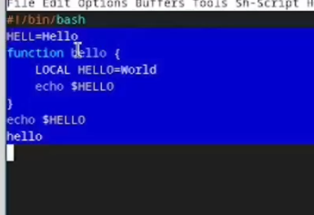{#fig-008 width=70%}

5.5. Вставим область в конец файла (`C-y`) ([рис. @fig-009]):

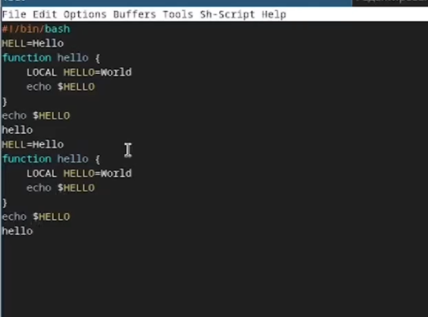{#fig-009 width=70%}

5.6. Вновь выделим эту область и вырежем её (`C-w`) ([рис. @fig-010]):

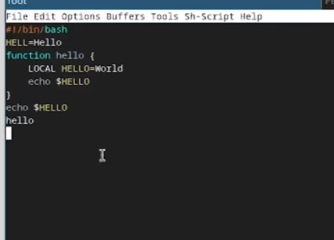{#fig-010 width=70%}

5.7. Отменим последнее действие (`C-/`) ([рис. @fig-011]):

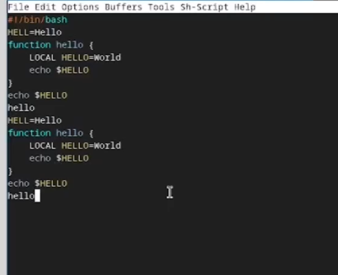{#fig-011 width=70%}

---

## Задание 3. Перемещение курсора

6. Научимся использовать команды по перемещению курсора:

6.1. Переместим курсор в начало строки (`C-a`) ([рис. @fig-012]):

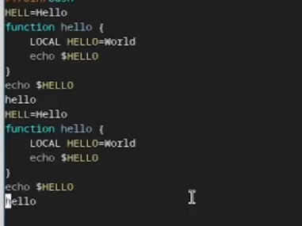{#fig-012 width=70%}

6.2. Переместим курсор в конец строки (`C-e`) ([рис. @fig-013]):

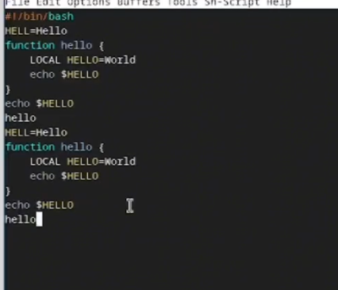{#fig-013 width=70%}

6.3. Переместим курсор в начало буфера (`M-<`) ([рис. @fig-014]):

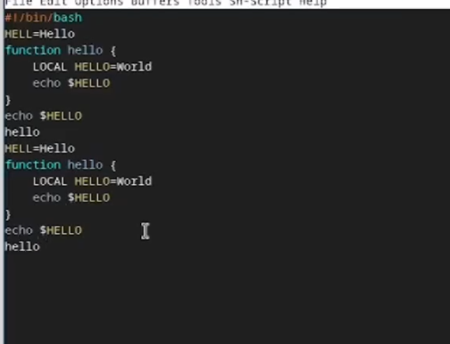{#fig-014 width=70%}

6.4. Переместим курсор в конец буфера (`M->`) ([рис. @fig-015]):

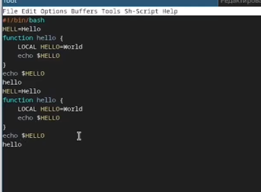{#fig-015 width=70%}

---

## Задание 4. Управление буферами

7. Управление буферами:

7.1. Выведем список активных буферов на экран (`C-x C-b`) ([рис. @fig-016]):

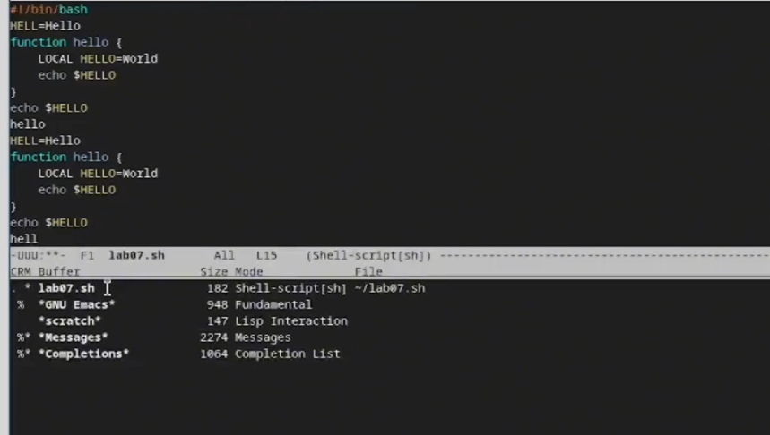{#fig-016 width=70%}

7.2. Переместимся во вновь открытое окно со списком буферов (`C-x o`) ([рис. @fig-017]):

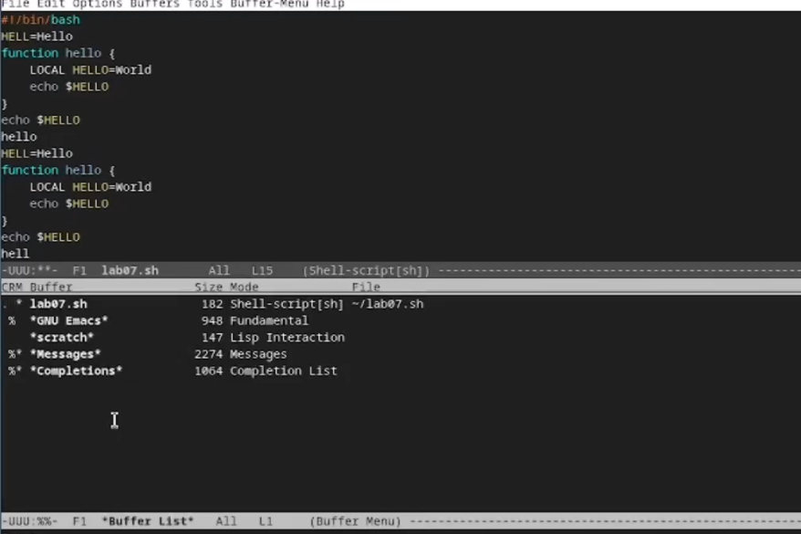{#fig-017 width=70%}

7.3. Закроем это окно (`C-x 0`) ([рис. @fig-018]):

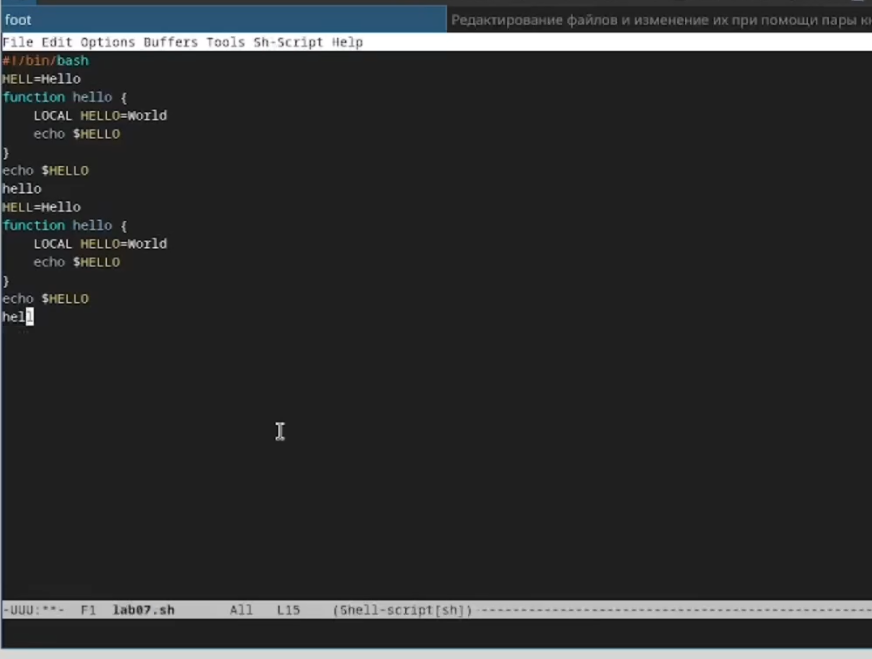{#fig-018 width=70%}

7.4. Переключимся между буферами без вывода списка на экран (`C-x b`) ([рис. @fig-019]):

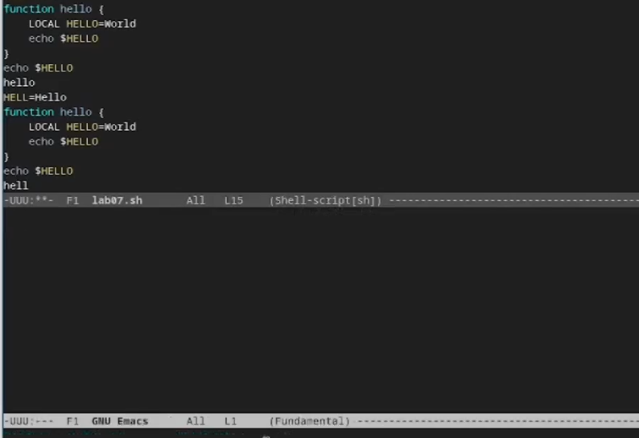{#fig-019 width=70%}

---

## Задание 5. Управление окнами

8. Управление окнами:

8.1. Разделим фрейм на 4 части: сначала разделим по вертикали (`C-x 3`), затем каждое окно по горизонтали (`C-x 2`) ([рис. @fig-020]):

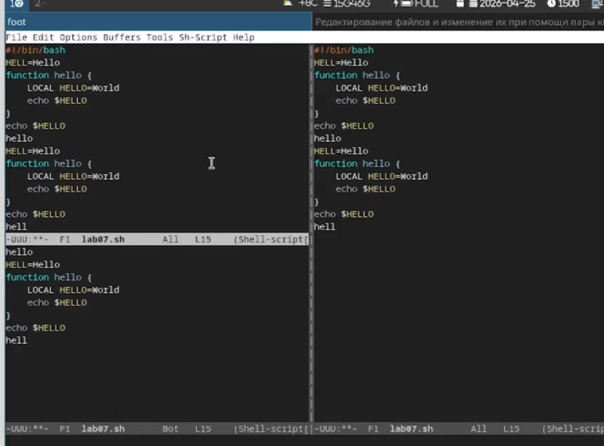{#fig-020 width=70%}

8.2. В каждом из четырёх созданных окон откроем новый буфер (файл) и введём несколько строк текста ([рис. @fig-021]):

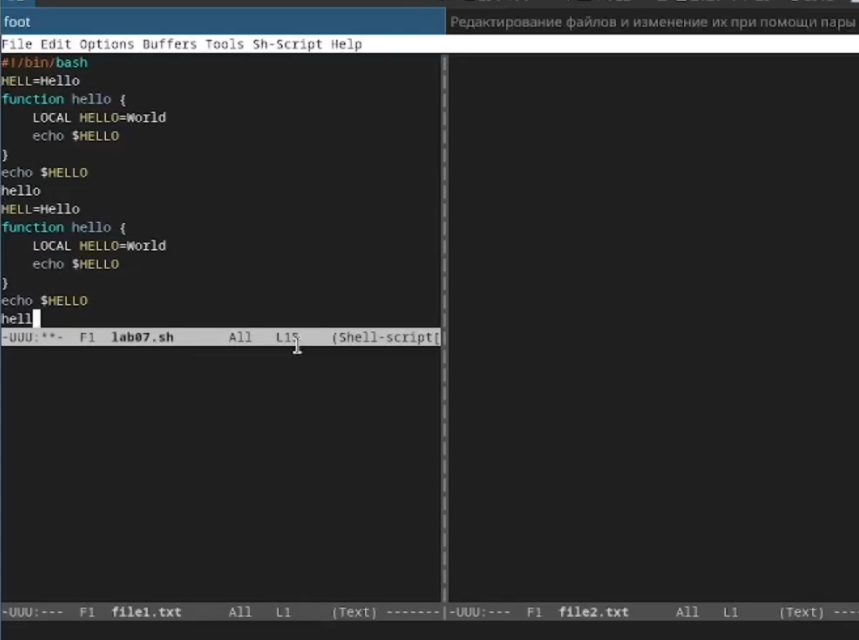{#fig-021 width=70%}

---

## Задание 6. Поиск и замена

9. Режим поиска:

9.1. Переключимся в режим поиска (`C-s`) и найдём несколько слов, присутствующих в тексте ([рис. @fig-022]):

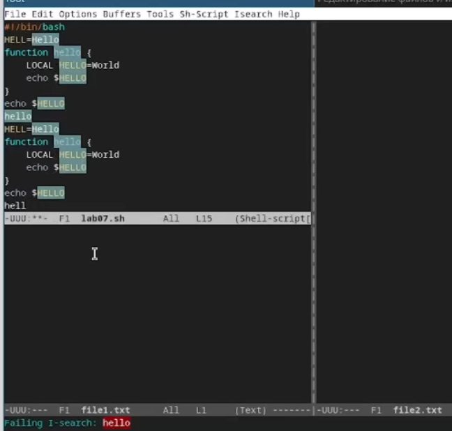{#fig-022 width=70%}

9.2. Переключимся между результатами поиска, нажимая `C-s` ([рис. @fig-023]):

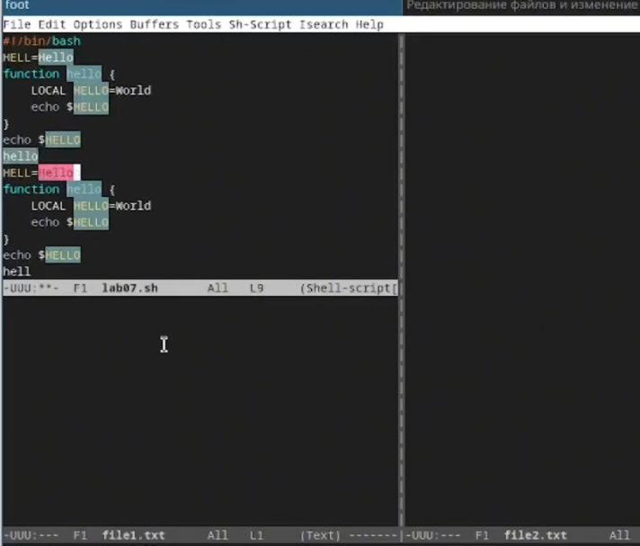{#fig-023 width=70%}

9.3. Выйдем из режима поиска, нажав `C-g` ([рис. @fig-024]):

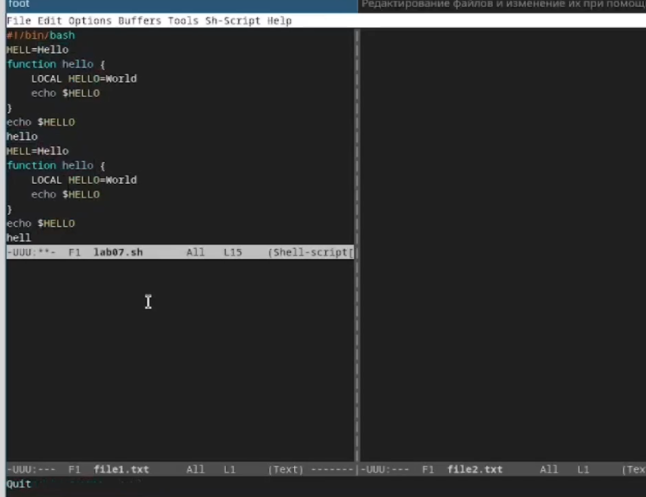{#fig-024 width=70%}

9.4. Перейдём в режим поиска и замены (`M-%`), введём текст, который следует найти и заменить, затем текст для замены. После подсветки результатов нажмём `!` для подтверждения замены ([рис. @fig-025]):

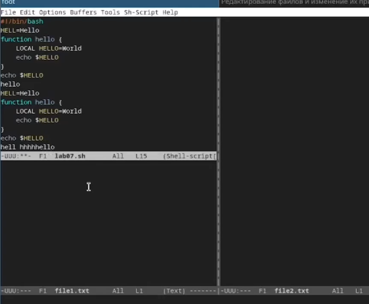{#fig-025 width=70%}

---

# Контрольные вопросы

**1. Кратко охарактеризуйте редактор emacs.**

Emacs — мощный экранный редактор текста, написанный на языке высокого уровня Elisp. Поддерживает множество режимов, расширений и может быть настроен под любые задачи.

---

**2. Какие особенности данного редактора могут сделать его сложным для освоения новичком?**

Сложность в большом количестве комбинаций клавиш, неочевидных для новичка. Многие действия выполняются через `Ctrl` и `Meta` (Alt), а не через меню. Также Emacs имеет собственную философию и терминологию (буферы, фреймы, окна).

---

**3. Своими словами опишите, что такое буфер и окно в терминологии emacs'а.**

- **Буфер** — объект, содержащий какой-либо текст (файл, результаты компиляции, сообщения, справку). Буфер может быть не связан с файлом на диске.
- **Окно** — прямоугольная область фрейма, отображающая один буфер. Один фрейм может содержать несколько окон.

---

**4. Можно ли открыть больше 10 буферов в одном окне?**

Да, количество буферов не ограничено. Окно показывает один буфер в каждый момент времени, но переключаться между буферами можно в любом количестве.

---

**5. Какие буферы создаются по умолчанию при запуске emacs?**

По умолчанию создаются: `*scratch*` (черновик для временных записей), `*Messages*` (буфер с системными сообщениями), `*GNU Emacs*` (приветственное окно).

---

**6. Какие клавиши вы нажмёте, чтобы ввести следующую комбинацию C-c | и C-c C-|?**

- `C-c |` — `Ctrl + c`, затем `|` (Shift + \)
- `C-c C-|` — `Ctrl + c`, затем `Ctrl + Shift + \`

---

**7. Как поделить текущее окно на две части?**

- По горизонтали (верх/низ): `C-x 2`
- По вертикали (лево/право): `C-x 3`

---

**8. В каком файле хранятся настройки редактора emacs?**

Настройки хранятся в файле `~/.emacs` или в каталоге `~/.emacs.d/init.el`.

---

**9. Какую функцию выполняет клавиша ← и можно ли её переназначить?**

Клавиша `←` (влево) перемещает курсор на один символ влево. Да, можно переназначить через `global-set-key` в конфигурационном файле.

---

**10. Какой редактор вам показался удобнее в работе vi или emacs? Поясните почему.**

Emacs удобнее для повседневной работы благодаря графическому интерфейсу, меню и большому количеству расширений. vi удобнее при работе в консоли и на удалённых серверах, так как он есть в любой Unix-системе по умолчанию.

---

# Вывод

Мы познакомились с операционной системой Linux и получили практические навыки работы с редактором Emacs.


::: {#refs}
:::

