---
author:
  name: Иванова Анастасия Сергеевна
  degrees: DSc
  orcid: 0000-0002-0877-7063
  email: 1132250427@rudn.ru
  affiliation:
    - name: Российский университет дружбы народов
      country: Российская Федерация
      postal-code: 117198
      city: Москва
      address: ул. Миклухо-Маклая, д. 6
title: "Лабораторная работа №12"
subtitle: "по курсу: Архитектура компьютера и операционные системы"
license: CC BY
date: today
date-format: "YYYY-MM-DD"
format:
  revealjs:
    theme: default
    slide-number: true
    preview-links: auto
  pptx: default
  beamer:
    toc: true
    toc-title: "Содержание"
    number-sections: true
    pdf-engine: lualatex
    mainfont: Liberation Serif
    sansfont: Liberation Sans
    monofont: Liberation Mono
    lang: ru-RU
    babel-lang: russian
    babel-otherlangs: english
---

# Докладчик

:::::::::::::: {.columns align=center}
::: {.column width="70%"}

  * Иванова Анастасия Сергеевна
  * 1 курс группа НКАбд-07-25
  * Российский университет дружбы народов
  * [1132250427@rudn.ru](mailto:1132250427@rudn.ru)

:::
::: {.column width="30%"}

{width=100%}

:::
::::::::::::::

---

# **Вводная часть**

## Актуальность темы

- Командные оболочки являются основным средством взаимодействия с UNIX-подобными операционными системами
- Навыки программирования в bash необходимы для автоматизации рутинных задач администрирования
- Понимание принципов работы shell-скриптов позволяет эффективно управлять системой и обрабатывать данные
- Создание собственных командных файлов значительно ускоряет выполнение повторяющихся операций

##

## Объект и предмет исследования

**Объект исследования:**
- Командный процессор bash
- Управляющие конструкции языка программирования оболочки
- Способы обработки аргументов командной строки

**Предмет исследования:**
- Создание и выполнение командных файлов в bash
- Использование переменных, массивов и циклов
- Обработка параметров и позиционных аргументов
- Написание скриптов для автоматизации задач

##

## Цели

- Изучить основы программирования в оболочке ОС UNIX/Linux
- Научиться писать небольшие командные файлы

##

# **Выполнение лабораторной работы**

## **Задание 1. Резервная копия самого скрипта**

1. Создадим директорию для скриптов ([рис. @fig-001]):

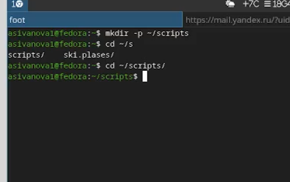{#fig-001 width=70%}

##

2. Создадим файл скрипта `backup_self.sh` ([рис. @fig-002]):

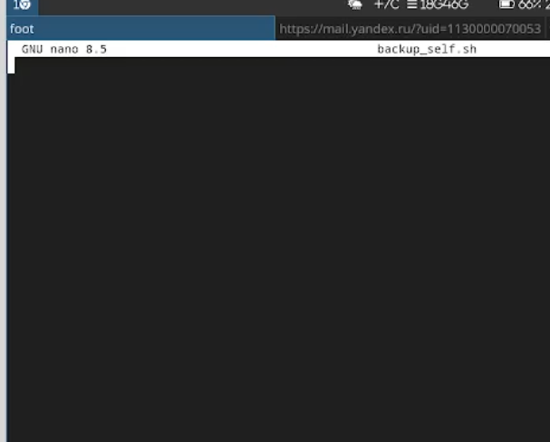{#fig-002 width=70%}

##

3. Код скрипта ([рис. @fig-003]):

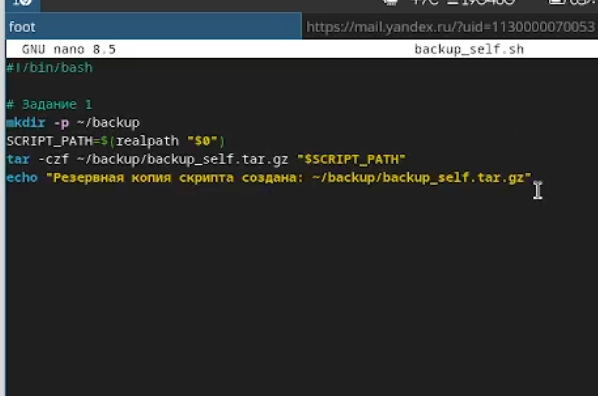{#fig-003 width=70%}

```bash
#!/bin/bash
mkdir -p ~/backup
SCRIPT_PATH=$(realpath "$0")
tar -czf ~/backup/backup_self.tar.gz "$SCRIPT_PATH"
echo "Резервная копия скрипта создана: ~/backup/backup_self.tar.gz"
```

##

4. Сделаем скрипт исполняемым ([рис. @fig-004]):

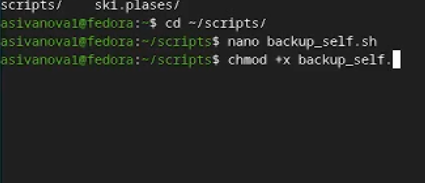{#fig-004 width=70%}

##

5. Запустим скрипт ([рис. @fig-005]):

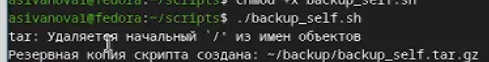{#fig-005 width=70%}

##

6. Проверим результат ([рис. @fig-006]):

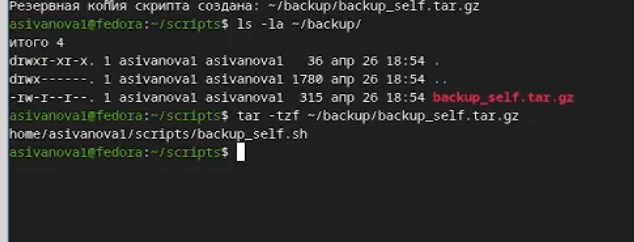{#fig-006 width=70%}

##

## **Задание 2. Обработка произвольного числа аргументов**

1. Создадим файл скрипта `print_args.sh` ([рис. @fig-007]):

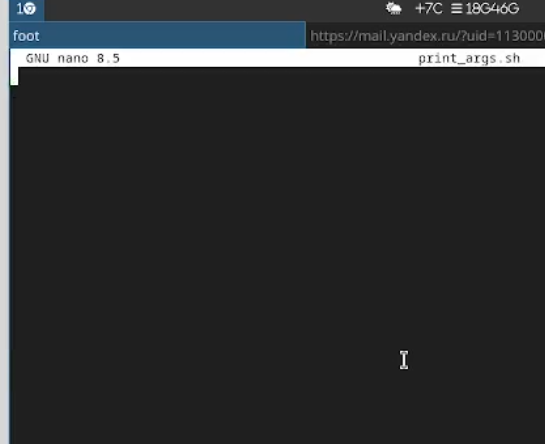{#fig-007 width=70%}

##

2. Код скрипта ([рис. @fig-008]):

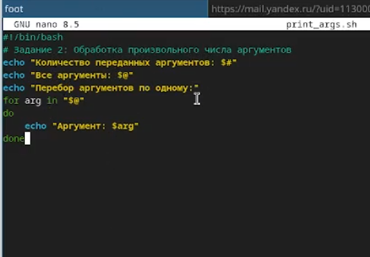{#fig-008 width=70%}

```bash
#!/bin/bash
echo "Количество переданных аргументов: $#"
echo "Все аргументы: $@"
echo "Перебор аргументов по одному:"
for arg in "$@"
do
    echo "Аргумент: $arg"
done
```

##

3. Запустим скрипт с 8 аргументами ([рис. @fig-009]):

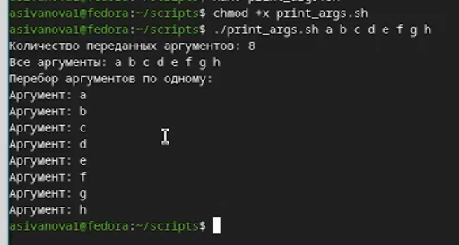{#fig-009 width=70%}

##

## **Задание 3. Аналог команды ls**

1. Создадим файл скрипта `myls.sh` ([рис. @fig-010]):

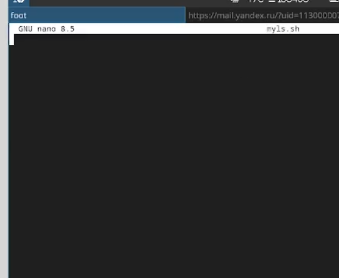{#fig-010 width=70%}

##

2. Код скрипта ([рис. @fig-011]):

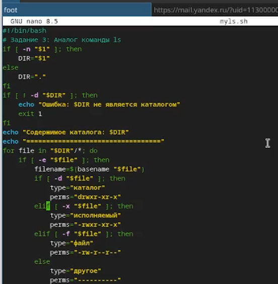{#fig-011 width=70%}

```bash
#!/bin/bash
if [ -n "$1" ]; then
    DIR="$1"
else
    DIR="."
fi
if [ ! -d "$DIR" ]; then
    echo "Ошибка: $DIR не является каталогом"
    exit 1
fi
echo "Содержимое каталога: $DIR"
echo "=================================="
for file in "$DIR"/*; do
    if [ -e "$file" ]; then
        filename=$(basename "$file")
        if [ -d "$file" ]; then
            type="каталог"
            perms="drwxr-xr-x"
        elif [ -x "$file" ]; then
            type="исполняемый"
            perms="-rwxr-xr-x"
        elif [ -f "$file" ]; then
            type="файл"
            perms="-rw-r--r--"
        else
            type="другое"
            perms="----------"
        fi
        echo "$perms $filename ($type)"
    fi
done
```

##

3. Запустим скрипт ([рис. @fig-012]):

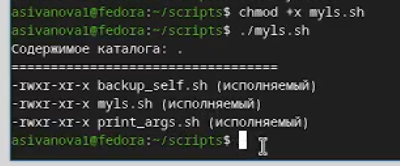{#fig-012 width=70%}

##

4. Запустим скрипт для каталога `/etc` ([рис. @fig-013]):

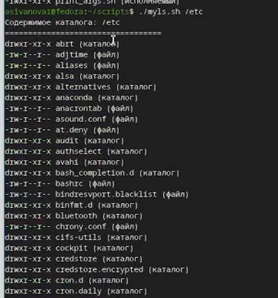{#fig-013 width=70%}

##

## **Задание 4. Подсчёт файлов по расширению**

1. Создадим файл скрипта `count_files.sh` ([рис. @fig-014]):

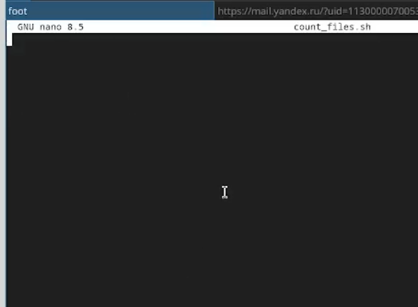{#fig-014 width=70%}

##

2. Код скрипта ([рис. @fig-015]):

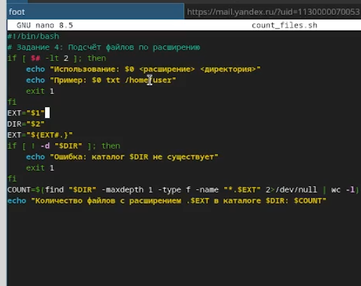{#fig-015 width=70%}

```bash
#!/bin/bash
if [ $# -lt 2 ]; then
    echo "Использование: $0 <расширение> <директория>"
    echo "Пример: $0 txt /home/user"
    exit 1
fi
EXT="$1"
DIR="$2"
EXT="${EXT#.}"
if [ ! -d "$DIR" ]; then
    echo "Ошибка: каталог $DIR не существует"
    exit 1
fi
COUNT=$(find "$DIR" -maxdepth 1 -type f -name "*.$EXT" 2>/dev/null | wc -l)
echo "Количество файлов с расширением .$EXT в каталоге $DIR: $COUNT"
```

##

3. Создадим тестовые файлы ([рис. @fig-016]):

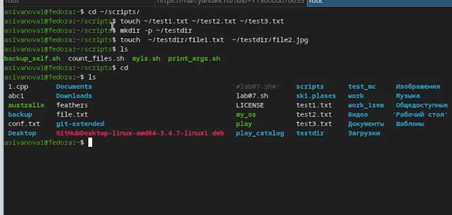{#fig-016 width=70%}

##

4. Запустим скрипт ([рис. @fig-017]):

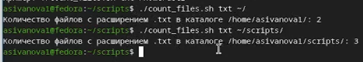{#fig-017 width=70%}

##

5. Запустим скрипт для другого расширения ([рис. @fig-018]):

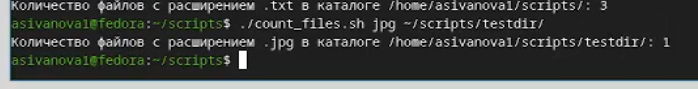{#fig-018 width=70%}

##

# **Контрольные вопросы**

**1. Что такое командная оболочка? Приведите примеры.**

Командная оболочка (shell) — программа для взаимодействия пользователя с ОС. Примеры: `sh`, `bash`, `csh`, `ksh`, `zsh`.

##

**2. Что такое POSIX?**

POSIX — набор стандартов для совместимости UNIX-подобных систем.

##

**3. Как определяются переменные и массивы в bash?**

Переменные: `var=value`. Массивы: `arr=(val1 val2)` или `set -A arr val1 val2`.

##

**4. Каково назначение операторов let и read?**

- `let` — арифметические вычисления
- `read` — чтение ввода с клавиатуры

##

**5. Какие арифметические операции можно применять?**

`+`, `-`, `*`, `/`, `%`, `**`, побитовые операции.

##

**6. Что означает операция (( ))?**

Двойные скобки для арифметических вычислений и условных выражений.

##

**7. Какие стандартные имена переменных Вам известны?**

`PATH`, `HOME`, `USER`, `SHELL`, `PWD`, `IFS`, `MAIL`, `TERM`, `LOGNAME`.

##

**8. Что такое метасимволы?**

Символы со специальным значением: `*`, `?`, `[`, `]`, `>`, `<`, `|`, `&`, `;`, `$`, `\`, `` ` ``.

##

**9. Как экранировать метасимволы?**

- `\` — экранирование одного символа
- `'...'` — полное экранирование
- `"..."` — частичное экранирование

##

**10. Как создавать и запускать командные файлы?**

Создать файл с `#!/bin/bash`, сделать исполняемым (`chmod +x`), запустить `./file.sh`.

##

**11. Как определяются функции в bash?**

```bash
function name { commands; }
# или
name() { commands; }
```

##

**12. Как выяснить, файл или каталог?**

`[ -d "$file" ]` — каталог, `[ -f "$file" ]` — файл.

##

**13. Назначение команд set, typeset и unset?**

- `set` — установка параметров оболочки
- `typeset` — атрибуты переменных
- `unset` — удаление переменных/функций

##

**14. Как передаются параметры в командные файлы?**

Через позиционные параметры: `$1`, `$2`, ... `$9`, `${10}`.

##

**15. Назовите специальные переменные bash.**

`$0` — имя скрипта, `$#` — количество параметров, `$@` — все параметры, `$?` — код возврата, `$$` — PID, `$!` — PID последнего фонового процесса.

##

# **Вывод**

Мы изучили основы программирования в оболочке bash, научились создавать командные файлы, работать с переменными и массивами, использовать управляющие конструкции `for`, `if`, организовывать поиск файлов и обрабатывать аргументы командной строки. В ходе работы были разработаны четыре скрипта: для создания резервной копии, обработки произвольного числа аргументов, аналог команды `ls` и подсчёт файлов по расширению.


---
