---
author:
  name: Иванова Анастасия Сергеевна
  degrees: DSc
  orcid: 0000-0002-0877-7063
  email: 1132250427@rudn.ru
  affiliation:
    - name: Российский университет дружбы народов
      country: Российская Федерация
      postal-code: 117198
      city: Москва
      address: ул. Миклухо-Маклая, д. 6
title: "Лабораторная работа №13"
subtitle: "Программирование в командном процессоре ОС UNIX. Ветвления и циклы"
license: CC BY
date: today
date-format: "YYYY-MM-DD"
format:
  revealjs:
    theme: default
    slide-number: true
    preview-links: auto
  pptx: default
  beamer:
    toc: true
    toc-title: "Содержание"
    number-sections: true
    pdf-engine: lualatex
    mainfont: Liberation Serif
    sansfont: Liberation Sans
    monofont: Liberation Mono
    lang: ru-RU
    babel-lang: russian
    babel-otherlangs: english
---

# Докладчик

:::::::::::::: {.columns align=center}
::: {.column width="70%"}

  * Иванова Анастасия Сергеевна
  * 1 курс группа НКАбд-07-25
  * Российский университет дружбы народов
  * [1132250427@rudn.ru](mailto:1132250427@rudn.ru)

:::
::: {.column width="30%"}

{width=100%}

:::
::::::::::::::

---

# **Вводная часть**

## Актуальность темы

- Ветвления и циклы – основа алгоритмизации в командных оболочках UNIX
- Позволяют создавать гибкие скрипты для автоматизации административных задач
- Умение обрабатывать ключи командной строки (`getopts`) необходимо для профессиональных скриптов
- Анализ кода возврата программ и работа с `find`/`tar` расширяют возможности shell-программирования

##

## Объект и предмет исследования

**Объект исследования:**
- Командный процессор bash
- Управляющие конструкции: `if`, `case`, `for`, `while`, `until`
- Механизмы обработки аргументов и кодов завершения

**Предмет исследования:**
- Разработка скриптов с использованием `getopts`
- Создание программы на C и анализ её кода завершения в оболочке
- Циклическое создание и удаление файлов
- Фильтрация файлов по времени изменения и архивация

##

## Цели

- Изучить основы программирования в оболочке ОС UNIX
- Научиться писать более сложные командные файлы с использованием логических управляющих конструкций и циклов

##

# Выполнение лабораторной работы

## Задание 1. Скрипт с ключами getopts

Разработаем скрипт `search.sh`, который анализирует командную строку с ключами `-inputfile`, `-outputfile`, `-p`, `-C`, `-n` и выполняет поиск строк в указанном файле.

1. Создадим файл скрипта `search.sh` (рис. 2.1):

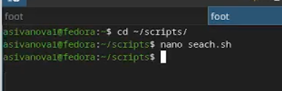{#fig:001 width=70%}

##

2. Листинг скрипта `search.sh` (рис. 2.2):

```bash
#!/bin/bash

input_file=""
output_file=""
pattern=""
case_sensitive="no"
number_lines="no"

usage() {
    echo "Использование: $0 -inputfile <файл> -p <шаблон> [-outputfile <файл>] [-C] [-n]"
    exit 1
}

while getopts ":i:o:p:Cn" opt; do
    case $opt in
        i) input_file="$OPTARG" ;;
        o) output_file="$OPTARG" ;;
        p) pattern="$OPTARG" ;;
        C) case_sensitive="yes" ;;
        n) number_lines="yes" ;;
        \?) echo "Неизвестный параметр: -$OPTARG" >&2; usage ;;
        :) echo "Параметр -$OPTARG требует аргумента" >&2; usage ;;
    esac
done

if [ -z "$input_file" ] || [ -z "$pattern" ]; then
    echo "Ошибка: необходимо указать -inputfile и -p"
    usage
fi

if [ ! -f "$input_file" ]; then
    echo "Ошибка: файл $input_file не существует"
    exit 1
fi

grep_opts=""
if [ "$case_sensitive" != "yes" ]; then
    grep_opts="-i"
fi
if [ "$number_lines" = "yes" ]; then
    grep_opts="$grep_opts -n"
fi

if [ -n "$output_file" ]; then
    grep $grep_opts "$pattern" "$input_file" > "$output_file"
    echo "Результат сохранён в $output_file"
else
    grep $grep_opts "$pattern" "$input_file"
fi
```
##

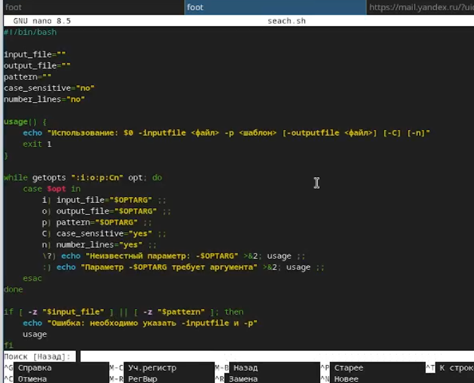{#fig:002 width=70%}

##

3. Сделаем файл исполняемым и подготовим тестовый файл `test.txt` (рис. 2.3):

```bash
echo "Hello world" > test.txt
echo "hello again" >> test.txt
echo "HELLO upper" >> test.txt
echo "goodbye" >> test.txt
```

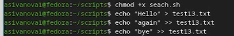{#fig:003 width=70%}

##

4. Запустим скрипт с различными ключами (рис. 2.4):

```bash
./search.sh -i test.txt -p hello -n
./search.sh -i test.txt -p hello -C -n
./search.sh -i test.txt -p hello -n -o output.txt
cat output.txt
```

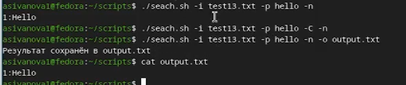{#fig:004 width=70%}

##

## Задание 2. Программа на C и анализ кода завершения

Создадим программу на C `checknum.c`, которая вводит число и возвращает код завершения в зависимости от его знака. Затем напишем скрипт, анализирующий этот код.

1. Листинг `checknum.c` (рис. 2.5):

```c
#include <stdio.h>
#include <stdlib.h>

int main() {
    int n;
    printf("Введите число: ");
    scanf("%d", &n);
    if (n > 0) {
        printf("Число положительное\n");
        exit(1);
    } else if (n < 0) {
        printf("Число отрицательное\n");
        exit(2);
    } else {
        printf("Число равно нулю\n");
        exit(0);
    }
}
```
##

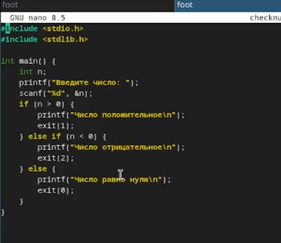{#fig:005 width=70%}

##

2. Скомпилируем программу (рис. 2.6):

```bash
gcc checknum.c -o checknum
```

{#fig:006 width=70%}

##

3. Создадим скрипт `run_check.sh` для анализа кода возврата (рис. 2.7):

```bash
#!/bin/bash
./checknum
status=$?
case $status in
    0) echo "Введён ноль" ;;
    1) echo "Введено положительное число" ;;
    2) echo "Введено отрицательное число" ;;
    *) echo "Неизвестный код завершения" ;;
esac
```

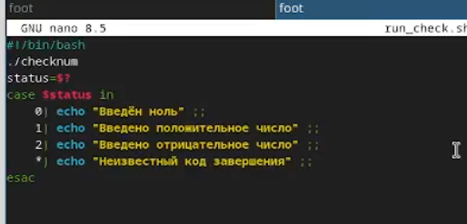{#fig:007 width=70%}

##

4. Сделаем файл исполняем и протестируем на числах 8, -10, 0 (рис. 2.8 – 2.10):

```bash
./run_check.sh   # ввод 8
./run_check.sh   # ввод -10
./run_check.sh   # ввод 0
```

##

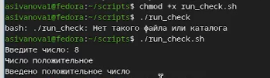{#fig:008 width=70%}

##

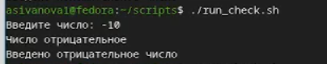{#fig:009 width=70%}

##

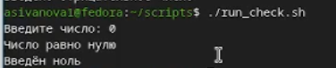{#fig:010 width=70%}

##

## Задание 3. Создание и удаление нумерованных файлов

Разработаем скрипт `file_manager.sh`, который создаёт или удаляет файлы `1.tmp`, `2.tmp`, ..., `N.tmp` в зависимости от наличия ключа `-d`.

1. Листинг `file_manager.sh` (рис. 2.11):

```bash
#!/bin/bash

if [ $# -lt 1 ]; then
    echo "Использование: $0 [-d] N"
    echo "  без -d: создаёт файлы 1.tmp .. N.tmp"
    echo "  с -d: удаляет файлы 1.tmp .. N.tmp"
    exit 1
fi

if [ "$1" = "-d" ]; then
    delete_mode=1
    N=$2
else
    delete_mode=0
    N=$1
fi

if ! [[ "$N" =~ ^[0-9]+$ ]]; then
    echo "Ошибка: N должно быть числом"
    exit 1
fi

if [ $delete_mode -eq 1 ]; then
    for i in $(seq 1 $N); do
        if [ -f "$i.tmp" ]; then
            rm "$i.tmp"
            echo "Удалён файл $i.tmp"
        else
            echo "Файл $i.tmp не существует"
        fi
    done
else
    for i in $(seq 1 $N); do
        touch "$i.tmp"
        echo "Создан файл $i.tmp"
    done
fi
```
##

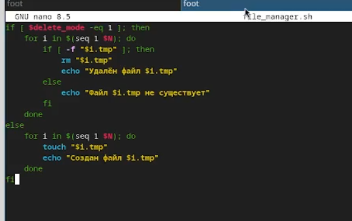{#fig:011 width=70%}

##

2. Сделаем файл исполняемым и создадим 5 файлов (рис. 2.12):

```bash
chmod +x file_manager.sh
./file_manager.sh 5
ls *.tmp
```

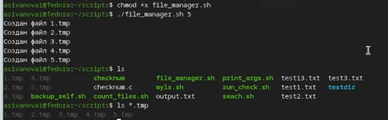{#fig:012 width=70%}

##

3. Удалим созданные файлы (рис. 2.13):

```bash
./file_manager.sh -d 5
ls *.tmp
```

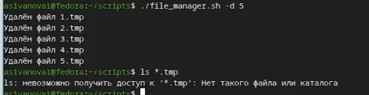{#fig:013 width=70%}

##

## Задание 4. Архивация свежих файлов

Разработаем скрипт `backup_recent.sh`, который архивирует только файлы, изменённые за последние 7 дней в указанной директории.

1. Листинг `backup_recent.sh` (рис. 2.14):

```bash
#!/bin/bash

if [ $# -ne 1 ]; then
    echo "Использование: $0 <директория>"
    exit 1
fi

DIR="$1"

if [ ! -d "$DIR" ]; then
    echo "Ошибка: директория $DIR не существует"
    exit 1
fi

BACKUP_NAME="backup_$(date +%Y%m%d_%H%M%S).tar.gz"

find "$DIR" -type f -mtime -7 -print | tar -czf "$BACKUP_NAME" -T -

echo "Архив создан: $BACKUP_NAME"
```
##

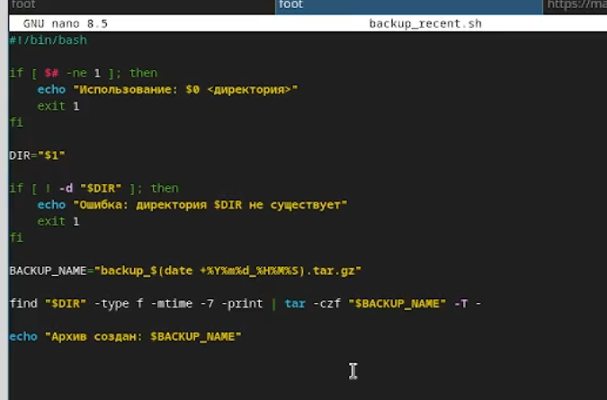{#fig:014 width=70%}

##

2. Сделаем файл исполняемым и подготовим тестовую директорию с файлами разной давности (рис. 2.15):

```bash
mkdir testdir
touch testdir/oldfile -d "10 days ago"
touch testdir/newfile1
echo "test" > testdir/newfile2
```

{#fig:015 width=70%}

##

3. Запустим скрипт и проверим содержимое архива (рис. 2.16):

```bash
chmod +x backup_recent.sh
./backup_recent.sh testdir
tar -tzf backup_*.tar.gz
```
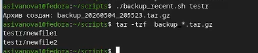{#fig:016 width=70%}

В архиве присутствуют только `testdir/newfile1` и `testdir/newfile2`.

##

# Контрольные вопросы

1. **Каково предназначение команды getopts?**  
   `getopts` используется для разбора опций командной строки в скриптах bash. Позволяет обрабатывать ключи с аргументами и без них, упрощая анализ параметров.

2. **Какое отношение метасимволы имеют к генерации имён файлов?**  
   Метасимволы (`*`, `?`, `[]`) служат для подстановки имён файлов (globbing) – замены шаблона на список существующих файлов.

3. **Какие операторы управления действиями вы знаете?**  
   `if`, `then`, `else`, `elif`, `fi`, `case`, `esac`, `for`, `while`, `until`, `break`, `continue`, `exit`.

4. **Какие операторы используются для прерывания цикла?**  
   `break` – немедленный выход из цикла, `continue` – переход к следующей итерации.

5. **Для чего нужны команды false и true?**  
   `true` всегда возвращает код 0 (истина), `false` – ненулевой код (ложь). Используются для организации бесконечных циклов или для задания условий.

6. **Что означает строка `if test -f man\$s/\\\$i.\\\$s` в командном файле?**  
   Проверяет существование файла, имя которого формируется из переменных `$s` и `$i`. Обратные слеши экранируют метасимволы, чтобы они воспринимались буквально.

7. **Объясните различие между конструкциями while и until.**  
   `while` выполняет тело цикла, пока условие истинно (код возврата 0). `until` – пока условие ложно (код возврата не 0). То есть `until` является антиподом `while`.

##

# Вывод

Мы изучили основы программирования в оболочке ОС UNIX, научились писать более сложные командные файлы с использованием логических управляющих конструкций и циклов.


---
