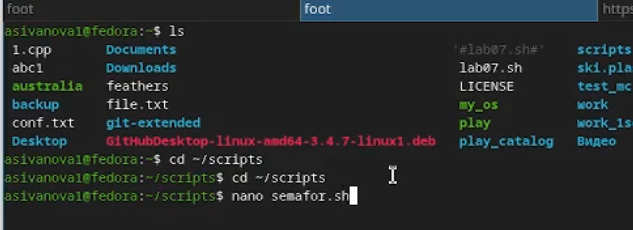
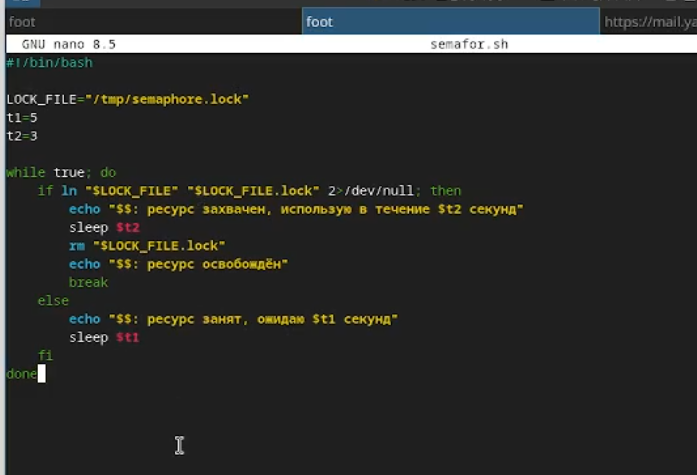
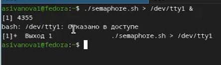
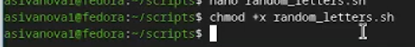

---
author:
  name: Иванова Анастасия Сергеевна
  degrees: DSc
  orcid: 0000-0002-0877-7063
  email: 1132250427@rudn.ru
  affiliation:
    - name: Российский университет дружбы народов
      country: Российская Федерация
      postal-code: 117198
      city: Москва
      address: ул. Миклухо-Маклая, д. 6
title: "Лабораторная работа №14"
subtitle: "Программирование в командном процессоре ОС UNIX. Расширенное программирование"
license: CC BY
date: today
date-format: "YYYY-MM-DD"
format:
  revealjs:
    theme: default
    slide-number: true
    preview-links: auto
  pptx: default
  beamer:
    toc: true
    toc-title: "Содержание"
    number-sections: true
    pdf-engine: lualatex
    mainfont: Liberation Serif
    sansfont: Liberation Sans
    monofont: Liberation Mono
    lang: ru-RU
    babel-lang: russian
    babel-otherlangs: english
---

# Докладчик

:::::::::::::: {.columns align=center}
::: {.column width="70%"}

  * Иванова Анастасия Сергеевна
  * 1 курс группа НКАбд-07-25
  * Российский университет дружбы народов
  * [1132250427@rudn.ru](mailto:1132250427@rudn.ru)

:::
::: {.column width="30%"}

{width=100%}

:::
::::::::::::::

---

# **Вводная часть**

## Актуальность темы

- Расширенное программирование в bash позволяет решать сложные задачи автоматизации
- Механизмы синхронизации процессов необходимы при разработке многопоточных скриптов
- Создание аналогов системных утилит (man) углубляет понимание работы ОС
- Генерация случайных данных полезна для тестирования и моделирования

##

## Объект и предмет исследования

**Объект исследования:**
- Командный процессор bash
- Механизмы синхронизации процессов (файловые блокировки)
- Встроенные переменные и функции оболочки

**Предмет исследования:**
- Реализация семафоров на уровне файловой системы
- Создание аналога команды man
- Генерация случайных последовательностей с использованием `$RANDOM`
- Взаимодействие между несколькими процессами

##

## Цели

- Изучить основы программирования в оболочке ОС UNIX
- Научиться писать более сложные командные файлы с использованием логических управляющих конструкций и циклов

##

# **Выполнение лабораторной работы**

## **Задание 1. Реализация упрощённого механизма семафоров**

### Создание файла `semafor.sh`

```bash
nano semafor.sh
```

{#fig-001 width=70%}

##

### Листинг `semafor.sh`

```bash
#!/bin/bash

LOCK_FILE="/tmp/semaphore.lock"
t1=5
t2=3

while true; do
    if ln "$LOCK_FILE" "$LOCK_FILE.lock" 2>/dev/null; then
        echo "$$: ресурс захвачен, использую в течение $t2 секунд"
        sleep $t2
        rm "$LOCK_FILE.lock"
        echo "$$: ресурс освобождён"
        break
    else
        echo "$$: ресурс занят, ожидаю $t1 секунд"
        sleep $t1
    fi
done
```
##

{#fig-002 width=70%}

##

### Делаем скрипт исполняемым

```bash
chmod +x semafor.sh
```

{#fig-003 width=70%}

##

### Тестирование работы семафора

**Терминал 1:**
```bash
./semafor.sh
```

{#fig-004 width=70%}

##

**Терминал 2 (фоновый запуск с перенаправлением вывода):**
```bash
./semafor.sh > /dev/tty1 &
```

{#fig-005 width=70%}

##

## **Задание 2. Реализация команды man**

### Создание файла `my_man.sh`

```bash
nano my_man.sh
```

{#fig-006 width=70%}

##

### Листинг `my_man.sh`

```bash
#!/bin/bash

if [ $# -ne 1 ]; then
    echo "Использование: $0 <команда>"
    exit 1
fi

CMD="$1"
MAN_FILE="/usr/share/man/man1/${CMD}.1.gz"

if [ -f "$MAN_FILE" ]; then
    zcat "$MAN_FILE" | less
else
    echo "Справка для команды '$CMD' не найдена"
    exit 1
fi
```
##

{#fig-007 width=70%}

##

### Делаем скрипт исполняемым

```bash
chmod +x my_man.sh
```

{#fig-008 width=70%}

##

### Тестирование работы `my_man.sh`

```bash
./my_man.sh ls
./my_man.sh unknown_command
```

{#fig-009 width=70%}

##

## **Задание 3. Генерация случайной последовательности букв**

### Создание файла `random_letters.sh`

```bash
nano random_letters.sh
```

{#fig-010 width=70%}

##

### Листинг `random_letters.sh`

```bash
#!/bin/bash

LENGTH=${1:-20}

for ((i=0; i<LENGTH; i++)); do
    RAND=$((RANDOM % 26))
    LETTER=$(printf \\$(printf '%03o' $((97 + RAND))))
    echo -n "$LETTER"
done
echo
```

##

{#fig-011 width=70%}

##

### Делаем скрипт исполняемым

```bash
chmod +x random_letters.sh
```

{#fig-012 width=70%}

##

### Тестирование работы `random_letters.sh`

```bash
./random_letters.sh
./random_letters.sh 10
```

{#fig-013 width=70%}

##

# **Контрольные вопросы**

**1. Найдите синтаксическую ошибку в следующей строке:**
```bash
while [$1 != "exit"]
```
**Ответ:** пропущены пробелы после `[` и перед `]`. Правильно: `while [ "$1" != "exit" ]`

##

**2. Как объединить (конкатенация) несколько строк в одну?**
**Ответ:** можно использовать оператор `+=`:
```bash
str="Hello"
str+=" World"
```

##

**3. Найдите информацию об утилите seq. Какими иными способами можно реализовать её функционал?**
**Ответ:** `seq` генерирует последовательность чисел. Альтернативы:
```bash
for i in {1..10}; do echo $i; done
for ((i=1; i<=10; i++)); do echo $i; done
```

##

**4. Какой результат даст вычисление выражения `$((10/3))`?**
**Ответ:** `3` (целочисленное деление).

##

**5. Укажите кратко основные отличия командной оболочки zsh от bash.**
**Ответ:** zsh имеет автодополнение с подсветкой, поддержку ассоциативных массивов, разделяемые истории между сеансами.

##

**6. Проверьте, верен ли синтаксис данной конструкции:**
```bash
for ((a=1; a <= LIMIT; a++))
```
**Ответ:** синтаксис верен.

##

**7. Сравните язык bash с какими-либо языками программирования. Какие преимущества у bash по сравнению с ними? Какие недостатки?**
**Ответ:**  
*Преимущества:* простота автоматизации команд ОС, встроенные инструменты для работы с файлами и процессами.  
*Недостатки:* медленная работа, ограниченная поддержка чисел с плавающей точкой.

##

# **Вывод**

В ходе лабораторной работы были разработаны три скрипта:

- `semafor.sh` – реализация упрощённого механизма семафоров с использованием файловой блокировки.
- `my_man.sh` – аналог команды `man` для просмотра справки из `/usr/share/man/man1`.
- `random_letters.sh` – генерация случайной последовательности букв латинского алфавита с использованием `$RANDOM`.

Приобретены навыки межпроцессного взаимодействия через файловые блокировки, работы со сжатыми man-страницами (`zcat`), генерации случайных последовательностей, а также изучены особенности синтаксиса bash.

---
