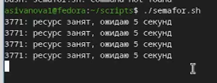
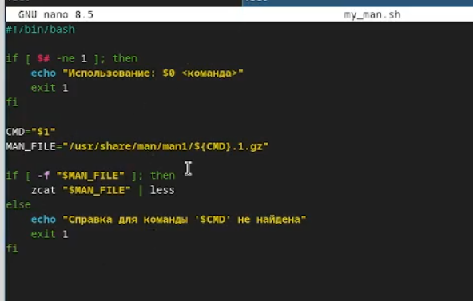
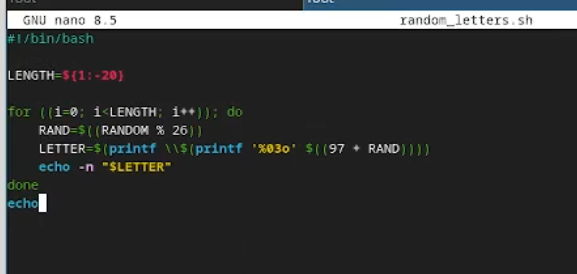
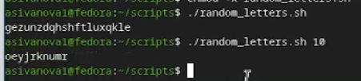

---
## Author
author:
  name: Иванова Анастасия Сергеевна
  degrees: DSc
  orcid: 0000-0002-0877-7063
  email: 1132250427@rudn.ru
  affiliation:
    - name: Российский университет дружбы народов
      country: Российская Федерация
      postal-code: 117198
      city: Москва
      address: ул. Миклухо-Маклая, д. 6

## Title
title: "Отчёт по лабораторной работе №14"
subtitle: "Программирование в командном процессоре ОС UNIX. Расширенное программирование"
license: "CC BY"
---

# Цель работы

Изучить основы программирования в оболочке ОС UNIX. Научиться писать более сложные командные файлы с использованием логических управляющих конструкций и циклов.

# Выполнение лабораторной работы

## Задание 1. Реализация упрощённого механизма семафоров

Разработаем скрипт `semafor.sh`, реализующий упрощённый механизм семафоров.

**Создание файла `semafor.sh` (рис. 2.1):**

{#fig:001 width=70%}

**Листинг `semafor.sh` (рис. 2.2):**

```bash
#!/bin/bash

LOCK_FILE="/tmp/semaphore.lock"
t1=5
t2=3

while true; do
    if ln "$LOCK_FILE" "$LOCK_FILE.lock" 2>/dev/null; then
        echo "$$: ресурс захвачен, использую в течение $t2 секунд"
        sleep $t2
        rm "$LOCK_FILE.lock"
        echo "$$: ресурс освобождён"
        break
    else
        echo "$$: ресурс занят, ожидаю $t1 секунд"
        sleep $t1
    fi
done
```

{#fig:002 width=70%}

**Делаем скрипт исполняемым (рис. 2.3):**

```bash
chmod +x semafor.sh
```

{#fig:003 width=70%}

**Тестирование работы семафора (рис. 2.4-2.5):**

```bash
# Терминал 1
./semafor.sh

# Терминал 2 (фоновый запуск с перенаправлением вывода)
./semafor.sh > /dev/tty1 &
```

{#fig:004 width=70%}

{#fig:005 width=70%}

---

## Задание 2. Реализация команды man

Разработаем скрипт `my_man.sh`, который выводит справку по указанной команде из каталога `/usr/share/man/man1`.

**Создание файла `my_man.sh` (рис. 2.6):**

{#fig:006 width=70%}

**Листинг `my_man.sh` (рис. 2.7):**

```bash
#!/bin/bash

if [ $# -ne 1 ]; then
    echo "Использование: $0 <команда>"
    exit 1
fi

CMD="$1"
MAN_FILE="/usr/share/man/man1/${CMD}.1.gz"

if [ -f "$MAN_FILE" ]; then
    zcat "$MAN_FILE" | less
else
    echo "Справка для команды '$CMD' не найдена"
    exit 1
fi
```

{#fig:007 width=70%}

**Делаем скрипт исполняемым (рис. 2.8):**

```bash
chmod +x my_man.sh
```

{#fig:008 width=70%}

**Тестирование работы `my_man.sh` (рис. 2.9):**

```bash
./my_man.sh ls
./my_man.sh unknown_command
```

{#fig:009 width=70%}

---

## Задание 3. Генерация случайной последовательности букв

Разработаем скрипт `random_letters.sh`, генерирующий случайную последовательность букв латинского алфавита.

**Создание файла `random_letters.sh` (рис. 2.10):**

{#fig:010 width=70%}

**Листинг `random_letters.sh` (рис. 2.11):**

```bash
#!/bin/bash

LENGTH=${1:-20}

for ((i=0; i<LENGTH; i++)); do
    RAND=$((RANDOM % 26))
    LETTER=$(printf \\$(printf '%03o' $((97 + RAND))))
    echo -n "$LETTER"
done
echo
```

{#fig:011 width=70%}

**Делаем скрипт исполняемым (рис. 2.12):**

```bash
chmod +x random_letters.sh
```

{#fig:012 width=70%}

**Тестирование работы `random_letters.sh` (рис. 2.13):**

```bash
./random_letters.sh
./random_letters.sh 10
```

{#fig:013 width=70%}

---

# Контрольные вопросы

**1. Найдите синтаксическую ошибку в следующей строке:**
```bash
while [$1 != "exit"]
```
**Ответ:** пропущены пробелы после `[` и перед `]`. Правильно: `while [ "$1" != "exit" ]`

**2. Как объединить (конкатенация) несколько строк в одну?**
**Ответ:** можно использовать оператор `+=` или просто записать строки подряд:
```bash
str="Hello"
str+=" World"
# или
str="${str} World"
```

**3. Найдите информацию об утилите seq. Какими иными способами можно реализовать её функционал при программировании на bash?**
**Ответ:** `seq` генерирует последовательность чисел. Альтернативы:
```bash
for i in {1..10}; do echo $i; done
# или
for ((i=1; i<=10; i++)); do echo $i; done
```

**4. Какой результат даст вычисление выражения `$((10/3))`?**
**Ответ:** `3` (целочисленное деление).

**5. Укажите кратко основные отличия командной оболочки zsh от bash.**
**Ответ:** zsh имеет автодополнение с подсветкой, поддержку ассоциативных массивов, разделяемые истории между сеансами, более мощные возможности для работы с путями, улучшенную обработку глоббинга.

**6. Проверьте, верен ли синтаксис данной конструкции:**
```bash
for ((a=1; a <= LIMIT; a++))
```
**Ответ:** синтаксис верен.

**7. Сравните язык bash с какими-либо языками программирования. Какие преимущества у bash по сравнению с ними? Какие недостатки?**
**Ответ:**  
*Преимущества:* простота автоматизации команд ОС, встроенные инструменты для работы с файлами и процессами, доступность в UNIX-системах.  
*Недостатки:* медленная работа, ограниченная поддержка чисел с плавающей точкой, неудобный синтаксис для сложных структур, отсутствие объектно-ориентированного программирования.

# Вывод

В ходе лабораторной работы были разработаны три скрипта:

- `semafor.sh` – реализация упрощённого механизма семафоров с использованием файловой блокировки.
- `my_man.sh` – аналог команды `man` для просмотра справки из `/usr/share/man/man1`.
- `random_letters.sh` – генерация случайной последовательности букв латинского алфавита с использованием `$RANDOM`.

Приобретены навыки межпроцессного взаимодействия через файловые блокировки, работы со сжатыми man-страницами (`zcat`), генерации случайных последовательностей, а также изучены особенности синтаксиса bash.

::: {#refs}
:::
